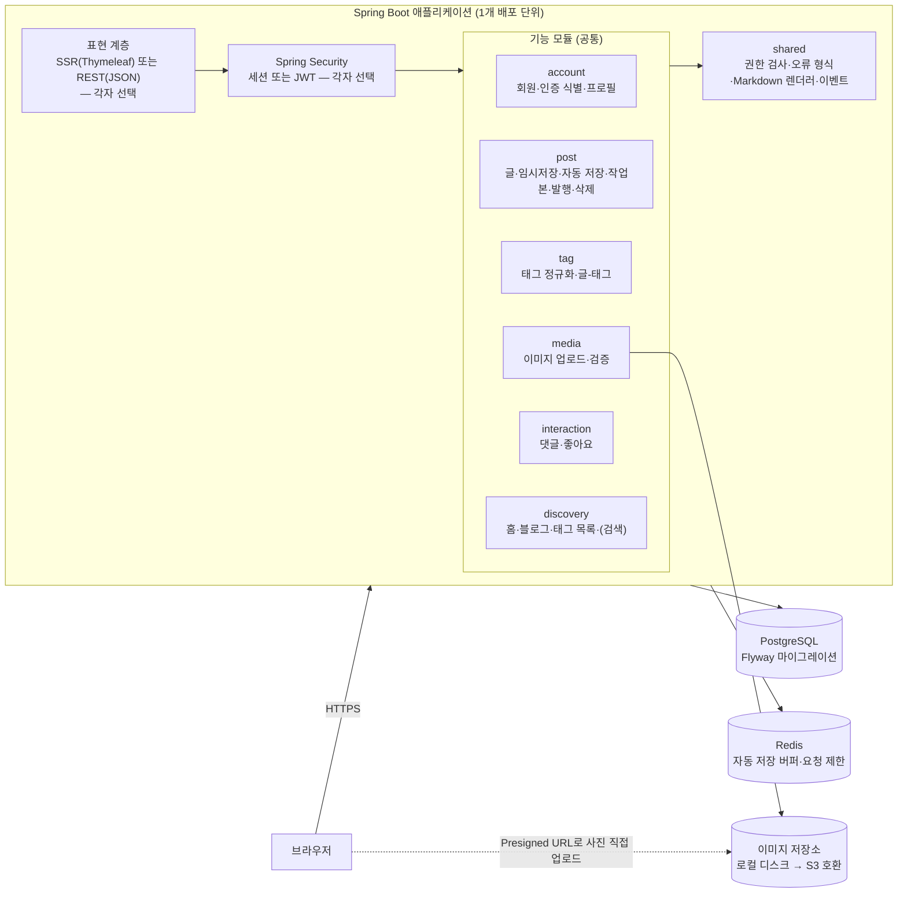
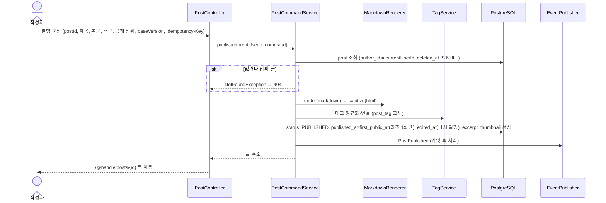
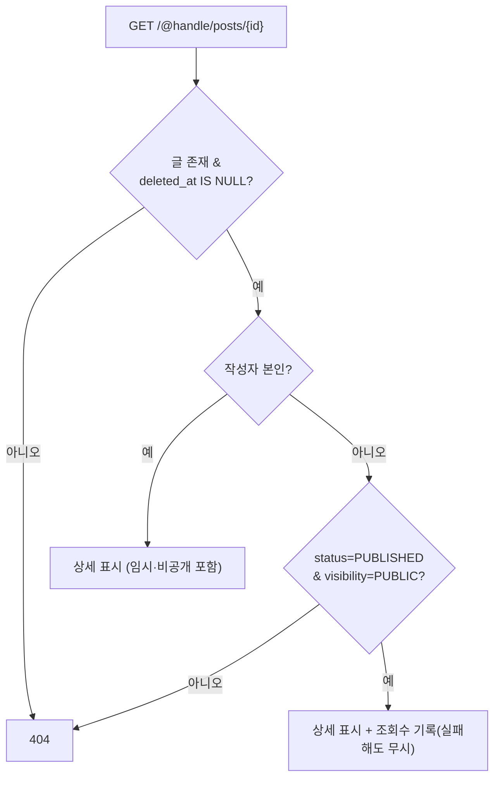

# 팀 공통 아키텍처 (초안)

> 기준: [01-common-requirements.md](./01-common-requirements.md)의 Tier A + B. `[확정]` MSA 금지, 하나의 저장소·하나의 배포 단위.
> 핵심 아이디어: **Service 계층(업무 규칙)과 ERD는 공통**, 표현 계층(SSR/REST)·인증 방식은 각자 고른다.

---

## 1. 전체 구조 — 모듈러 모놀리스



| 원칙 | 내용 | 왜 |
|---|---|---|
| 모듈 경계 | 모듈은 **다른 모듈의 Repository·테이블을 직접 쓰지 않고**, 공개된 Service(또는 이벤트)로만 소통 | 개인 확장 모듈이 공통 모듈을 깨지 않게. 나중에 분리 가능 (김민서 SCALE-5) |
| 공통 Service | 권한·상태 전이·검증은 Service에 둔다 | 표현 방식이 달라도 같은 규칙·같은 테스트 |
| 설정값 분리 | 태그 최대 개수, 조회수 중복 기준, 페이지 크기 등은 `application.yml` | 세 사람의 정책 차이를 코드 수정 없이 흡수 |
| 이벤트 | 댓글·좋아요 → `ApplicationEvent` 발행, 알림 등은 `@TransactionalEventListener(AFTER_COMMIT)`로 구독 | 알림(Tier C)·AI·통계를 붙여도 기존 모듈 수정 0줄 |

---

## 2. 기술 스택 (제안)

| 영역 | 선택 | 비고 |
|---|---|---|
| 언어·프레임워크 | Java 21, Spring Boot (버전 팀 확정) | 김민서 문서는 Spring Boot 4.1.1 기준 |
| 데이터 접근 | Spring Data JPA (+ 목록 조회는 필요 시 QueryDSL/JPQL fetch join) | N+1 금지 (나 NFR-07, 김 PERF-2) |
| DB | PostgreSQL (`pg_trgm` 확장 사용) | 셋 다 PostgreSQL |
| 캐시·버퍼 | Redis (AOF `everysec`, `noeviction`). 운영은 NHN 제공 Redis (이 두 설정이 가능한지 배포 전 확인) | 자동 저장 버퍼, 요청 횟수 제한 ([04 문서](./04-draft-and-image.md)) |
| 파일 저장소 | **MinIO** + Presigned URL(SigV4). 운영은 NHN 제공 MinIO, 로컬 개발은 MinIO 커뮤니티 포크 이미지 | AWS SDK for Java v2, `endpointOverride` + `forcePathStyle(true)`. 공식 MinIO 이미지는 배포 중단이라 로컬 이미지는 [04 §6-1](./04-draft-and-image.md) |
| 메시지 브로커 | 공통은 쓰지 않음. 이벤트는 앱 안에서 커밋 후 처리 ([20 문서](./20-domain-events.md)) | NHN이 RabbitMQ 계정을 제공한다. 유실 없는 알림·메일 발송·AI 비동기 처리가 필요하면 개인 확장으로 쓴다 (도입 시 배포 구성에 들어가므로 팀에 알림) |
| 브라우저 저장 | IndexedDB (예: localforage) | 자동 저장 1차 저장소, 오프라인 사진 대기열 |
| 스케줄러 | Spring `@Scheduled` + ShedLock | 자동 저장 DB 반영(1분), 버려진 사진·빈 임시글 정리 |
| 마이그레이션 | Flyway | 나 NFR-11, 김 MAINT-3 |
| 인증 | Spring Security 폼 로그인 + OAuth2 Client(Google·GitHub), BCrypt | [07 문서](./07-auth.md) |
| 세션 | Spring Session Data Redis (14일, 마지막 활동 기준) | 서버를 늘려도 로그인 유지 |
| 메일 | 개발: Mailpit(Docker), 배포: SMTP (환경 확인 후) | 이메일 인증·비밀번호 재설정 |
| 화면 | Thymeleaf SSR **또는** REST + SPA | Q2 결과에 따름 |
| Markdown | **commonmark-java 0.30.0** + GFM 확장(표·취소선·체크리스트·자동 링크·제목 앵커) | 발행할 때 렌더링 → `content_html` 저장, 직접 쓴 HTML은 글자로 ([12 문서](./12-content-sanitize.md)) |
| 정화 | **OWASP Java HTML Sanitizer 20260924.2**, 허용 목록 방식 | 렌더러 뒤에서 한 번 더 (이중 방어) |
| 코드 강조 | highlight.js (브라우저, 우리 서버에서 제공) | JS 없어도 코드는 읽힘 |
| 테스트 | JUnit 5, Testcontainers(PostgreSQL), Spring Security Test | H2 대신 실제 PostgreSQL |
| 실행 | Docker Compose (app + postgres) | 환경 변수로 비밀값 주입 |
| (개인) | Ollama/LLM(AI, 나·김), CloudFront(강), Redis 트렌딩 캐시(강) | 공통 필수 아님 |

---

## 3. 패키지 구조

기능 모듈 우선(package-by-feature), 모듈 안에서 계층을 나눈다.

```
com.team.blog
├── account/
│   ├── web/            AuthController, ProfileController   ← 표현 (각자)
│   ├── application/    MemberService, ProfileService        ← 업무 규칙 (공통)
│   ├── domain/         Member, AuthIdentity, Role, MemberStatus
│   └── infra/          MemberRepository, AuthIdentityRepository, OAuth/폼 로그인 어댑터
├── post/
│   ├── web/            PostController, ManagePostController
│   ├── application/    PostCommandService(작성·임시저장·발행·삭제), PostQueryService,
│   │                   AutosaveService(Redis 버퍼), AutosaveFlushJob(1분마다 DB 반영)
│   ├── domain/         Post, PostStatus, Visibility, PostAccessPolicy(읽기 판정),
│   │                   VisibilityRule(공개 범위 값마다 1개: PUBLIC·PRIVATE, 선택 FRIENDS)
│   └── infra/          PostRepository
├── tag/                TagService(정규화), Tag, PostTag
├── media/              ImageService(presign·complete·본문 이미지 추출), ImageCleanupJob,
│                       ImageStorage(인터페이스) ← LocalImageStorage / S3ImageStorage
├── interaction/        CommentService, LikeService, ViewCountService
├── discovery/          HomeQueryService, BlogQueryService, TagQueryService (읽기 전용 조회)
└── shared/
    ├── security/       CurrentUser, @LoginRequired, AccessPolicy
    ├── markdown/       MarkdownRenderer, HtmlSanitizer
    ├── error/          NotFoundException(→404), ErrorResponse, GlobalExceptionHandler
    └── event/          DomainEvent (PostPublished, CommentCreated, PostLiked …)
```

**개인 확장은 새 모듈 패키지로 추가**한다. 예: 강성찬 `group/`·`mission/`·`streak/`, 나민서 `blog/`·`category/`·`topic/`, 김민서 `revision/`·`bookmark/`·`series/`.

---

## 4. 요청 흐름

### 4-1. 글 발행



- 렌더링은 **저장할 때 1번**, 조회 때는 `content_html`을 그대로 쓴다 (김 PERF-3).
- `published_at`·`first_public_at`은 처음 한 번만 정하고, 다시 발행하면 `edited_at`만 기록한다. 목록은 `first_public_at`으로 정렬한다.
- 연타·재전송은 `Idempotency-Key`(Redis)로 막고, 행 잠금 + `edit_version` 확인으로 한 번 더 막는다.
- 상세 설계는 [05-publish.md](./05-publish.md)에 있다.
- 트랜잭션 안에서 외부 호출(LLM·파일 쓰기·HTTP)을 하지 않는다. 이미지 업로드는 글 저장 전에 별도 요청으로 끝낸다.
- 발행 요청 본문에 업로드가 끝나지 않은 사진(`local:` 주소)이 있으면 400으로 거부한다.
- Redis 자동 저장 키는 **커밋 후** 삭제한다.

### 4-1-1. 자동 저장과 사진 업로드

IndexedDB → Redis → PostgreSQL 3단계 자동 저장과 Presigned URL 사진 업로드의 상세 설계는 [04-draft-and-image.md](./04-draft-and-image.md)에 있다.

```
타이핑 → IndexedDB(1초) → PUT /autosave → Redis(30초 이내) → 스케줄러 → PostgreSQL(1분) / 수동 저장·발행은 즉시
사진   → 브라우저 압축·EXIF 제거 → presign → S3 직접 업로드 → complete(서버 재검사) → 본문에는 URL만
```

### 4-2. 글 상세 조회와 권한



이 판정은 `PostAccessPolicy.canRead(post, viewer)` 하나에 둔다. 공개 범위 값마다 `VisibilityRule` Bean을 하나씩 두고, 친구 공개(`FRIENDS`, 공통 규격·선택 구현)나 강성찬의 그룹·링크 공개는 **규칙 Bean을 추가**해서 확장한다. 목록 쿼리도 같은 규칙의 조건(`VisibilityFilter`)만 쓴다. 상세는 [06-visibility.md](./06-visibility.md) §7.

---

## 5. 인증·권한

| 항목 | 공통 규칙 |
|---|---|
| 현재 사용자 | 인증 정보에서만 꺼낸다. **작성자 ID를 요청 파라미터로 받지 않는다** |
| 소유 검사 | Service에서 `author_id = currentUserId` 조건으로 조회 → 없으면 404 |
| 비회원 쓰기 | 로그인 화면으로(SSR) 또는 401(REST) |
| CSRF | SSR+세션이면 Spring Security 기본 CSRF 유지. JWT(쿠키 저장)면 SameSite + CSRF 토큰 |
| XSS | 본문은 `ContentRenderer` 하나만 HTML을 만들고 반드시 정화한다. 제목·소개·댓글은 글자만(이스케이프). 상세는 [12 문서](./12-content-sanitize.md) |
| 보안 헤더 | CSP(`script-src 'self'`, `img-src 'self' {CDN} data:`, `object-src 'none'`, `frame-ancestors 'none'` 등), `X-Content-Type-Options: nosniff`, `Referrer-Policy: strict-origin-when-cross-origin` |
| 비밀값 | OAuth Client Secret·JWT 키·SMTP 비밀번호는 환경 변수로만 |
| 로그인 | 이메일 가입 + Google + GitHub, 로그인 수단이 다르면 별도 계정. 이메일 인증 전에는 쓰기 API 403. 실패 제한·토큰은 Redis. 상세는 [07-auth.md](./07-auth.md) |

---

## 6. 비기능 공통 기준

세 문서의 수치를 공통 최소선으로 맞춘 값이다. 개인은 더 엄격하게 잡아도 된다.

| 영역 | 공통 기준 | 출처 |
|---|---|---|
| 응답 시간 | 목록·상세 서버 응답 300ms 이내 (글 1만 건) | 나 NFR-05, 강 1초, 김 p95 200ms |
| N+1 | 목록 쿼리 수가 글 수에 비례하지 않음 | 나 NFR-07, 김 PERF-2 |
| 동시성 | 좋아요를 동시에 여러 번 보내도 1건 (복합 PK + `ON CONFLICT DO NOTHING`) | 김 REL-3 |
| 장애 격리 | 조회수·알림·AI 실패가 글쓰기·읽기를 막지 않음 | 강 가용성, 나 AI 공통 규칙, 김 REL-4 |
| 반응형 | 375px ~ 데스크톱, 가로 스크롤 없음 | 셋 다 |
| SEO | 글별 `<title>`·description·OG, 공개 글 sitemap. 비공개 글 제외 | 셋 다 |
| 테스트 | 권한 관련 기능은 통합 테스트 필수 | 나 NFR-12, 김 SEC-1 |

---

## 7. 개인 확장이 붙는 지점

| 확장 | 붙는 곳 | 공통 코드 수정 |
|---|---|---|
| 친구 공개 (공통 규격, 선택) | `Visibility.FRIENDS` + `FriendsVisibilityRule` Bean + `friend` 모듈 + 06 §6 마이그레이션 | enum 값 1개 |
| 그룹·링크 공개 (강) | `GroupVisibilityRule`, `LinkVisibilityRule` Bean + `group` 모듈 | enum 값 추가 |
| 카테고리·주제·고정 글 (나) | `post`에 nullable 컬럼 추가 + `category`·`topic` 모듈 | 없음 (컬럼 추가) |
| 작업본/발행본 분리 (김) | `post_revision` 테이블 + 발행 Service 확장 | 발행 로직 |
| 알림·통계·AI | `shared/event` 구독 리스너 추가 | 없음 |
| 이미지 S3 | `ImageStorage` 구현체 교체 | 없음 (설정) |
