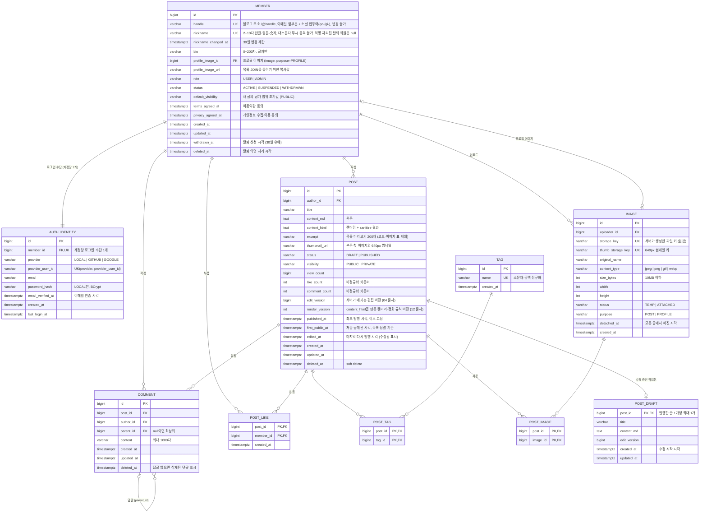
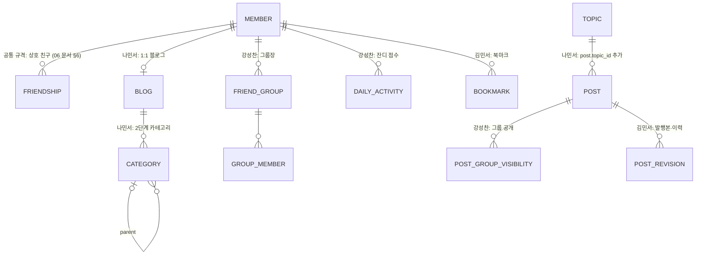

# 팀 공통 ERD (초안)

> 기준: [01-common-requirements.md](./01-common-requirements.md) Tier A + B. DBMS: PostgreSQL.
> 공통 테이블 **10개**. 개인 확장은 이 테이블을 바꾸지 않고 **테이블·컬럼을 추가만** 한다.

---

## 1. ERD



---

## 2. 설계 결정

| # | 결정 | 이유 | 관련 요구사항 |
|---|---|---|---|
| E-1 | **회원과 로그인 수단 분리** (`member` 1 : 1 `auth_identity`) | 팀 결정(L-1): 로그인 수단이 다르면 이메일이 같아도 별도 계정. `UNIQUE(provider, provider_user_id)`로 "같은 로그인 수단 = 계정 1개", `UNIQUE(member_id)`로 "계정 1개 = 로그인 수단 1개"를 보장. 테이블을 분리해 두었으므로 나중에 계정 연결을 허용하려면 `UNIQUE(member_id)`만 빼면 된다 ([07 문서](./07-auth.md)) | C-AUTH-1, 강 BASE-03, 나 USR-06 |
| E-2 | **회원 = 블로그** (`member.handle`이 블로그 주소) | 강·김은 아이디가 곧 주소. 나민서의 블로그 이름·slug 분리는 1:1 `blog` 테이블 추가로 확장. 주소 형식은 `^((go|gi)-)?[a-z0-9][a-z0-9_]{1,34}[a-z0-9]$` — 이메일 앞부분으로 미리 채우고 가입 때 한 번 수정 가능, 소셜은 두 글자 접두어 ([08 문서](./08-blog-address.md)) | C-BLOG-1 |
| E-3 | 상태와 공개 범위를 **두 컬럼으로 분리** (`status` × `visibility`) | "임시냐 발행이냐"와 "누가 보느냐"는 다른 축. 강성찬의 그룹·링크 공개는 `visibility` 값 추가로, 김민서의 휴지통·숨김은 별도 컬럼으로 확장 | C-POST-2·4 |
| E-4 | **soft delete** (`deleted_at`) | 휴지통(김)·탈퇴 유예(강)로 자연스럽게 확장. 자식 FK는 `ON DELETE CASCADE`라 완전 삭제(나 D-16)도 그대로 동작 | C-POST-5 |
| E-5 | Markdown 원문 + 렌더링 결과 **둘 다 저장** | 조회 때 변환하지 않음(성능), 원문으로 재편집. 에디터가 달라도 저장 형식은 같다 | C-POST-1, 김 PERF-3 |
| E-6 | 반응 수 **비정규화** (`like_count`, `comment_count`, `view_count`) | 목록 9개를 그릴 때 COUNT 쿼리를 글마다 하지 않음 (N+1 방지). 좋아요 INSERT가 실제로 된 경우에만 같은 트랜잭션에서 +1 | 나 NFR-07, 김 PERF-2 |
| E-7 | 좋아요·글-태그는 **복합 PK** | 중복이 DB 수준에서 불가능. 동시 요청은 `INSERT … ON CONFLICT DO NOTHING` | C-LIKE-1 |
| E-8 | 댓글은 **`parent_id` 자기참조 하나** | 공통 규칙은 1단계(애플리케이션 검사), 강성찬의 무한 깊이도 같은 스키마로 가능 | C-CMT-1 |
| E-9 | `published_at`은 **최초 발행 때 한 번만** 기록 | 다시 발행해도 발행일·글 주소가 흔들리지 않음 | C-POST-3, 김 WRITE-3 |
| E-15 | 목록 정렬은 `first_public_at` (처음 `PUBLISHED`+`PUBLIC`이 된 시각, 이후 고정) | 비공개로 발행했다가 나중에 공개한 글이 목록 뒤쪽에 묻히지 않음. 공개 범위를 껐다 켜서 맨 위로 올리는 것도 막음 ([05 문서](./05-publish.md) §3) | C-POST-3·4, 강 OPEN-01 |
| E-19 | 닉네임: `varchar(10)` + CHECK(완성형 한글·영문·숫자 2~10자, 글자 1자 이상) + `lower(nickname)` UNIQUE + `nickname_changed_at` | 형식은 DB가, 금칙어·예약어는 `NicknamePolicy`가 검사. 대소문자만 다른 사칭을 DB에서 막는다. 30일 변경 제한 ([09 문서](./09-nickname.md)) | C-AUTH-2 |
| E-20 | 목록 카드용 데이터: `post.excerpt` 200자(코드·이미지·표 제외), `post.thumbnail_url` = 첫 이미지의 640px 썸네일, `image.thumb_storage_key` | 목록 9개를 SQL 1번으로 그리고, 카드 썸네일 전송량을 원본의 약 1/10로 줄인다 ([10 문서](./10-post-list.md)) | C-READ-1, C-BLOG-1 |
| E-22 | `post.render_version` | 정화 규칙을 고쳐도 이미 저장된 `content_html`에는 옛 규칙이 남는다. 버전이 낮은 발행 글을 배치가 다시 렌더링한다 ([12 문서](./12-content-sanitize.md) §7-7) | C-POST-1 |
| E-21 | 프로필 이미지: `member.profile_image_id`(FK) + `image.purpose`(`POST`/`PROFILE`) | 연결된 프로필 이미지는 `ATTACHED`라서 정리 배치가 지우지 않는다. `purpose`로 검사 규칙(256×256, 썸네일 없음)을 구분. `profile_image_url`은 목록 JOIN을 줄이는 복사값 ([11 문서](./11-profile.md)) | C-AUTH-2 |
| E-23 | 삭제·탈퇴: 글은 `deleted_at`(휴지통 30일) 후 `DELETE`(CASCADE), 회원은 `withdrawn_at`(30일 유예) 후 **익명 껍데기**(`handle`만 남기고 `nickname` 등 null, `deleted_at`) | 복구 기간을 주고, 30일 뒤에는 개인 정보를 남기지 않는다. 블로그 주소는 영구 예약, 닉네임은 해제 ([13 문서](./13-delete-withdraw.md)) | C-POST-5, 탈퇴 |
| E-17 | `member.default_visibility` (기본 `PUBLIC`) | 새 글의 공개 범위 초기값. 친구 공개 규격을 적용한 사람은 `FRIENDS`도 쓸 수 있다 ([06 문서](./06-visibility.md) §5) | C-POST-4, 강 FRIEND-01 |
| E-18 | 친구 공개(`FRIENDS`)·`friendship`은 **공통 규격, 선택 구현** | 공통 스키마에는 넣지 않는다. 구현하는 사람은 06 문서 §6의 마이그레이션을 그대로 적용해서 ERD를 맞춘다 (공통 테이블은 CHECK 교체만, E-10) | C-POST-4 |
| E-16 | `edited_at` 별도 컬럼 | `updated_at`은 자동 저장 반영에도 바뀐다. 독자에게 보이는 "수정됨"은 다시 발행한 시각이어야 함 | C-POST-3, 나 PST-02 |
| E-10 | 문자열 enum은 `varchar + CHECK` | PostgreSQL enum 타입은 값 추가·삭제가 번거롭다. 확장 시 CHECK만 교체 (**유일하게 허용하는 공통 스키마 변경**) | E-3 |
| E-11 | 조회 중복 판정 데이터는 **공통에 두지 않음** | 기준이 셋 다 다름(30분 5회 / 24시간 1회). 공통은 `view_count` 카운터만, 판정은 Redis 또는 개인 테이블 | C-VIEW-1 |
| E-12 | 편집 버전 `edit_version` (`post`, `post_draft`) | 저장이 받아들여질 때마다 서버가 1씩 올린다. 클라이언트가 보낸 기준 버전과 다르면 409로 **여러 탭·기기의 충돌을 감지**하고, Redis → DB 반영 때 `WHERE edit_version < :version`으로 옛 버전이 새 버전을 덮어쓰지 않게 한다 ([04 문서 §2-7](./04-draft-and-image.md)) | C-POST-2 |
| E-14 | 발행한 글의 작업본 `post_draft` (1:0..1) | 발행한 글을 고치는 동안 자동 저장 내용을 `post`가 아니라 여기에 저장해서 **독자에게는 마지막 발행본이 보이게** 한다. 행이 있으면 "수정 중" 상태. 다시 발행하면 `post`로 복사한 뒤 삭제, [변경 취소]도 삭제 | C-POST-2·3 |
| E-13 | 글 ↔ 사진 연결 `post_image` + `image.status` | 저장·발행할 때 본문에서 이미지 주소를 추출해 연결. 어떤 글에도 연결되지 않은 사진(`TEMP` 24시간, 연결이 끊긴 지 7일)을 정리 배치가 삭제. 첫 사진은 썸네일 | C-IMG-1 |

---

## 3. DDL (Flyway `V1__common_schema.sql` 초안)

```sql
-- 회원 (= 블로그)
CREATE TABLE member (
    id                bigint GENERATED ALWAYS AS IDENTITY PRIMARY KEY,
    handle            varchar(39)  NOT NULL,
    nickname          varchar(10),          -- 익명 처리된 탈퇴 회원만 null (13 문서)
    nickname_changed_at timestamptz,
    withdrawn_at      timestamptz,          -- 탈퇴 신청 시각 (30일 유예)
    bio               varchar(200),
    profile_image_id  bigint,          -- FK는 image 생성 뒤 ALTER TABLE로 추가 (아래)
    profile_image_url varchar(500),
    role              varchar(20)  NOT NULL DEFAULT 'USER',
    status            varchar(20)  NOT NULL DEFAULT 'ACTIVE',
    default_visibility varchar(20) NOT NULL DEFAULT 'PUBLIC',
    terms_agreed_at   timestamptz  NOT NULL,
    privacy_agreed_at timestamptz  NOT NULL,
    created_at        timestamptz  NOT NULL DEFAULT now(),
    updated_at        timestamptz  NOT NULL DEFAULT now(),
    deleted_at        timestamptz,
    CONSTRAINT uq_member_handle UNIQUE (handle),
    -- [접두어-]본문: 접두어는 소셜 가입만(go-, gi-), 본문은 소문자·숫자·_ 3~36자 (08 문서). 예약어는 애플리케이션에서 검사
    CONSTRAINT ck_member_handle CHECK (handle ~ '^((go|gi)-)?[a-z0-9][a-z0-9_]{1,34}[a-z0-9]$'),
    -- 2~10자 완성형 한글·영문·숫자, 한글·영문 1자 이상 (09 문서). 금칙어·예약어는 NicknamePolicy에서 검사
    CONSTRAINT ck_member_nickname CHECK (nickname ~ '^[가-힣a-zA-Z0-9]{2,10}$' AND nickname ~ '[가-힣a-zA-Z]'),
    CONSTRAINT ck_member_bio    CHECK (bio IS NULL OR char_length(bio) <= 200),
    CONSTRAINT ck_member_role   CHECK (role IN ('USER', 'ADMIN')),
    CONSTRAINT ck_member_status CHECK (status IN ('ACTIVE', 'SUSPENDED', 'WITHDRAWN')),
    CONSTRAINT ck_member_withdrawn     CHECK ((status = 'WITHDRAWN') = (withdrawn_at IS NOT NULL)),
    CONSTRAINT ck_member_deleted       CHECK (deleted_at IS NULL OR status = 'WITHDRAWN'),
    CONSTRAINT ck_member_nickname_null CHECK (nickname IS NOT NULL OR deleted_at IS NOT NULL),
    CONSTRAINT ck_member_default_visibility CHECK (default_visibility IN ('PUBLIC', 'PRIVATE'))
);

-- 닉네임 중복은 대소문자 무시 (Kim = kim)
CREATE UNIQUE INDEX uq_member_nickname ON member (lower(nickname));   -- NULL(익명 처리)은 무시 → 닉네임 해제
-- 탈퇴 30일 뒤 익명 처리 배치
CREATE INDEX ix_member_withdraw_purge ON member (withdrawn_at) WHERE status = 'WITHDRAWN' AND deleted_at IS NULL;

-- 로그인 수단 (LOCAL: provider_user_id = 소문자 이메일)
CREATE TABLE auth_identity (
    id               bigint GENERATED ALWAYS AS IDENTITY PRIMARY KEY,
    member_id        bigint       NOT NULL REFERENCES member (id),
    provider         varchar(20)  NOT NULL,
    provider_user_id varchar(255) NOT NULL,
    email            varchar(255),
    password_hash    varchar(100),
    email_verified_at timestamptz,
    created_at       timestamptz  NOT NULL DEFAULT now(),
    last_login_at    timestamptz,
    CONSTRAINT uq_auth_identity        UNIQUE (provider, provider_user_id),
    CONSTRAINT uq_auth_identity_member UNIQUE (member_id),       -- 계정당 로그인 수단 1개 (07 L-1)
    CONSTRAINT ck_auth_provider CHECK (provider IN ('LOCAL', 'GITHUB', 'GOOGLE')),
    CONSTRAINT ck_auth_password CHECK ((provider = 'LOCAL') = (password_hash IS NOT NULL)),
    -- 이메일 가입은 소문자 이메일이 곧 식별값
    CONSTRAINT ck_auth_local_email CHECK (provider <> 'LOCAL'
        OR (email IS NOT NULL AND email = lower(email) AND provider_user_id = email))
);
-- 비밀번호 재설정 메일에서 같은 이메일의 계정들을 찾을 때
CREATE INDEX ix_auth_identity_email ON auth_identity (email) WHERE email IS NOT NULL;

-- 글
CREATE TABLE post (
    id            bigint GENERATED ALWAYS AS IDENTITY PRIMARY KEY,
    author_id     bigint       NOT NULL REFERENCES member (id),
    title         varchar(100) NOT NULL DEFAULT '',
    content_md    text         NOT NULL DEFAULT '',
    content_html  text         NOT NULL DEFAULT '',
    excerpt       varchar(200),
    thumbnail_url varchar(500),
    status        varchar(20)  NOT NULL DEFAULT 'DRAFT',
    visibility    varchar(20)  NOT NULL DEFAULT 'PUBLIC',
    view_count    bigint       NOT NULL DEFAULT 0,
    like_count    integer      NOT NULL DEFAULT 0,
    comment_count integer      NOT NULL DEFAULT 0,
    edit_version  bigint       NOT NULL DEFAULT 0,
    render_version integer     NOT NULL DEFAULT 1,
    published_at    timestamptz,
    first_public_at timestamptz,
    edited_at       timestamptz,
    created_at    timestamptz  NOT NULL DEFAULT now(),
    updated_at    timestamptz  NOT NULL DEFAULT now(),
    deleted_at    timestamptz,
    CONSTRAINT ck_post_status     CHECK (status IN ('DRAFT', 'PUBLISHED')),
    CONSTRAINT ck_post_visibility CHECK (visibility IN ('PUBLIC', 'PRIVATE')),
    CONSTRAINT ck_post_published  CHECK (status = 'DRAFT' OR (published_at IS NOT NULL AND length(btrim(title)) > 0)),
    -- 공개된 발행 글은 반드시 first_public_at이 있다
    CONSTRAINT ck_post_public_at  CHECK (NOT (status = 'PUBLISHED' AND visibility = 'PUBLIC') OR first_public_at IS NOT NULL),
    CONSTRAINT ck_post_edited_at  CHECK (edited_at IS NULL OR (published_at IS NOT NULL AND edited_at >= published_at)),
    CONSTRAINT ck_post_content    CHECK (char_length(content_md) <= 100000),
    CONSTRAINT ck_post_counts     CHECK (view_count >= 0 AND like_count >= 0 AND comment_count >= 0)
);
-- 홈 최신 글 (커서: first_public_at, id)
CREATE INDEX ix_post_feed ON post (first_public_at DESC, id DESC)
    WHERE status = 'PUBLISHED' AND visibility = 'PUBLIC' AND deleted_at IS NULL;
-- 개인 블로그 글 목록
CREATE INDEX ix_post_blog ON post (author_id, first_public_at DESC, id DESC)
    WHERE status = 'PUBLISHED' AND visibility = 'PUBLIC' AND deleted_at IS NULL;
-- 내 글 관리 (임시·발행 탭)
CREATE INDEX ix_post_manage ON post (author_id, status, updated_at DESC)
    WHERE deleted_at IS NULL;
-- 휴지통 목록·30일 뒤 비우기 (13 문서)
CREATE INDEX ix_post_trash ON post (author_id, deleted_at DESC) WHERE deleted_at IS NOT NULL;

-- 태그
CREATE TABLE tag (
    id         bigint GENERATED ALWAYS AS IDENTITY PRIMARY KEY,
    name       varchar(30) NOT NULL,
    created_at timestamptz NOT NULL DEFAULT now(),
    CONSTRAINT uq_tag_name UNIQUE (name),
    CONSTRAINT ck_tag_name CHECK (name = lower(btrim(name)) AND length(name) > 0)
);

CREATE TABLE post_tag (
    post_id bigint NOT NULL REFERENCES post (id) ON DELETE CASCADE,
    tag_id  bigint NOT NULL REFERENCES tag (id),
    PRIMARY KEY (post_id, tag_id)
);
CREATE INDEX ix_post_tag_tag ON post_tag (tag_id, post_id);

-- 댓글 (parent_id 자기참조, 공통 규칙은 1단계)
CREATE TABLE comment (
    id         bigint GENERATED ALWAYS AS IDENTITY PRIMARY KEY,
    post_id    bigint        NOT NULL REFERENCES post (id) ON DELETE CASCADE,
    author_id  bigint        NOT NULL REFERENCES member (id),
    parent_id  bigint        REFERENCES comment (id) ON DELETE CASCADE,
    content    varchar(1000) NOT NULL,
    created_at timestamptz   NOT NULL DEFAULT now(),
    updated_at timestamptz   NOT NULL DEFAULT now(),
    deleted_at timestamptz,
    -- 삭제된 댓글(답글이 있어 남긴 것, 탈퇴 익명 처리)은 내용을 비운다 (13 문서)
    CONSTRAINT ck_comment_content CHECK (deleted_at IS NOT NULL OR length(btrim(content)) > 0),
    CONSTRAINT ck_comment_parent  CHECK (parent_id IS NULL OR parent_id <> id)
);
CREATE INDEX ix_comment_post   ON comment (post_id, created_at, id);
CREATE INDEX ix_comment_parent ON comment (parent_id) WHERE parent_id IS NOT NULL;

-- 글 좋아요
CREATE TABLE post_like (
    post_id    bigint      NOT NULL REFERENCES post (id) ON DELETE CASCADE,
    member_id  bigint      NOT NULL REFERENCES member (id),
    created_at timestamptz NOT NULL DEFAULT now(),
    PRIMARY KEY (post_id, member_id)
);
CREATE INDEX ix_post_like_member ON post_like (member_id, created_at DESC);

-- 업로드 이미지 (파일 자체는 ImageStorage: 로컬 디스크 / S3)
CREATE TABLE image (
    id            bigint GENERATED ALWAYS AS IDENTITY PRIMARY KEY,
    uploader_id   bigint       NOT NULL REFERENCES member (id),
    storage_key   varchar(255) NOT NULL,
    thumb_storage_key varchar(255),
    original_name varchar(255) NOT NULL,
    content_type  varchar(50)  NOT NULL,
    size_bytes    integer      NOT NULL,
    width         integer,
    height        integer,
    status        varchar(20)  NOT NULL DEFAULT 'TEMP',
    purpose       varchar(20)  NOT NULL DEFAULT 'POST',
    detached_at   timestamptz,
    created_at    timestamptz  NOT NULL DEFAULT now(),
    CONSTRAINT uq_image_storage_key UNIQUE (storage_key),
    CONSTRAINT uq_image_thumb_key   UNIQUE (thumb_storage_key),
    CONSTRAINT ck_image_type   CHECK (content_type IN ('image/jpeg', 'image/png', 'image/gif', 'image/webp')),
    CONSTRAINT ck_image_size   CHECK (size_bytes > 0 AND size_bytes <= 10485760),
    CONSTRAINT ck_image_status CHECK (status IN ('TEMP', 'ATTACHED')),
    CONSTRAINT ck_image_purpose CHECK (purpose IN ('POST', 'PROFILE')),
    CONSTRAINT ck_image_dim    CHECK ((width IS NULL OR width > 0) AND (height IS NULL OR height > 0))
);
CREATE INDEX ix_image_uploader ON image (uploader_id, created_at DESC);
-- 정리 배치: 오래된 TEMP, 연결이 끊긴 지 오래된 ATTACHED
CREATE INDEX ix_image_cleanup_temp     ON image (created_at)  WHERE status = 'TEMP';
CREATE INDEX ix_image_cleanup_detached ON image (detached_at) WHERE detached_at IS NOT NULL;

-- 글 ↔ 사진 (저장·발행할 때 본문에서 추출해 갱신)
CREATE TABLE post_image (
    post_id  bigint NOT NULL REFERENCES post (id) ON DELETE CASCADE,
    image_id bigint NOT NULL REFERENCES image (id) ON DELETE CASCADE,
    PRIMARY KEY (post_id, image_id)
);
CREATE INDEX ix_post_image_image ON post_image (image_id);

-- 프로필 이미지 (member ↔ image가 서로 참조하므로 image 생성 뒤 추가, 11 문서)
ALTER TABLE member ADD CONSTRAINT fk_member_profile_image
    FOREIGN KEY (profile_image_id) REFERENCES image (id);

-- 발행한 글을 수정하는 동안의 작업본 (행이 있으면 "수정 중")
CREATE TABLE post_draft (
    post_id      bigint       PRIMARY KEY REFERENCES post (id) ON DELETE CASCADE,
    title        varchar(100) NOT NULL DEFAULT '',
    content_md   text         NOT NULL DEFAULT '' CHECK (char_length(content_md) <= 100000),
    edit_version bigint       NOT NULL DEFAULT 0,
    created_at   timestamptz  NOT NULL DEFAULT now(),
    updated_at   timestamptz  NOT NULL DEFAULT now()
);
```

---

## 4. 대표 쿼리

```sql
-- 홈 최신 글 (커서 페이지, 9개 + 다음 페이지 확인용 1개) — ix_post_feed 사용, 본문 제외 (10 문서)
SELECT p.id, p.title, p.excerpt, p.thumbnail_url, p.like_count, p.comment_count,
       p.first_public_at, m.handle, m.nickname, m.profile_image_url
FROM post p JOIN member m ON m.id = p.author_id
WHERE p.status = 'PUBLISHED' AND p.visibility = 'PUBLIC' AND p.deleted_at IS NULL
  AND m.withdrawn_at IS NULL                       -- 탈퇴 신청한 작성자의 글 제외 (13 문서)
  AND (p.first_public_at, p.id) < (:cursorFirstPublicAt, :cursorId)
ORDER BY p.first_public_at DESC, p.id DESC
LIMIT 10;
-- 태그는 위 결과의 id 목록으로 한 번에: SELECT pt.post_id, t.name FROM post_tag pt JOIN tag t … WHERE pt.post_id = ANY(:ids)

-- 좋아요 (동시 요청 안전): 실제로 INSERT된 경우에만 카운터 +1
WITH ins AS (
    INSERT INTO post_like (post_id, member_id) VALUES (:postId, :memberId)
    ON CONFLICT DO NOTHING RETURNING post_id
)
UPDATE post SET like_count = like_count + 1 WHERE id IN (SELECT post_id FROM ins);
```

> 커서 페이지는 셋 중 둘(강·김)의 방식이다. 나민서의 블로그 홈 페이지 번호 방식(D-15)도 `ix_post_blog` 인덱스로 `OFFSET` 처리할 수 있다.

---

## 5. 2차 공통 후보 (자리만 잡아 둠)

Tier C에서 공통으로 확정되면 V2 마이그레이션으로 추가한다.

| 테이블 | 주요 컬럼 | 비고 |
|---|---|---|
| `notification` | id, receiver_id, actor_id, type, target_type, target_id, read_at, created_at | 셋 다 있음. 이벤트 리스너가 생성, 본인 행동 제외 |
| `follow` | follower_id, followee_id, created_at (PK 복합), CHECK(follower ≠ followee) | 대상이 회원(강·김) vs 블로그(나) — 공통 = 회원 |
| `report` | id, reporter_id, target_type, target_id, reason, status, UQ(reporter, target) | 셋 다 있음 |
| 검색 | `CREATE EXTENSION pg_trgm;` + `post`(title, content_md)에 GIN trigram 인덱스 | 테이블 추가 없음 |

---

## 6. 공통 규격(선택 구현)과 개인 확장 (공통 테이블을 바꾸지 않음)



| 팀원 | 추가 방식 | 공통 스키마 변경 |
|---|---|---|
| (친구 공개 구현자 모두) | [06 문서 §6](./06-visibility.md) 규격: `visibility`·`default_visibility` CHECK에 `FRIENDS` 추가 + `friendship` 테이블 + `ix_post_blog_friends` 인덱스 | CHECK 교체만 (E-10) |
| 강성찬 | 친구 공개 규격 + `visibility` CHECK에 `GROUP`, `LINK` 추가 + 그룹·미션·잔디 테이블 | CHECK 교체만 (E-10) |
| 나민서 | `blog`, `category`, `topic` 테이블 + `post`에 `category_id`, `topic_id`, `pinned_at` nullable 컬럼, `comment.secret` | 컬럼 추가만 |
| 김민서 | `post_revision`(발행 이력), `post.slug`, `bookmark`, `outbox_event` | 컬럼 추가만 (작업본은 공통 `post_draft` 사용) |
