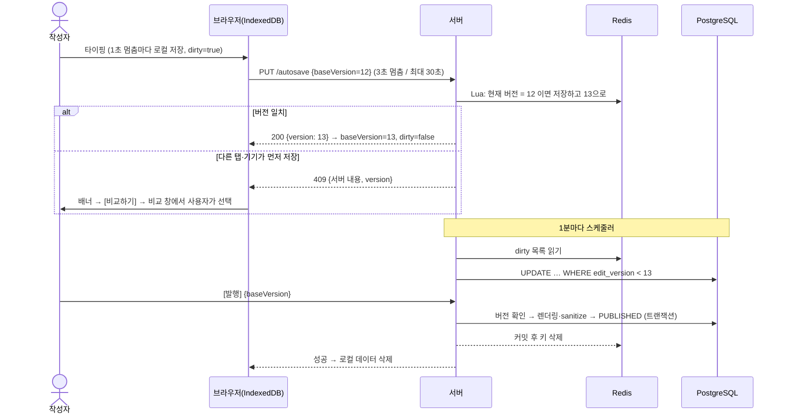

# 임시저장·자동 저장과 사진 업로드 설계

> 작성일 2026-10-02 · 관련 요구사항: C-POST-2(임시저장), C-IMG-1(이미지 업로드)
> 결정: 자동 저장은 **IndexedDB → Redis → PostgreSQL 3단계 구조(안 A)**, 사진은 **임시저장 흐름과 분리해 즉시 업로드**한다.
> 2026-10-02 추가 결정: 발행 글은 `post_draft` 작업본에 저장, 사진은 주소 공개 방식, 파일 저장소는 S3 호환 자체 호스팅([§6](#6-결정-사항)).

---

## 1. 원칙

| # | 원칙 | 이유 |
|---|---|---|
| D-1 | **원본은 항상 PostgreSQL.** Redis는 최근 입력을 잠깐 보관하는 버퍼이고, 브라우저 저장소는 네트워크가 끊겼을 때를 위한 백업이다 | C-POST-2 "임시글을 다시 열어 이어 쓸 수 있다"를 TTL과 상관없이 지킨다 |
| D-2 | 저장 빈도는 **브라우저 > 서버 > DB** 순으로 줄인다 | 서버 트래픽은 줄이고 사용자 기기에는 1초 단위로 남긴다 |
| D-3 | 사용자가 직접 누른 **수동 저장·발행은 즉시 DB에 반영**한다 | 사용자가 "저장했다"고 믿은 내용은 사라지지 않는다 |
| D-4 | **사진은 본문에 넣지 않는다.** 올리는 즉시 파일 저장소에 업로드하고 본문에는 URL만 남긴다 | 사진 1장(3~8MB)이 본문(10~50KB)보다 수백 배 커서 자동 저장 경로에 넣으면 모든 단계가 무거워진다 |

---

## 2. 자동 저장: 3단계 구조

```
타이핑
  │ ① 입력이 1초 멈출 때마다                      서버 트래픽 0
  ▼
[브라우저 IndexedDB]  draft:{memberId}:{postId}
  │ ② 바뀐 내용이 있을 때만: 입력이 3초 멈추면, 계속 입력 중이면 최대 30초마다
  │    + 탭이 가려질 때(visibilitychange) / 페이지를 떠날 때(pagehide, fetch keepalive)
  ▼
[서버 → Redis]        autosave:post:{postId}  (TTL 24시간)
  │ ③ 스케줄러가 1분마다 반영 + 수동 저장 + 발행
  ▼
[PostgreSQL post]     원본
```

### 2-1. 단계별 설정값 (초기값, `application.yml`)

| 항목 | 값 | 근거 |
|---|---|---|
| 브라우저 저장 | 입력이 1초 멈추면 | 기기 안 저장이라 비용이 없음 |
| 서버 전송 | 입력이 3초 멈추면, 최대 30초마다, 내용이 바뀐 경우만 | 강성찬 BASE-09, 김민서 WRITE-2 |
| DB 반영 주기 | 1분 | 서버 쪽 유실 범위의 상한 |
| Redis TTL | 24시간 (저장할 때마다 갱신) | DB에는 1분 안에 반영되므로 TTL은 남은 키 정리용 |
| 서버 요청 제한 | 사용자당 자동 저장 5초에 1번, 요청 본문 1MB | 넘으면 `429` + `Retry-After` / `413` |

### 2-2. 브라우저 (IndexedDB)

localStorage는 용량이 약 5MB이고 동기 방식이라 저장하는 동안 화면이 멈출 수 있다. 그래서 IndexedDB를 쓴다(`localforage` 등).

```js
// 키: draft:{memberId}:{postId}
{
  title, contentMd,    // 자동 저장 대상은 제목·본문만 (태그는 발행할 때 확정, §7)
  baseVersion: 12,     // 이 내용이 출발한 서버 편집 버전
  dirty: true,         // 서버로 아직 못 보낸 변경이 있음
  pendingImages: [],   // 업로드 대기 중인 사진 (§4-3)
  updatedAt
}
```

| 규칙 | 내용 |
|---|---|
| 미전송 판정 | `dirty = true`이면 서버로 아직 못 보낸 내용이 있음 |
| 전송 순서 | 탭 하나에서는 **요청을 한 번에 하나만** 보낸다. 응답을 받은 뒤 다음 요청을 보내므로 요청 순서가 뒤바뀌지 않는다 |
| 재시도 | 실패하면 2초 → 4초 → 8초 … 최대 60초 간격으로 재시도하고 무작위 지연(jitter)을 섞음. 그동안 데이터는 IndexedDB에 있음 |
| 이탈 경고 | 미전송 내용이 있는데 페이지를 떠나려 하면 `beforeunload` 확인창 |
| 다시 열기 | 에디터를 열 때 서버 내용과 비교한다 (§2-7) |
| 삭제 | 발행 성공, 또는 `dirty = false`인 상태로 에디터를 떠날 때 |
| 공용 PC | **로그아웃할 때 `draft:{memberId}:*`와 `draft-backup:{memberId}:*`를 전부 삭제** (§7 결정 4). 키에 memberId를 넣어 다른 계정의 데이터와 섞이지 않게 함. 인증 토큰은 저장하지 않음 |

**저장 상태 표시** (상태를 색만으로 구분하지 않고 글자로도 표시)

| 상태 | 표시 |
|---|---|
| DB 또는 Redis까지 반영 | ✓ 저장됨 14:03 |
| 브라우저에만 있음 | ● 이 기기에 저장됨 (동기화 대기) |
| 오프라인 | ⚠ 오프라인 — 이 기기에 저장 중, 연결되면 자동 동기화 |
| 충돌 | ⚠ 다른 곳에서 수정됨 — 이 기기에만 저장 중 [비교하기] (§2-7) |

### 2-3. 서버 (Redis)

```
autosave:post:{postId}   Hash, TTL 24h
  memberId  = 7                       소유자 확인용
  title     = "JPA N+1 정리"
  contentMd = "## 문제\n..."
  version   = 13                      서버가 매긴 편집 버전 (저장이 받아들여질 때마다 +1)
  savedAt   = 2026-10-02T14:03:12+09:00

autosave:dirty           Set          DB에 아직 반영하지 않은 postId 목록
```

**API: `PUT /api/posts/{postId}/autosave`** `{ title, contentMd, baseVersion }`

| 응답 | 의미 | 본문 |
|---|---|---|
| `200` | 저장됨 | `{ version }` → 클라이언트는 `baseVersion = version`, `dirty = false` |
| `409` | 그 사이 다른 탭·기기에서 저장됨 | `{ server: { title, contentMd, version, savedAt } }` → §2-7 |
| `404` | 없는 글이거나 남의 글 | — |

1. **소유자 확인:** Redis의 `memberId`, 키가 없으면 DB의 `post.author_id`로 확인한다.
2. **버전 확인과 저장을 한 번에 (Lua 스크립트):** 현재 버전(Redis에 없으면 DB의 `edit_version`)이 요청의 `baseVersion`과 **같을 때만** 저장하고 버전을 1 올린다. 다르면 저장하지 않고 409.
3. `autosave:dirty`에 postId를 추가하고 TTL을 갱신한다.

```lua
-- KEYS[1] = autosave:post:{postId}, KEYS[2] = autosave:dirty
-- ARGV = memberId, baseVersion, dbVersion, title, contentMd, savedAt, ttlSeconds, postId
local cur = redis.call('HGET', KEYS[1], 'version')
if cur then
  if redis.call('HGET', KEYS[1], 'memberId') ~= ARGV[1] then return {-1, 0} end  -- 남의 글
  cur = tonumber(cur)
else
  cur = tonumber(ARGV[3])                                -- 키가 없으면 DB 버전이 기준
end
if tonumber(ARGV[2]) ~= cur then return {0, cur} end    -- 충돌
local nextVersion = cur + 1
redis.call('HSET', KEYS[1], 'memberId', ARGV[1], 'title', ARGV[4], 'contentMd', ARGV[5],
           'version', nextVersion, 'savedAt', ARGV[6])
redis.call('EXPIRE', KEYS[1], tonumber(ARGV[7]))
redis.call('SADD', KEYS[2], ARGV[8])
return {1, nextVersion}
```

키가 없을 때 두 요청이 동시에 와도, 먼저 실행된 요청이 키를 만들고 버전을 올리므로 나중 요청은 409가 된다. 스크립트는 Redis에서 원자적으로 실행된다.

### 2-4. DB 반영 (스케줄러, 1분마다)

```sql
-- 1. dirty 목록에서 postId를 꺼내고 Redis Hash를 읽는다 (version = 13)
-- 2-a. 임시글: post에 바로 반영. 더 오래된 버전으로 덮어쓰지 않도록 조건을 건다
UPDATE post
SET title = :title, content_md = :contentMd, edit_version = :version, updated_at = now()
WHERE id = :postId AND status = 'DRAFT' AND edit_version < :version;

-- 2-b. 발행한 글: post는 건드리지 않고 작업본(post_draft)에 반영 → 독자에게는 마지막 발행본이 보임
INSERT INTO post_draft (post_id, title, content_md, edit_version)
VALUES (:postId, :title, :contentMd, :version)
ON CONFLICT (post_id) DO UPDATE
SET title = EXCLUDED.title, content_md = EXCLUDED.content_md,
    edit_version = EXCLUDED.edit_version, updated_at = now()
WHERE post_draft.edit_version < EXCLUDED.edit_version;
-- 3. Redis 키는 지우지 않는다 (반영하는 사이에 version 14가 들어왔을 수 있음). 정리는 TTL과 발행이 맡는다
```

- 서버가 2대 이상이면 ShedLock 같은 **실행 잠금**으로 스케줄러가 한 번만 돌게 한다.
- 글 상태에 따라 반영 위치가 다르다. **임시글은 `post`, 발행한 글은 `post_draft`**. 그래서 발행한 글을 고치는 중에도 독자는 반쯤 고친 글을 보지 않는다.
- `content_html` 렌더링은 하지 않는다. 임시글은 아무도 보지 않으므로 렌더링은 발행할 때 한 번만 한다.

### 2-5. 수동 저장과 발행

| 동작 | 처리 순서 |
|---|---|
| 새 글 | [새 글]을 누르면 DB에 `DRAFT` 행을 먼저 만들고 `postId`를 받는다 (`edit_version = 0`) |
| 수동 저장 | 자동 저장과 같은 버전 확인을 거친 뒤 DB에 즉시 반영한다 (임시글은 `post`, 발행한 글은 `post_draft`). 버전이 다르면 409 |
| 발행한 글 다시 열기 | `post_draft`가 있으면 작업본을, 없으면 `post`를 불러온다. 내 글 관리에는 "수정 중"으로 표시 |
| 변경 취소 | `post_draft`와 Redis 키를 삭제한다. 독자가 보던 발행본은 그대로 |
| 발행 | 상세는 [05 문서](./05-publish.md) §7. 요약: ① 버전 확인(`baseVersion`이 현재 버전과 다르면 409) → ② `local:` 임시 사진이 남아 있으면 `400` → ③ Markdown 렌더링·sanitize → ④ 태그 확정, `post_image` 연결, 썸네일 지정 → ⑤ `post`에 반영, `status = PUBLISHED`, 최초 발행이면 `published_at` 기록, `post_draft` 삭제 (①~⑤ 한 트랜잭션) → **⑥ 커밋 후** Redis 키 삭제 |
| 빈 임시글 정리 | 매일 새벽 배치: `status = 'DRAFT'`, 제목·본문이 모두 비어 있고, 만든 지와 마지막 수정 후 모두 24시간이 지났고, Redis 자동 저장 키도 없는 글 → **완전 삭제** (§7 결정 2) |

커밋 전에 Redis를 지우면 커밋이 실패했을 때 내용이 사라진다. 그래서 ⑥은 `@TransactionalEventListener(AFTER_COMMIT)`에서 처리한다.

### 2-6. 실패 상황

| 상황 | 대응 | 최대 손실 |
|---|---|---|
| 네트워크 끊김 | IndexedDB에 계속 저장하고, 연결되면 자동 동기화 | 없음 |
| Redis 재시작 | AOF(`appendfsync everysec`) 설정 | 약 1초 (브라우저에 남아 있으면 그것도 복구) |
| Redis 메모리 부족 | `maxmemory-policy noeviction` — 자동 저장 키가 밀려나지 않게 함 | 없음 (쓰기 실패 → 브라우저에 남음 → 재시도) |
| Redis 장애 (연결 불가) | 자동 저장 API가 DB에 바로 쓰도록 전환 (Circuit Breaker). 버전 확인은 DB `edit_version`으로 | 없음 |
| 브라우저 데이터 삭제 | 서버(Redis·DB)에 30초 이내 내용이 있음 | 최대 30초 |
| 같은 글을 탭 두 개·기기 두 대에서 편집 | 버전 충돌로 감지해서 두 내용을 비교해 보여주고 사용자가 고른다 (§2-7). 어느 쪽도 몰래 덮어쓰지 않음 | 없음 |

### 2-7. 충돌 처리: 두 내용을 비교해 보여주기

**원칙: 서버는 어느 쪽 내용도 몰래 덮어쓰지 않는다. 덮어쓰기는 사용자가 차이를 보고 직접 고른 경우에만 한다.**

#### 충돌이 생기는 경우

| 경우 | 판정 | 처리 |
|---|---|---|
| 자동 저장·수동 저장·발행이 409 | 다른 탭·기기에서 먼저 저장함 | 아래 흐름 |
| 에디터를 열 때 로컬에 미전송 내용이 있음 | `dirty = true`이고 로컬 `baseVersion` = 서버 버전 | **충돌 아님.** 로컬이 그대로 최신이므로 "이 기기에 저장되지 않은 변경을 불러왔어요" 안내 후 이어서 편집 |
| 〃 | `dirty = true`이고 로컬 `baseVersion` ≠ 서버 버전 | **충돌.** 비교 창을 바로 띄움 |

#### 흐름

```
자동 저장 409
 → 편집은 막지 않는다 (타이핑 중에 창을 띄우지 않음)
 → 서버 전송만 멈추고 IndexedDB에는 계속 저장
 → 에디터 위에 배너:
   ⚠ 다른 탭이나 기기에서 이 글이 수정되었어요(14:03).
     지금 내용은 이 기기에만 저장되고 있어요.            [비교하기]
 → [비교하기]를 누르거나, 수동 저장·발행을 누르면 비교 창
```

#### 비교 창

```
┌──────────────────────────────────────────────────────────────────────┐
│ 저장된 내용과 지금 편집 중인 내용이 달라요                              │
├───────────────────────────────────┬──────────────────────────────────┤
│ 저장된 내용 · 14:03 (다른 탭·기기)   │ 지금 편집 중인 내용 · 이 탭        │
│ ## 원인                            │ ## 원인                           │
│ - 지연 로딩으로 쿼리가 N번 실행      │ - 지연 로딩으로 쿼리가 N번 실행     │
│ − fetch join으로 해결한다          │ + EntityGraph로 해결한다           │
│                                    │ + 페이지네이션이 필요하면 batch size│
├───────────────────────────────────┴──────────────────────────────────┤
│ [편집 중인 내용으로 저장]  [저장된 내용 불러오기]  [새 임시글로 따로 저장] │
└──────────────────────────────────────────────────────────────────────┘
```

| 항목 | 규칙 |
|---|---|
| 비교 방식 | 줄 단위 비교, 바뀐 줄 안에서는 단어 단위로 강조 (브라우저에서 `jsdiff` 라이브러리). 제목이 다르면 제목도 비교 |
| 강조 | 지워진 부분은 빨간 배경 + `−`, 추가된 부분은 초록 배경 + `+`. **색만으로 구분하지 않고 기호도 붙인다** |
| 화면 폭 | 넓은 화면은 좌우 나란히, 모바일은 위아래로 합친 보기 |
| 바뀐 곳으로 이동 | 긴 글이면 [이전 차이] [다음 차이] 버튼, 바뀌지 않은 긴 구간은 접기 |

| 버튼 | 결과 | 확인 문구 |
|---|---|---|
| **편집 중인 내용으로 저장** | `baseVersion`을 서버 버전으로 바꿔 다시 저장 → 저장된 내용이 대체됨 | "14:03에 저장된 내용이 지금 편집 중인 내용으로 바뀌어요. 정말 저장할까요?" [저장] [취소] |
| **저장된 내용 불러오기** | 에디터를 서버 내용으로 바꿈. 편집 중이던 내용은 `draft-backup:{memberId}:{postId}`에 7일 보관 | "편집 중인 내용은 이 기기에 7일 동안 백업돼요." (안내만) |
| **새 임시글로 따로 저장** | 편집 중인 내용으로 새 `DRAFT`를 만들고, 원래 글은 서버 내용 그대로 | 없음 |
| 닫기 (X) | 계속 편집. 서버 전송은 계속 멈춰 있고 배너 유지 | 없음 |

> **"정말로 수정하시겠습니까? [예] [아니오]"만 쓰지 않는 이유:** "예"를 누르면 어느 쪽 내용이 남는지 버튼만 보고는 알 수 없다. 그래서 버튼 이름에 결과를 적고, 되돌릴 수 없는 덮어쓰기에만 확인 문구를 한 번 더 띄운다.

---

## 3. 저장 흐름 전체 순서도



---

## 4. 사진 업로드

### 4-1. 흐름

```
① 사진을 붙여넣거나 끌어놓음
② [브라우저] 원본: 리사이즈(긴 변 최대 1920px)·WebP 변환(품질 0.8)·EXIF 제거   ← GIF는 그대로
            썸네일: 가로 최대 640px, WebP 0.8 (GIF는 첫 장면)            ← 목록 카드용 (10 문서 §6)
③ POST /api/images/presign {contentType, size, thumbSize}
     서버: 형식·크기·요청 횟수 확인 → image 행 생성(status=TEMP) → 업로드 주소 2개 발급(5분 유효)
④ [브라우저 → S3] 원본·썸네일을 각각 업로드                                  ← 앱 서버를 거치지 않음
⑤ POST /api/images/{id}/complete
     서버: 두 파일의 존재·실제 크기·매직 바이트·이미지 해상도 검사(썸네일은 가로 640px·1MB 이하)
           → 통과하면 URL 반환, 실패하면 파일 삭제
⑥ 에디터의 임시 표시를 진짜 URL로 교체 → 다음 자동 저장 때 본문에 함께 저장
```

| 장치 | 효과 |
|---|---|
| ② 브라우저에서 압축 | 5MB 사진이 약 300~500KB로 줄어 전송량이 약 10분의 1 |
| ② EXIF 제거 | 휴대폰 사진에 들어 있는 **촬영 위치(GPS)** 노출 방지. 캔버스로 다시 그리면 자동으로 제거됨 |
| ④ Presigned URL | 사진 데이터가 앱 서버를 거치지 않아 서버에는 작은 JSON 요청 두 번만 남음 |
| ⑤ 서버 재검사 | 브라우저 검사는 우회할 수 있으므로 형식 위장·손상 파일·초대형 해상도(예: 1만 px 초과)를 서버에서 다시 거부 |

**저장소:** **MinIO**를 쓴다(§6 결정 3). 운영은 NHN이 제공한 MinIO, 로컬 개발은 Docker로 띄운 MinIO 커뮤니티 포크 이미지다. 앱은 AWS SDK for Java v2(`S3Client`, `S3Presigner`)에 `endpointOverride`와 `forcePathStyle(true)`만 설정하므로, AWS S3·NCP Object Storage로 옮길 때도 설정만 바꾼다. 저장소를 띄울 수 없는 환경을 위해 `LocalImageStorage`(우리 서버의 `PUT /api/images/{id}/content`로 업로드)도 남겨 둔다.

> Presigned URL은 반드시 **SigV4**로 만든다. Java SDK v2의 `S3Presigner`는 항상 SigV4라 문제없지만, Python botocore 같은 다른 도구로 테스트 URL을 만들 때는 `signature_version="s3v4"`를 명시해야 한다.

```java
public interface ImageStorage {
    UploadTarget prepareUpload(String key, String contentType, long size); // 업로드 주소 발급
    Optional<StoredObject> inspect(String key);                            // 존재·크기·앞부분 바이트
    String publicUrl(String key);
    void delete(String key);
}
```

### 4-2. 파일 주소와 캐시

| 항목 | 규칙 |
|---|---|
| 저장 키 | `images/{yyyy}/{MM}/{uuid}.{ext}` — 서버가 만들고, 사용자가 올린 원래 파일 이름은 경로에 쓰지 않음 (`original_name` 컬럼에만 보관) |
| 캐시 | 주소가 바뀌지 않으므로 `Cache-Control: public, max-age=31536000, immutable` + CDN |
| 요청 제한 | Redis 카운터로 사용자당 1분에 20장 |

### 4-3. 오프라인이거나 업로드에 실패하면

```
업로드 실패
 → IndexedDB pendingImages에 원본 Blob 저장
 → 본문에는 임시 표시:  
 → 화면에는 URL.createObjectURL(blob)로 정상 표시
 → 연결되면 자동 재시도 → 성공하면 local:7f3e… 를 진짜 URL로 교체
```

- 자동 저장은 `local:`이 있어도 그대로 한다. 글이 사라지면 안 되기 때문이다.
- **발행은 `local:`이 있으면 `400`**으로 거부한다. 다른 사람은 볼 수 없는 주소가 공개 글에 들어가는 것을 막는다.

### 4-4. 버려진 사진 정리

| 시점 | 처리 |
|---|---|
| 업로드 완료 | `image.status = TEMP` |
| 수동 저장·DB 반영·발행 | 본문에서 이미지 주소를 추출해 `post_image`를 갱신하고, 연결된 사진은 `ATTACHED`로 바꿈. 첫 이미지의 썸네일이 `post.thumbnail_url` |
| 매일 새벽 배치 | `TEMP` 상태로 24시간이 지난 사진, `ATTACHED`였다가 연결이 끊긴 지(`detached_at`) 7일이 지난 사진 → 저장소 파일(원본·썸네일) 삭제 후 DB 행 삭제 |
| 프로필 이미지 | `purpose = PROFILE`. `member.profile_image_id`로 연결되면 `ATTACHED`, 바꾸거나 기본 이미지로 돌리면 `detached_at` 기록 → 같은 배치 규칙 ([11 문서 §4-4](./11-profile.md)) |

사진 파일 삭제는 외부 호출이므로 DB 트랜잭션 밖에서 한다. 저장소 삭제에 성공한 뒤 DB 행을 지운다(실패하면 다음 배치에서 재시도).

---

## 5. 스키마 변경

[03-erd.md](./03-erd.md)에 반영했다. 모두 **추가만** 하는 변경이다.

| 변경 | 이유 |
|---|---|
| `post.edit_version`, `post_draft.edit_version` | 서버가 매기는 편집 버전. 충돌 감지(§2-7)와, 옛 버전이 새 버전을 덮어쓰지 못하게 막는 데 사용 (§2-4) |
| `image.status`, `width`, `height`, `detached_at` | 버려진 사진 정리, 해상도 검사 기록 |
| `post_image` (글 ↔ 사진 N:M) | 어떤 글이 어떤 사진을 쓰는지 추적 → 정리 배치·썸네일 |
| `post_draft` (발행 글 1:0..1) | 발행한 글을 고치는 동안의 작업본. 독자에게는 마지막 발행본이 보임 |

---

## 6. 결정 사항

| # | 안건 | 결정 | 이유 |
|---|---|---|---|
| 1 | 발행한 글을 수정할 때의 자동 저장 | **`post_draft` 작업본 테이블** | 수정 중에도 독자에게는 마지막 발행본이 보이고, 자동 저장 내용도 DB에 남아 Redis·브라우저 데이터가 모두 사라져도 유실되지 않는다 |
| 2 | 비공개 글 사진 접근 | **주소를 알면 볼 수 있음** (GitHub·Velog 방식) | 주소는 UUID라 추측할 수 없고, 사진마다 권한을 확인하지 않아 캐시·CDN 효율이 좋다. 친구 공개(FRIENDS)를 공통에 넣으면 서명된 URL 방식으로 재검토 |
| 3 | 파일 저장소 | **MinIO (S3 API).** 운영은 NHN이 제공한 MinIO, 로컬 개발은 MinIO 커뮤니티 포크 이미지 (2026-10-06 결정) | 아래 참고 |

### 6-1. 파일 저장소: MinIO

**운영은 NHN이 제공한 MinIO를 쓰고, 로컬 개발은 MinIO 커뮤니티 포크 이미지를 쓴다.** NHN이 운영용 MinIO 계정을 제공하고, 팀이 이전 프로젝트에서 MinIO를 써 봤기 때문이다. 앱은 S3 API만 쓰므로 운영과 개발은 **endpoint와 키만 다르다.**

로컬 이미지는 공식 MinIO를 쓸 수 없다. MinIO Inc.는 2025년 10월 커뮤니티판 Docker 이미지·바이너리 배포를 멈췄고 2026년 2월 저장소를 보관(archive) 처리했다. 2026-10-06에 다시 확인한 결과 `minio/minio`, `quay.io/minio/minio`, `bitnami/minio`는 받을 수 없다.

| 로컬 이미지 후보 | 상태 (2026-10-06 확인) | 판단 |
|---|---|---|
| **`pgsty/silo:RELEASE.2026-09-16T00-00-00Z`** | MinIO 커뮤니티 포크(옛 이름 `pgsty/minio`, 2026-08부터 SILO로 이름 변경). 버전 태그가 있고 보안 릴리스가 이어진다. 명령은 `silo`, 환경 변수는 `MINIO_*` 그대로, 클라이언트는 `pgsty/mc` | **선택.** 버전을 고정할 수 있다 |
| `cgr.dev/chainguard/minio` | Chainguard가 소스에서 매일 다시 빌드. 무료는 `latest` 태그만 | 대안. 버전 고정이 안 돼 검증 결과가 바뀔 수 있다 |
| `bitnamilegacy/minio` | 마지막 빌드로 고정, 패치 없음 | 제외 |

라이선스는 GNU AGPLv3다. 우리는 수정하지 않고 별도 서버로 실행만 한다.

**검증 (`scripts/check-storage.sh`, 위 고정 이미지): PASS 11 / FAIL 0.** [23 §2-3](./23-image.md)의 7가지(정상 PUT 200, 서명 위조·경로 변경·Content-Type 불일치·만료 403, 익명 목록 403, 익명 파일 읽기 200)에 서명 없는 익명 PUT 403, `images/*` 밖 익명 읽기 403, CORS 우리 출처 허용·다른 출처 거부를 더했다.

**운영(NHN MinIO)에서 배포 전에 확인할 것** — 같은 검증을 NHN 엔드포인트에 돌린다 (`scripts/lib/presign_check.py`, 환경 변수만 바꿈).

| 항목 | 우리 규칙 | 확인할 것 |
|---|---|---|
| 접속 | path-style (`forcePathStyle(true)`), SigV4 | NHN 엔드포인트 주소, 리전 이름, path-style 지원 |
| 키 | 앱 전용 키 (Put·Get·Delete만), 환경 변수로만 | 기본 계정이 아닌 앱 전용 키를 받을 수 있는지 |
| 버킷 정책 | 익명은 `images/*`의 파일 하나 읽기만, 목록 금지 ([23 §2-2](./23-image.md)) | 우리가 버킷 정책을 설정할 수 있는지 |
| CORS | 우리 사이트 출처에서 `PUT`만 | CORS를 우리가 설정할 수 있는지 (MinIO는 서버 설정 `MINIO_API_CORS_ALLOW_ORIGIN`) |
| CSP | `connect-src`·`img-src`에 저장소 주소 ([검증 H3](../verification/reports/2026-10-06/summary.md)) | 사진을 내려줄 공개 주소(저장소 또는 CDN) |

```yaml
# compose.yaml (로컬 개발용 예시)
services:
  storage:
    image: pgsty/silo:RELEASE.2026-09-16T00-00-00Z   # MinIO 커뮤니티 포크, 버전 고정
    command: server /data
    environment:
      MINIO_ROOT_USER: ${STORAGE_ROOT_USER}
      MINIO_ROOT_PASSWORD: ${STORAGE_ROOT_PASSWORD}
      MINIO_API_CORS_ALLOW_ORIGIN: http://localhost:8080
    ports: ["9000:9000"]
    volumes:
      - storage-data:/data
volumes:
  storage-data:
```

버킷·정책·앱 전용 키 만들기는 `scripts/check-storage.sh`의 `mc` 명령과 같다. 출처: [pgsty/silo 릴리스](https://github.com/pgsty/minio/releases), [Chainguard MinIO 이미지](https://www.chainguard.dev/unchained/secure-and-free-minio-chainguard-containers), [MinIO 커뮤니티판 운영 위험 정리](https://pepitedata.com/minio-community-edition-production-risk/).

### 6-2. 임시저장 세부 결정 (2026-10-02)

| # | 안건 | 결정 |
|---|---|---|
| 1 | 같은 글을 여러 탭·기기에서 편집 | 서버 편집 버전으로 충돌을 감지하고, **두 내용을 나란히 보여주며 차이를 강조**한다. 덮어쓰기는 사용자가 고르고 확인 문구에 동의한 경우에만 (§2-7) |
| 2 | 빈 임시글 정리 | 만든 지 24시간이 지났고 제목·본문이 모두 비어 있으면 완전 삭제 (§2-5) |
| 3 | 자동 저장 범위 | 공통은 제목과 본문만. 태그는 발행할 때 확정 |
| 4 | 공용 PC | 로그아웃할 때 그 사용자의 브라우저 임시 데이터(작업 내용·백업)를 전부 삭제 |
