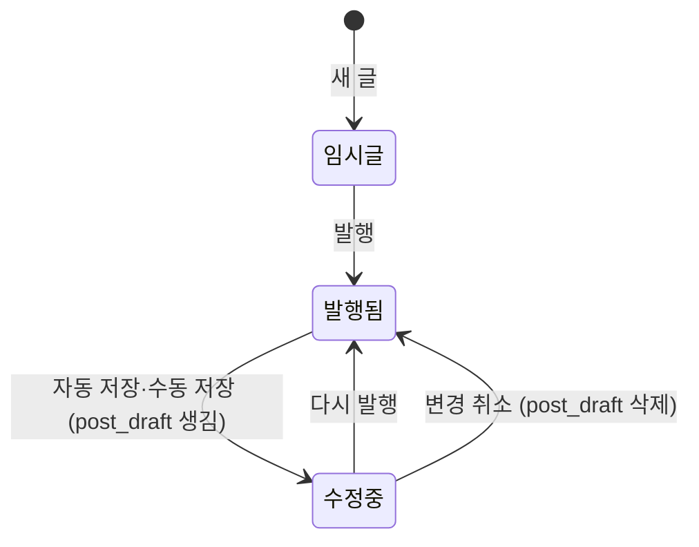

# 발행·수정 설계

> 작성일 2026-10-02 · 관련 요구사항: C-POST-3(발행·수정). 연관: C-POST-1(글 작성), C-POST-2(임시저장, [04 문서](./04-draft-and-image.md)), C-POST-4(공개 범위)
> 임시저장에서 정한 `post_draft`(작업본), `edit_version`(편집 버전), 충돌 비교 창을 그대로 이어받는다.

---

## 1. 결정 사항

| # | 안건 | 결정 | 이유 |
|---|---|---|---|
| P-1 | 발행 → 임시글로 되돌리기 | **두지 않는다.** 내리고 싶으면 비공개(`PRIVATE`)로 바꾼다 | 상태가 한 방향으로만 흐르면 조건문과 테스트가 단순해진다 |
| P-2 | "수정됨" 표시 | **`post.edited_at` 추가.** 다시 발행할 때만 기록 | `updated_at`은 자동 저장 반영 등에도 바뀌어서 "독자가 보는 내용이 바뀐 시각"과 의미가 다르다 |
| P-3 | 비공개로 발행했다가 나중에 공개한 글의 목록 위치 | **`post.first_public_at` 추가.** 홈·블로그 목록은 이 값으로 정렬 | 최초 발행일로 정렬하면 늦게 공개한 글이 목록 뒤쪽에 묻힌다. 친구 공개 → 전체 공개 전환(강성찬 OPEN-01)에서 바로 생기는 문제 |
| P-4 | 연타 방지 | **버튼 비활성화 + `Idempotency-Key`(Redis)** | 버튼만 막으면 네트워크 재전송은 막지 못한다 |
| P-5 | 태그 최대 개수 | **기본 10개**, 설정값 `blog.post.max-tags`로 각자 조정 | 강 5개 / 나·김 10개 |
| P-6 | 본문 최대 길이 | **100,000자** (DB CHECK) | 자동 저장 요청 1MB 제한과 맞춤 |

---

## 2. 글 상태



| 상태 | 판별 | 작성자에게 | 독자에게 |
|---|---|---|---|
| 임시글 | `status = DRAFT` | 내 글 관리에 보임 | 404 |
| 발행됨 | `status = PUBLISHED`, `post_draft` 없음 | 보임 | 공개 범위에 따라 보임 |
| 수정 중 | `status = PUBLISHED`, `post_draft` 있음 | "수정 중" 표시, 작업본을 편집 | **마지막 발행본** |

발행됨 → 임시글 전이는 없다 (P-1). 삭제는 C-POST-5에서 다룬다.

---

## 3. 시각 컬럼의 의미

| 컬럼 | 언제 기록 | 바뀌는가 | 어디에 쓰나 |
|---|---|---|---|
| `created_at` | [새 글]을 누를 때 | 안 바뀜 | 빈 임시글 정리 |
| `updated_at` | 행이 바뀔 때마다 (자동 저장 반영 포함) | 자주 바뀜 | 내 글 관리 정렬 |
| `published_at` | **최초 발행** 때 한 번 | 안 바뀜 | 작성자용 "발행일" |
| `first_public_at` | **처음으로 `PUBLISHED` + `PUBLIC`이 된 순간** 한 번 | 안 바뀜 | **홈·블로그 목록 정렬**, 독자에게 보이는 날짜 |
| `edited_at` | **다시 발행**할 때마다 | 바뀜 | 글 상세의 "수정됨 · 10월 3일" |

- `first_public_at`은 공개 → 비공개 → 다시 공개로 바꿔도 **처음 값을 유지**한다. 공개 범위를 껐다 켜는 것만으로 글을 목록 맨 위로 끌어올리는 일을 막기 위해서다.
- 공개 범위만 바꾸는 API(C-POST-4)도 같은 규칙으로 `first_public_at`을 채운다.

---

## 4. 발행 입력과 검증

| 항목 | 규칙 | 실패 시 |
|---|---|---|
| 제목 | 필수, 앞뒤 공백 제거 후 1~100자 | 400 `TITLE_REQUIRED` / `TITLE_TOO_LONG` |
| 본문 | 필수, 앞뒤 공백 제거 후 1자 이상, 최대 100,000자 | 400 `CONTENT_REQUIRED` / `CONTENT_TOO_LONG` |
| 태그 | 0~10개(설정값). 소문자로 바꾸고 앞뒤 공백을 지운 뒤 중복 제거, 각 1~30자 | 400 `TOO_MANY_TAGS` / `INVALID_TAG` |
| 공개 범위 | `PUBLIC` / `PRIVATE` (값 추가는 C-POST-4) | 400 `INVALID_VISIBILITY` |
| 사진 | 본문에 `local:` 주소(업로드 미완료 사진)가 없어야 함 | 400 `PENDING_IMAGES` |
| 요약 | 서버가 자동 생성: 정화된 HTML에서 코드 블록·이미지·표를 빼고 글자만 뽑아 앞 200자 ([10 §2-1](./10-post-list.md)) | — |
| 썸네일 | 서버가 자동 지정: 본문에 나오는 첫 번째 업로드 이미지의 **640px 썸네일** ([10 §6](./10-post-list.md)) | — |

검증 실패 응답에는 실패한 항목을 모두 담는다. 화면은 각 입력칸 옆에 이유를 표시한다.

```json
{ "code": "VALIDATION_FAILED",
  "errors": [ { "field": "title", "code": "TITLE_REQUIRED", "message": "제목을 입력해 주세요." } ] }
```

---

## 5. API

```
POST /api/posts/{postId}/publish
Idempotency-Key: 3f9c2a…                 ← [발행]을 누를 때마다 브라우저가 새로 만든 UUID
Content-Type: application/json

{ "title": "JPA N+1 정리", "contentMd": "## 문제\n…", "tags": ["spring", "jpa"],
  "visibility": "PUBLIC", "baseVersion": 13 }
```

| 응답 | 의미 | 본문 |
|---|---|---|
| `200` | 발행됨 (최초 또는 다시 발행) | `{ url: "/@alice/posts/42", publishedAt, firstPublicAt, editedAt, version: 14 }` |
| `400` | 검증 실패 | §4 형식 |
| `404` | 없는 글, 남의 글, 삭제된 글 | — |
| `409` `VERSION_CONFLICT` | 다른 탭·기기에서 먼저 저장함 | `{ server: { title, contentMd, version, savedAt } }` → 비교 창 ([04 §2-7](./04-draft-and-image.md)) |
| `409` `IN_PROGRESS` | 같은 키의 요청이 아직 처리 중 | 브라우저는 1초 뒤 같은 키로 재시도 |
| `422` `IDEMPOTENCY_KEY_REUSED` | 같은 키로 다른 내용을 보냄 | — (클라이언트 버그) |

SSR을 쓰는 팀원은 같은 Service를 폼 POST로 호출하고, 결과에 따라 글 상세로 리다이렉트하거나 에디터를 다시 보여준다.

---

## 6. 연타·재전송 방지 (`Idempotency-Key`)

버전 확인만으로는 부족하다. [발행]을 두 번 누르면 두 번째 요청은 옛 `baseVersion`을 들고 오기 때문에, 이미 성공했는데도 **409 충돌 창이 뜬다.**

```
요청 도착
 → SET idem:publish:{memberId}:{key} = {hash(요청 본문), "IN_PROGRESS"}  NX EX 600
    ├─ 새로 저장됨   → 발행 처리 → 성공하면 값을 {hash, 응답}으로 교체 (10분 보관)
    │                            실패하면 키 삭제 (같은 키로 다시 시도할 수 있게)
    └─ 이미 있음     → hash가 다르면 422
                       IN_PROGRESS면 409 IN_PROGRESS
                       완료됐으면 저장된 응답을 그대로 반환 (발행은 한 번만 일어남)
```

| 위치 | 장치 |
|---|---|
| 브라우저 | [발행]을 누르면 버튼 비활성화 + "발행 중…" 표시. 응답을 받을 때까지 다시 누를 수 없음 |
| 서버 | 위 Redis 키. Redis 장애 시에는 ③의 행 잠금과 ④의 버전 확인이 두 번째 요청을 409로 막는다 (중복 발행은 일어나지 않음) |

---

## 7. 서버 처리 순서

```
[트랜잭션 밖]
 ① 입력 검증 (§4)
 ② Markdown → HTML 렌더링 → sanitize ([12 문서](./12-content-sanitize.md) §2) → 요약 200자·썸네일·이미지 주소 목록 추출, render_version 기록
    CPU 작업이라 락을 잡기 전에 끝내서 트랜잭션을 짧게 유지한다

[트랜잭션]
 ③ SELECT … FROM post WHERE id = ? AND author_id = :me AND deleted_at IS NULL FOR UPDATE
    → 없으면 404
 ④ 현재 버전 = max(Redis 자동 저장 버전, post_draft.edit_version, post.edit_version)
    baseVersion ≠ 현재 버전이면 409 VERSION_CONFLICT
 ⑤ 태그: INSERT INTO tag … ON CONFLICT (name) DO NOTHING → 이 글의 post_tag 교체
 ⑥ post_image 동기화, 연결된 사진 status = ATTACHED, 빠진 사진 detached_at 기록
 ⑦ UPDATE post SET
      title, content_md, content_html, excerpt, thumbnail_url, visibility,
      status          = 'PUBLISHED',
      published_at    = COALESCE(published_at, now()),
      first_public_at = CASE WHEN first_public_at IS NULL AND visibility = 'PUBLIC'
                             THEN now() ELSE first_public_at END,
      edited_at       = CASE WHEN 최초 발행이 아님 THEN now() ELSE edited_at END,
      edit_version    = 현재 버전 + 1,
      updated_at      = now()
 ⑧ DELETE FROM post_draft WHERE post_id = ?

[커밋 후 — @TransactionalEventListener(AFTER_COMMIT)]
 ⑨ Redis 자동 저장 키를 "버전이 ④의 현재 버전 이하일 때만" 삭제 (아래 Lua)
 ⑩ 이벤트: 최초 발행이면 PostPublished, 다시 발행이면 PostEdited
    → 알림·검색 색인·sitemap은 나중에 리스너로 붙인다 (기존 코드 수정 없음)
 ⑪ Idempotency 키에 응답 저장
```

**⑨를 조건부로 지우는 이유:** 발행하는 사이에 다른 탭에서 자동 저장이 들어왔다면, 그 내용까지 지우면 안 된다.

```lua
-- KEYS[1] = autosave:post:{postId}, ARGV[1] = 발행 때 확인한 버전
local v = redis.call('HGET', KEYS[1], 'version')
if v and tonumber(v) <= tonumber(ARGV[1]) then return redis.call('DEL', KEYS[1]) end
return 0
```

---

## 8. 다시 발행(수정) 규칙

| 항목 | 규칙 |
|---|---|
| 주소 | 바뀌지 않는다 (`/@handle/posts/{id}`) |
| `published_at`, `first_public_at` | 바뀌지 않는다. 목록 순서가 흔들리지 않는다 |
| `edited_at` | 다시 발행할 때마다 기록, 글 상세에 "수정됨 · 10월 3일" |
| 조회수·좋아요·댓글 | 그대로 유지 |
| 공개 범위 | 다시 발행하면서 바꿀 수 있다 (`PUBLIC` ↔ `PRIVATE`) |
| 권한 | 작성자만. 관리자도 내용은 수정할 수 없고 숨김만 가능 (나민서 2.1, 김민서 §6 공통) |
| 이력 | 공통에서는 남기지 않는다. 발행 이력·되돌리기는 김민서 개인 확장(`post_revision`) |

---

## 9. JPA 구현 지침

| # | 지침 | 이유 |
|---|---|---|
| J-1 | 발행은 엔티티의 도메인 메서드로 한다. 예: `post.publish(PublishCommand cmd, RenderedContent html, Instant now)` | 최초 발행 판단, `published_at`·`first_public_at`·`edited_at` 규칙을 한곳에 모은다 |
| J-2 | 조회수·좋아요·댓글 수는 `@Modifying` 쿼리로 `SET like_count = like_count + 1`처럼 바꾼다 | 엔티티 필드로 바꾸면 변경 감지로 `updated_at`이 바뀌고, 동시에 고친 다른 필드를 덮어쓸 수 있다 |
| J-3 | `edit_version`에 JPA `@Version`을 붙이지 않는다 | Redis Lua와 스케줄러도 이 값을 다룬다. JPA가 자동으로 올리면 값이 어긋난다 |
| J-4 | ③의 잠금은 `@Lock(LockModeType.PESSIMISTIC_WRITE)` 조회 메서드로 한다 | 탭 두 개에서 동시에 [발행]을 눌러도 한 요청씩 처리된다 |
| J-5 | 트랜잭션 안에서 Redis 삭제·이벤트 후속 처리를 하지 않는다 (⑨~⑪은 커밋 후) | 커밋이 실패했는데 자동 저장 키만 지워지는 일을 막는다 |

---

## 10. 공통 완료 기준 (C-POST-3)

| # | 기준 | 확인 방법 |
|---|---|---|
| 1 | 발행하면 `/@handle/posts/{id}`에서 누구나 읽을 수 있다 (`PUBLIC`) | 통합 테스트: 발행 → 비로그인 조회 200 |
| 2 | 다시 발행하면 내용이 반영되고 주소·`published_at`·`first_public_at`·조회수·좋아요·댓글은 그대로다 | 다시 발행 전후 값 비교 |
| 3 | 수정 중(작업본 저장 상태)에는 독자에게 마지막 발행본이 보인다 | 작업본 저장 후 비로그인 조회 내용 비교 |
| 4 | [발행]을 연달아 보내도 한 번만 발행된다 | 같은 `Idempotency-Key`로 동시 20건 → `edit_version` 1만 증가 |
| 5 | 남의 글 발행·수정 요청은 404이고 글은 바뀌지 않는다 | 다른 회원으로 요청 → 404, DB 값 동일 |
| 6 | 제목·본문이 비었거나 업로드 미완료 사진이 있으면 발행되지 않는다 | 400 + `status = DRAFT` 유지 |
| 7 | 비공개로 발행한 글을 나중에 공개하면 목록에서 공개한 시점의 위치에 나온다 | `first_public_at` 정렬 확인 |
| 8 | 본문의 스크립트는 실행되지 않는다 (C-POST-1) | XSS 문자열 목록 테스트 |
