# 팀 공통 ERD 통합 명세

> 2026-10-06 · **기준: ERD Cloud "ai blog" 최신 상태** · 20개 테이블 / 149개 컬럼 / 41개 FK.
> ERD Cloud 원본: [erdcloud-export.sql](../erd/erdcloud-export.sql) (PK·FK 포함 내보내기). ERD Cloud에 칸이 없는 UNIQUE·CHECK·ON DELETE·인덱스는 [V1](../erd/V1__common_schema.sql)이 기준이다. 원문 01~45는 수정하지 않는다.

표기: ERD Cloud는 `DATETIME`, PostgreSQL은 `timestamptz`; 지금 시각 기본값은 `CURRENT_TIMESTAMP`. 사건 시각의 NULL과 기본값 없음은 유지한다. `PK1, PK2`는 복합 키 순서이며, 모든 FK의 삭제 동작을 명시한다. 원문에서 생략된 삭제 동작은 팀 결정에 따라 `RESTRICT`로 쓴다. 현재 시각 기본값은 INSERT에만 적용되고 `updated_at`의 후속 갱신은 애플리케이션이 수행한다.

FK는 **41개**다. 이전 통합본 33개에서 신고 FK 3개(신고자·대상 작성자·처리 관리자)를 사건·신고로 옮기고, 신고 사건 4개 + 신고 2개 + 회원 정지 3개 + 회원 동의 1개 + 친구 요청자 1개를 더했다 (33 − 3 + 11 = 41). 복합 댓글 부모 FK는 컬럼 두 개를 연결하는 **한 관계**로 센다. ERD Cloud에는 이 선이 `parent_id` 하나로 그려져 있다.

## 1. ERD

```mermaid
erDiagram
  IMAGE |o..o{ MEMBER : "profile_image_id / RESTRICT"
  MEMBER ||..o{ IMAGE : "uploader_id / RESTRICT"
  MEMBER ||..o| AUTH_IDENTITY : "member_id / RESTRICT"
  MEMBER ||--o{ MEMBER_AGREEMENT : "member_id / RESTRICT"
  MEMBER ||..o{ POST : "author_id / RESTRICT"
  MEMBER |o..o{ POST : "hidden_by / RESTRICT"
  POST ||--o| POST_DRAFT : "post_id / CASCADE"
  POST ||--o{ POST_LIKE : "post_id / CASCADE"
  MEMBER ||--o{ POST_LIKE : "member_id / RESTRICT"
  POST ||--o{ POST_VIEW_DAILY : "post_id / CASCADE"
  POST ||--o{ POST_TAG : "post_id / CASCADE"
  TAG ||--o{ POST_TAG : "tag_id / RESTRICT"
  POST ||--o{ POST_IMAGE : "post_id / CASCADE"
  IMAGE ||--o{ POST_IMAGE : "image_id / CASCADE"
  POST ||..o{ COMMENT : "post_id / CASCADE"
  MEMBER ||..o{ COMMENT : "author_id / RESTRICT"
  MEMBER |o..o{ COMMENT : "reply_to_member_id / RESTRICT"
  COMMENT |o..o{ COMMENT : "post_id, parent_id / CASCADE"
  MEMBER |o..o{ COMMENT : "hidden_by / RESTRICT"
  MEMBER ||--o{ FOLLOW : "follower_id / RESTRICT"
  MEMBER ||--o{ FOLLOW : "followee_id / RESTRICT"
  MEMBER ||--o{ FRIENDSHIP : "member_a_id / RESTRICT"
  MEMBER ||--o{ FRIENDSHIP : "member_b_id / RESTRICT"
  MEMBER ||..o{ FRIENDSHIP : "requested_by / RESTRICT"
  MEMBER ||..o{ REPORT : "reporter_id / RESTRICT"
  REPORT_CASE ||..o{ REPORT : "case_id / RESTRICT"
  POST |o..o{ REPORT_CASE : "post_id / SET NULL"
  COMMENT |o..o{ REPORT_CASE : "comment_id / SET NULL"
  MEMBER ||..o{ REPORT_CASE : "target_author_id / RESTRICT"
  MEMBER |o..o{ REPORT_CASE : "handled_by / RESTRICT"
  MEMBER ||..o{ MEMBER_SUSPENSION : "member_id / RESTRICT"
  MEMBER ||..o{ MEMBER_SUSPENSION : "suspended_by / RESTRICT"
  MEMBER |o..o{ MEMBER_SUSPENSION : "lifted_by / RESTRICT"
  MEMBER ||..o{ NOTIFICATION : "receiver_id / RESTRICT"
  POST |o..o{ NOTIFICATION : "post_id / CASCADE"
  COMMENT |o..o{ NOTIFICATION : "comment_id / CASCADE"
  MEMBER |o..o{ NOTIFICATION : "last_actor_id / RESTRICT"
  REPORT |o..o{ NOTIFICATION : "report_id / SET NULL"
  NOTIFICATION ||--o{ NOTIFICATION_ACTOR : "notification_id / CASCADE"
  MEMBER ||--o{ NOTIFICATION_ACTOR : "actor_id / RESTRICT"
  MEMBER ||--o{ NOTIFICATION_MUTE : "member_id / RESTRICT"
  MEMBER {
    BIGINT id PK "회원 번호"
    VARCHAR(39) handle UK "블로그 주소"
    VARCHAR(10) nickname UK "닉네임"
    DATETIME nickname_changed_at "닉네임 변경 일자"
    VARCHAR(200) bio "소개"
    BIGINT profile_image_id FK "프로필 사진 번호"
    VARCHAR(500) profile_image_url "프로필 사진 주소"
    VARCHAR(20) role "권한"
    VARCHAR(20) status "회원 상태"
    VARCHAR(20) default_visibility "기본 공개 범위"
    DATETIME created_at "생성 일자"
    DATETIME updated_at "수정 일자"
    DATETIME withdrawn_at "탈퇴 신청 일자"
    DATETIME deleted_at "익명 처리 일자"
  }
  IMAGE {
    BIGINT id PK "사진 번호"
    BIGINT uploader_id FK "올린 회원 번호"
    VARCHAR(255) storage_key UK "저장 경로"
    VARCHAR(255) thumb_storage_key UK "썸네일 경로"
    VARCHAR(255) original_name "원래 파일 이름"
    VARCHAR(50) content_type "파일 형식"
    INT size_bytes "원본 크기"
    INT thumb_size_bytes "썸네일 크기"
    INT width "가로"
    INT height "세로"
    VARCHAR(20) status "사진 상태"
    VARCHAR(20) purpose "용도"
    DATETIME detached_at "연결 해제 일자"
    DATETIME created_at "생성 일자"
  }
  AUTH_IDENTITY {
    BIGINT id PK "로그인 수단 번호"
    BIGINT member_id FK, UK "회원 번호"
    VARCHAR(20) provider UK "로그인 방식"
    VARCHAR(255) provider_user_id UK "로그인 식별값"
    VARCHAR(255) email "이메일"
    VARCHAR(100) password_hash "비밀번호 해시"
    DATETIME email_verified_at "이메일 인증 일자"
    DATETIME created_at "생성 일자"
    DATETIME last_login_at "마지막 로그인 일자"
  }
  MEMBER_AGREEMENT {
    BIGINT member_id PK, FK "회원 번호"
    VARCHAR(20) type PK "동의 종류"
    DATETIME agreed_at "동의 일자"
  }
  TAG {
    BIGINT id PK "태그 번호"
    VARCHAR(30) name UK "태그 이름"
    DATETIME created_at "생성 일자"
  }
  POST {
    BIGINT id PK "글 번호"
    BIGINT author_id FK "작성자 번호"
    VARCHAR(100) title "제목"
    TEXT content_md "본문 원문"
    TEXT content_html "렌더링 본문"
    VARCHAR(200) excerpt "목록 요약"
    VARCHAR(500) thumbnail_url "썸네일 주소"
    VARCHAR(20) status "글 상태"
    VARCHAR(20) visibility "공개 범위"
    BIGINT view_count "조회 수"
    INT like_count "좋아요 수"
    INT comment_count "댓글 수"
    BIGINT edit_version "편집 버전"
    INT render_version "렌더링 버전"
    DATETIME published_at "최초 발행 일자"
    DATETIME first_public_at "최초 공개 일자"
    DATETIME edited_at "재발행 일자"
    DATETIME created_at "생성 일자"
    DATETIME updated_at "수정 일자"
    DATETIME deleted_at "삭제 일자"
    DATETIME hidden_at "숨김 일자"
    BIGINT hidden_by FK "숨긴 관리자 번호"
    VARCHAR(30) hidden_reason "숨김 사유"
  }
  POST_DRAFT {
    BIGINT post_id PK, FK "글 번호"
    VARCHAR(100) title "작업 제목"
    TEXT content_md "작업 본문"
    BIGINT edit_version "편집 버전"
    DATETIME created_at "생성 일자"
    DATETIME updated_at "수정 일자"
  }
  POST_LIKE {
    BIGINT post_id PK, FK "글 번호"
    BIGINT member_id PK, FK "회원 번호"
    DATETIME created_at "생성 일자"
  }
  POST_VIEW_DAILY {
    BIGINT post_id PK, FK "글 번호"
    DATE view_date PK "조회 일자"
    INT views "조회 수"
  }
  POST_TAG {
    BIGINT post_id PK, FK, UK "글 번호"
    BIGINT tag_id PK, FK "태그 번호"
    SMALLINT position UK "입력 순서"
  }
  POST_IMAGE {
    BIGINT post_id PK, FK "글 번호"
    BIGINT image_id PK, FK "사진 번호"
  }
  COMMENT {
    BIGINT id PK, UK "댓글 번호"
    BIGINT post_id FK, UK "글 번호"
    BIGINT author_id FK "작성자 번호"
    BIGINT parent_id FK "부모 댓글 번호"
    BIGINT reply_to_member_id FK "답글 대상 회원 번호"
    VARCHAR(1000) content "내용"
    DATETIME created_at "생성 일자"
    DATETIME updated_at "수정 일자"
    DATETIME deleted_at "삭제 일자"
    DATETIME hidden_at "숨김 일자"
    BIGINT hidden_by FK "숨긴 관리자 번호"
    VARCHAR(30) hidden_reason "숨김 사유"
  }
  FOLLOW {
    BIGINT follower_id PK, FK "팔로우하는 회원 번호"
    BIGINT followee_id PK, FK "팔로우받는 회원 번호"
    DATETIME created_at "생성 일자"
  }
  FRIENDSHIP {
    BIGINT member_a_id PK, FK "회원 A 번호"
    BIGINT member_b_id PK, FK "회원 B 번호"
    BIGINT requested_by FK "요청 회원 번호"
    VARCHAR(20) status "관계 상태"
    DATETIME created_at "생성 일자"
    DATETIME accepted_at "수락 일자"
  }
  REPORT_CASE {
    BIGINT id PK "신고 사건 번호"
    VARCHAR(20) target_type "신고 대상 종류"
    BIGINT post_id FK "신고 글 번호"
    BIGINT comment_id FK "신고 댓글 번호"
    BIGINT target_author_id FK "대상 작성자 번호"
    VARCHAR(100) snapshot_title "신고 시점 제목"
    VARCHAR(2000) snapshot_content "신고 시점 내용"
    VARCHAR(20) status "처리 상태"
    BIGINT handled_by FK "처리 관리자 번호"
    DATETIME handled_at "처리 일자"
    DATETIME closed_at "종료 일자"
    DATETIME created_at "생성 일자"
  }
  REPORT {
    BIGINT id PK "신고 번호"
    BIGINT case_id FK, UK "신고 사건 번호"
    BIGINT reporter_id FK, UK "신고자 번호"
    VARCHAR(30) reason "신고 사유"
    VARCHAR(200) detail "신고 설명"
    DATETIME created_at "생성 일자"
  }
  MEMBER_SUSPENSION {
    BIGINT id PK "정지 번호"
    BIGINT member_id FK "정지 회원 번호"
    VARCHAR(200) reason "정지 사유"
    DATETIME started_at "정지 시작 일자"
    DATETIME ends_at "정지 종료 일자"
    BIGINT suspended_by FK "정지 관리자 번호"
    DATETIME lifted_at "정지 해제 일자"
    BIGINT lifted_by FK "해제 관리자 번호"
  }
  NOTIFICATION {
    BIGINT id PK "알림 번호"
    BIGINT receiver_id FK "받는 회원 번호"
    VARCHAR(30) type "알림 종류"
    BIGINT post_id FK "관련 글 번호"
    BIGINT comment_id FK "관련 댓글 번호"
    BIGINT report_id FK "관련 신고 번호"
    VARCHAR(20) result "신고 결과"
    BIGINT last_actor_id FK "마지막 행동 회원 번호"
    INT actor_count "묶인 인원 수"
    VARCHAR(100) group_key "묶음 키"
    DATETIME read_at "읽은 일자"
    DATETIME created_at "생성 일자"
    DATETIME updated_at "수정 일자"
  }
  NOTIFICATION_ACTOR {
    BIGINT notification_id PK, FK "알림 번호"
    BIGINT actor_id PK, FK "행동 회원 번호"
    DATETIME created_at "생성 일자"
  }
  NOTIFICATION_MUTE {
    BIGINT member_id PK, FK "회원 번호"
    VARCHAR(30) type PK "끈 알림 종류"
    DATETIME created_at "생성 일자"
  }
```



실선은 자식 PK에 포함되는 식별 관계, 점선은 비식별 관계다. 작업본은 글 1개에 0..1개이고, 로그인 수단도 회원 1개에 최대 1개다 (탈퇴 익명 처리 후 0개). 프로필 사진 FK에는 UNIQUE가 없어 DB 카디널리티는 사진 1개에 회원 0..N명이며, 소유자·PROFILE 용도 검사는 Service 규칙이다. 회원 동의는 회원 1명에 종류별 1행(식별 관계)이고, 신고 사건 1개에 신고 1건 이상, 회원 1명에 정지 이력 0..N건이다. 신고 사건의 글·댓글 FK는 둘 중 하나만 채운다.

## 2. 테이블별 컬럼표

설명 칸은 ERD Cloud 설명 칸(2026-10-06)을 그대로 옮겼다. ERD Cloud 설명이 빈 컬럼만 이전 명세의 설명을 남겼다. 머리말 괄호는 ERD Cloud 색 기준인 기능 영역이다.

### member — 회원 (회원·인증, 14개)

| 순서 | 물리명 | 논리명 | 타입(ERD Cloud 표기) | NULL | 기본값 | 키 | 참조·ON DELETE | 설명 | 출처 문서 |
| --- | --- | --- | --- | --- | --- | --- | --- | --- | --- |
| 1 | id | 회원 번호 | BIGINT | 불가 | AUTO_INCREMENT | PK1 | — | PK, 자동 증가 | [03](./03-erd.md) |
| 2 | handle | 블로그 주소 | VARCHAR(39) | 불가 | — | UQ | — | /@handle. 소문자·숫자·_ 3~36자, 소셜 가입은 go-·gi- 접두어. 가입 후 변경 불가, 탈퇴 후에도 재사용 불가 (08). 유일 | [03](./03-erd.md) |
| 3 | nickname | 닉네임 | VARCHAR(10) | 허용 | — | UQ(lower) | — | 2~10자 한글·영문·숫자, 대소문자 무시 유일. 익명 처리 후에만 비움 (09) | [03](./03-erd.md) |
| 4 | nickname_changed_at | 닉네임 변경 일자 | DATETIME | 허용 | — | — | — | 30일 변경 제한 판단 (09) | [03](./03-erd.md) |
| 5 | bio | 소개 | VARCHAR(200) | 허용 | — | — | — | 0~200자, 글자만 (11) | [03](./03-erd.md) |
| 6 | profile_image_id | 프로필 사진 번호 | BIGINT | 허용 | — | FK | image(id); RESTRICT | FK → image. 비어 있으면 기본 아이콘 (11) | [03](./03-erd.md) |
| 7 | profile_image_url | 프로필 사진 주소 | VARCHAR(500) | 허용 | — | — | — | 목록마다 image를 JOIN하지 않으려고 둔 복사본 (의도된 중복) | [03](./03-erd.md) |
| 8 | role | 권한 | VARCHAR(20) | 불가 | 'USER' | — | — | USER / ADMIN | [03](./03-erd.md) |
| 9 | status | 회원 상태 | VARCHAR(20) | 불가 | 'ACTIVE' | — | — | ACTIVE / SUSPENDED(정지 중, 근거는 member_suspension) / WITHDRAWN(탈퇴 유예) | [03](./03-erd.md) |
| 10 | default_visibility | 기본 공개 범위 | VARCHAR(20) | 불가 | 'PUBLIC' | — | — | 새 글의 공개 범위 PUBLIC / PRIVATE (06) | [03](./03-erd.md) |
| 11 | created_at | 생성 일자 | DATETIME | 불가 | CURRENT_TIMESTAMP | — | — | 가입한 일자 | [03](./03-erd.md) |
| 12 | updated_at | 수정 일자 | DATETIME | 불가 | CURRENT_TIMESTAMP | — | — | 회원 정보를 마지막으로 바꾼 일자 | [03](./03-erd.md) |
| 13 | withdrawn_at | 탈퇴 신청 일자 | DATETIME | 허용 | — | — | — | 30일 유예 시작. status = WITHDRAWN일 때만 (13) | [03](./03-erd.md) |
| 14 | deleted_at | 익명 처리 일자 | DATETIME | 허용 | — | — | — | 탈퇴 30일 뒤 개인 정보를 지운 일자. handle만 남김 (13) | [03](./03-erd.md) |


### image — 사진 (글 부속, 14개)

| 순서 | 물리명 | 논리명 | 타입(ERD Cloud 표기) | NULL | 기본값 | 키 | 참조·ON DELETE | 설명 | 출처 문서 |
| --- | --- | --- | --- | --- | --- | --- | --- | --- | --- |
| 1 | id | 사진 번호 | BIGINT | 불가 | AUTO_INCREMENT | PK1 | — | PK, 자동 증가 | [03](./03-erd.md) |
| 2 | uploader_id | 올린 회원 번호 | BIGINT | 불가 | — | FK | member(id); RESTRICT | FK → member | [03](./03-erd.md) |
| 3 | storage_key | 저장 경로 | VARCHAR(255) | 불가 | — | UQ | — | images/년/월/uuid.확장자, 서버가 만듦, 유일 | [03](./03-erd.md) |
| 4 | thumb_storage_key | 썸네일 경로 | VARCHAR(255) | 허용 | — | UQ | — | 640px 썸네일, 유일 | [03](./03-erd.md) |
| 5 | original_name | 원래 파일 이름 | VARCHAR(255) | 불가 | — | — | — | 기록용, 대체글로 쓰지 않음 | [03](./03-erd.md) |
| 6 | content_type | 파일 형식 | VARCHAR(50) | 불가 | — | — | — | image/jpeg, png, gif, webp 만 | [03](./03-erd.md) |
| 7 | size_bytes | 원본 크기 | INT | 불가 | — | — | — | 1바이트~10MB | [03](./03-erd.md) |
| 8 | thumb_size_bytes | 썸네일 크기 | INT | 허용 | — | — | — | 1바이트~1MB, 1인 1GB 한도에 함께 셈 | [23](./23-image.md) |
| 9 | width | 가로 | INT | 허용 | — | — | — | 픽셀 | [03](./03-erd.md) |
| 10 | height | 세로 | INT | 허용 | — | — | — | 픽셀 | [03](./03-erd.md) |
| 11 | status | 사진 상태 | VARCHAR(20) | 불가 | 'TEMP' | — | — | TEMP(올리기만 함) → ATTACHED(연결됨) | [03](./03-erd.md) |
| 12 | purpose | 용도 | VARCHAR(20) | 불가 | 'POST' | — | — | POST(글 사진) / PROFILE(프로필 사진) | [03](./03-erd.md) |
| 13 | detached_at | 연결 해제 일자 | DATETIME | 허용 | — | — | — | 글·프로필에서 빠진 일자, 7일 뒤 정리 | [03](./03-erd.md) |
| 14 | created_at | 생성 일자 | DATETIME | 불가 | CURRENT_TIMESTAMP | — | — | 올린 일자 | [03](./03-erd.md) |


### auth_identity — 로그인 수단 (회원·인증, 9개)

| 순서 | 물리명 | 논리명 | 타입(ERD Cloud 표기) | NULL | 기본값 | 키 | 참조·ON DELETE | 설명 | 출처 문서 |
| --- | --- | --- | --- | --- | --- | --- | --- | --- | --- |
| 1 | id | 로그인 수단 번호 | BIGINT | 불가 | AUTO_INCREMENT | PK1 | — | PK, 자동 증가 | [03](./03-erd.md) |
| 2 | member_id | 회원 번호 | BIGINT | 불가 | — | FK, UQ | member(id); RESTRICT | FK → member. 계정당 1개 (유일) | [03](./03-erd.md) |
| 3 | provider | 로그인 방식 | VARCHAR(20) | 불가 | — | UQ(복합) | — | LOCAL(이메일) / GITHUB / GOOGLE | [03](./03-erd.md) |
| 4 | provider_user_id | 로그인 식별값 | VARCHAR(255) | 불가 | — | UQ(복합) | — | 제공자의 사용자 ID, 이메일 가입은 소문자 이메일. (provider, provider_user_id) 유일 | [03](./03-erd.md) |
| 5 | email | 이메일 | VARCHAR(255) | 허용 | — | — | — | 이메일 가입은 필수(소문자), 소셜은 받은 경우만 | [03](./03-erd.md) |
| 6 | password_hash | 비밀번호 해시 | VARCHAR(100) | 허용 | — | — | — | 이메일 가입만 | [03](./03-erd.md) |
| 7 | email_verified_at | 이메일 인증 일자 | DATETIME | 허용 | — | — | — | 비어 있으면 인증 전 → 글·댓글·사진·좋아요·신고 불가 (42 P-6) | [03](./03-erd.md) |
| 8 | created_at | 생성 일자 | DATETIME | 불가 | CURRENT_TIMESTAMP | — | — | 로그인 수단을 등록한 일자 | [03](./03-erd.md) |
| 9 | last_login_at | 마지막 로그인 일자 | DATETIME | 허용 | — | — | — | 마지막 로그인 성공. | [03](./03-erd.md) |


### member_agreement — 회원 동의 (회원·인증, 3개)

| 순서 | 물리명 | 논리명 | 타입(ERD Cloud 표기) | NULL | 기본값 | 키 | 참조·ON DELETE | 설명 | 출처 문서 |
| --- | --- | --- | --- | --- | --- | --- | --- | --- | --- |
| 1 | member_id | 회원 번호 | BIGINT | 불가 | — | PK1, FK | member(id); RESTRICT | PK + FK → member | [07](./07-auth.md) · ERD Cloud 2026-10-06 |
| 2 | type | 동의 종류 | VARCHAR(20) | 불가 | — | PK2 | — | PK. TERMS(이용약관) / PRIVACY(개인정보 처리방침) / AI(글 내용 외부 AI 전송, 34) | [07](./07-auth.md) · [34](./34-ai-tag-suggest.md) |
| 3 | agreed_at | 동의 일자 | DATETIME | 불가 | CURRENT_TIMESTAMP | — | — | 동의한 일자. AI 동의를 철회하면 행 삭제 | ERD Cloud 2026-10-06 |


### tag — 태그 (글 부속, 3개)

| 순서 | 물리명 | 논리명 | 타입(ERD Cloud 표기) | NULL | 기본값 | 키 | 참조·ON DELETE | 설명 | 출처 문서 |
| --- | --- | --- | --- | --- | --- | --- | --- | --- | --- |
| 1 | id | 태그 번호 | BIGINT | 불가 | AUTO_INCREMENT | PK1 | — | PK, 자동 증가 | [22](./22-tag.md) |
| 2 | name | 태그 이름 | VARCHAR(30) | 불가 | — | UQ | — | 유일. 한글·영문 소문자·숫자·- _ . + # 만, 1~30자, 띄어쓰기는 하이픈 | [22](./22-tag.md) |
| 3 | created_at | 생성 일자 | DATETIME | 불가 | CURRENT_TIMESTAMP | — | — | 처음 쓰인 일자 | [22](./22-tag.md) |


### post — 글 (글, 23개)

| 순서 | 물리명 | 논리명 | 타입(ERD Cloud 표기) | NULL | 기본값 | 키 | 참조·ON DELETE | 설명 | 출처 문서 |
| --- | --- | --- | --- | --- | --- | --- | --- | --- | --- |
| 1 | id | 글 번호 | BIGINT | 불가 | AUTO_INCREMENT | PK1 | — | PK, 자동 증가 | [03](./03-erd.md) |
| 2 | author_id | 작성자 번호 | BIGINT | 불가 | — | FK | member(id); RESTRICT | FK → member | [03](./03-erd.md) |
| 3 | title | 제목 | VARCHAR(100) | 불가 | '' | — | — | 최대 100자, 발행하려면 필수 (05) | [03](./03-erd.md) |
| 4 | content_md | 본문 원문 | TEXT | 불가 | '' | — | — | Markdown 원문, 최대 100,000자 (12) | [03](./03-erd.md) |
| 5 | content_html | 렌더링 본문 | TEXT | 불가 | '' | — | — | 정화된 HTML, 화면에 그대로 출력 (12) | [03](./03-erd.md) |
| 6 | excerpt | 목록 요약 | VARCHAR(200) | 허용 | — | — | — | 목록 카드 요약 (10) | [03](./03-erd.md) |
| 7 | thumbnail_url | 썸네일 주소 | VARCHAR(500) | 허용 | — | — | — | 목록 카드 썸네일 (10) | [03](./03-erd.md) |
| 8 | status | 글 상태 | VARCHAR(20) | 불가 | 'DRAFT' | — | — | DRAFT(임시) / PUBLISHED(발행) | [03](./03-erd.md) |
| 9 | visibility | 공개 범위 | VARCHAR(20) | 불가 | 'PUBLIC' | — | — | PUBLIC / PRIVATE (친구 공개 구현 시 FRIENDS) | [03](./03-erd.md) |
| 10 | view_count | 조회 수 | BIGINT | 불가 | 0 | — | — | 의도된 중복 (31) | [03](./03-erd.md) |
| 11 | like_count | 좋아요 수 | INT | 불가 | 0 | — | — | 의도된 중복, post_like 행과 같은 트랜잭션에서 증감 (30) | [03](./03-erd.md) |
| 12 | comment_count | 댓글 수 | INT | 불가 | 0 | — | — | 보이는 댓글 수 = 삭제·숨김 제외 (21) | [03](./03-erd.md) |
| 13 | edit_version | 편집 버전 | BIGINT | 불가 | 0 | — | — | 자동 저장 충돌 방지 (04) | [03](./03-erd.md) |
| 14 | render_version | 렌더링 버전 | INT | 불가 | 1 | — | — | 렌더링 규칙이 바뀌면 다시 렌더링 (12) | [03](./03-erd.md) |
| 15 | published_at | 최초 발행 일자 | DATETIME | 허용 | — | — | — | (05) | [03](./03-erd.md) |
| 16 | first_public_at | 최초 공개 일자 | DATETIME | 허용 | — | — | — | 목록 정렬 기준, 한 번 정해지면 안 바뀜 (05·06·10) | [03](./03-erd.md) |
| 17 | edited_at | 재발행 일자 | DATETIME | 허용 | — | — | — | 다시 발행한 일자, 수정됨 표시 (05) | [03](./03-erd.md) |
| 18 | created_at | 생성 일자 | DATETIME | 불가 | CURRENT_TIMESTAMP | — | — | 행 생성 시 기록. | [03](./03-erd.md) |
| 19 | updated_at | 수정 일자 | DATETIME | 불가 | CURRENT_TIMESTAMP | — | — | 행 갱신 시 애플리케이션이 갱신. | [03](./03-erd.md) |
| 20 | deleted_at | 삭제 일자 | DATETIME | 허용 | — | — | — | 휴지통으로 옮긴 일자, 30일 뒤 완전 삭제 (13) | [03](./03-erd.md) |
| 21 | hidden_at | 숨김 일자 | DATETIME | 허용 | — | — | — | 관리자 숨김. 목록 조건 hidden_at IS NULL (43) | [43](./43-report-hide.md) |
| 22 | hidden_by | 숨긴 관리자 번호 | BIGINT | 허용 | — | FK | member(id); RESTRICT | FK → member (43) | [43](./43-report-hide.md) |
| 23 | hidden_reason | 숨김 사유 | VARCHAR(30) | 허용 | — | — | — | (43) | [43](./43-report-hide.md) |


### post_draft — 글 작업본 (글, 6개)

| 순서 | 물리명 | 논리명 | 타입(ERD Cloud 표기) | NULL | 기본값 | 키 | 참조·ON DELETE | 설명 | 출처 문서 |
| --- | --- | --- | --- | --- | --- | --- | --- | --- | --- |
| 1 | post_id | 글 번호 | BIGINT | 불가 | — | PK1, FK | post(id); CASCADE | PK + FK → post, 글이 지워지면 함께 삭제 | [03](./03-erd.md) |
| 2 | title | 작업 제목 | VARCHAR(100) | 불가 | '' | — | — | 독자가 보는 발행본과 분리한 제목. | [03](./03-erd.md) |
| 3 | content_md | 작업 본문 | TEXT | 불가 | '' | — | — | 최대 100,000자 | [03](./03-erd.md) |
| 4 | edit_version | 편집 버전 | BIGINT | 불가 | 0 | — | — | 늦게 온 옛 저장이 덮어쓰지 않게 | [03](./03-erd.md) |
| 5 | created_at | 생성 일자 | DATETIME | 불가 | CURRENT_TIMESTAMP | — | — | 수정을 시작한 일자 | [03](./03-erd.md) |
| 6 | updated_at | 수정 일자 | DATETIME | 불가 | CURRENT_TIMESTAMP | — | — | 마지막 저장 일자 | [03](./03-erd.md) |


### post_like — 글 좋아요 (반응·통계, 3개)

| 순서 | 물리명 | 논리명 | 타입(ERD Cloud 표기) | NULL | 기본값 | 키 | 참조·ON DELETE | 설명 | 출처 문서 |
| --- | --- | --- | --- | --- | --- | --- | --- | --- | --- |
| 1 | post_id | 글 번호 | BIGINT | 불가 | — | PK1, FK | post(id); CASCADE | PK + FK → post, 글이 지워지면 함께 삭제 | [03](./03-erd.md) |
| 2 | member_id | 회원 번호 | BIGINT | 불가 | — | PK2, FK | member(id); RESTRICT | PK + FK → member, 누른 사람 | [03](./03-erd.md) |
| 3 | created_at | 생성 일자 | DATETIME | 불가 | CURRENT_TIMESTAMP | — | — | 누른 일자 | [03](./03-erd.md) |


### post_view_daily — 일별 조회 수 (반응·통계, 3개)

| 순서 | 물리명 | 논리명 | 타입(ERD Cloud 표기) | NULL | 기본값 | 키 | 참조·ON DELETE | 설명 | 출처 문서 |
| --- | --- | --- | --- | --- | --- | --- | --- | --- | --- |
| 1 | post_id | 글 번호 | BIGINT | 불가 | — | PK1, FK | post(id); CASCADE | PK + FK → post, 글이 지워지면 함께 삭제 | [31](./31-view-count.md) |
| 2 | view_date | 조회 일자 | DATE | 불가 | — | PK2 | — | PK. 한국 시간 기준 날짜 (DATE 타입) | [31](./31-view-count.md) |
| 3 | views | 조회 수 | INT | 불가 | — | — | — | 그날 합계, 1 이상 | [31](./31-view-count.md) |


### post_tag — 글-태그 연결 (글 부속, 3개)

| 순서 | 물리명 | 논리명 | 타입(ERD Cloud 표기) | NULL | 기본값 | 키 | 참조·ON DELETE | 설명 | 출처 문서 |
| --- | --- | --- | --- | --- | --- | --- | --- | --- | --- |
| 1 | post_id | 글 번호 | BIGINT | 불가 | — | PK1, FK, UQ(복합) | post(id); CASCADE | PK + FK → post, 글이 지워지면 함께 삭제 | [22](./22-tag.md) |
| 2 | tag_id | 태그 번호 | BIGINT | 불가 | — | PK2, FK | tag(id); RESTRICT | PK + FK → tag | [22](./22-tag.md) |
| 3 | position | 입력 순서 | SMALLINT | 불가 | — | UQ(복합) | — | 0부터, 한 글 안에서 중복 없음 (0~99) | [22](./22-tag.md) |


### post_image — 글-사진 연결 (글 부속, 2개)

| 순서 | 물리명 | 논리명 | 타입(ERD Cloud 표기) | NULL | 기본값 | 키 | 참조·ON DELETE | 설명 | 출처 문서 |
| --- | --- | --- | --- | --- | --- | --- | --- | --- | --- |
| 1 | post_id | 글 번호 | BIGINT | 불가 | — | PK1, FK | post(id); CASCADE | PK + FK → post, 글이 지워지면 함께 삭제 | [03](./03-erd.md) |
| 2 | image_id | 사진 번호 | BIGINT | 불가 | — | PK2, FK | image(id); CASCADE | PK + FK → image, 사진이 지워지면 함께 삭제 | [03](./03-erd.md) |


### comment — 댓글 (반응·통계, 12개)

| 순서 | 물리명 | 논리명 | 타입(ERD Cloud 표기) | NULL | 기본값 | 키 | 참조·ON DELETE | 설명 | 출처 문서 |
| --- | --- | --- | --- | --- | --- | --- | --- | --- | --- |
| 1 | id | 댓글 번호 | BIGINT | 불가 | AUTO_INCREMENT | PK1, UQ(복합) | — | PK, 자동 증가 | [21](./21-comment.md) |
| 2 | post_id | 글 번호 | BIGINT | 불가 | — | FK, UQ(복합) | post(id); CASCADE<br>comment(post_id, id); CASCADE [복합: post_id, parent_id] | FK → post, 글이 지워지면 함께 삭제 | [21](./21-comment.md) |
| 3 | author_id | 작성자 번호 | BIGINT | 불가 | — | FK | member(id); RESTRICT | FK → member | [21](./21-comment.md) |
| 4 | parent_id | 부모 댓글 번호 | BIGINT | 허용 | — | FK | comment(post_id, id); CASCADE [복합: post_id, parent_id] | 답글이면 최상위 댓글 번호, 같은 글의 댓글만 (실제 FK는 post_id와 함께 거는 복합 FK) | [21](./21-comment.md) |
| 5 | reply_to_member_id | 답글 대상 회원 번호 | BIGINT | 허용 | — | FK | member(id); RESTRICT | FK → member, @대상에게 표시 | [21](./21-comment.md) |
| 6 | content | 내용 | VARCHAR(1000) | 불가 | — | — | — | 1~1000자, 글자만. 삭제된 자리는 빈 내용 | [21](./21-comment.md) |
| 7 | created_at | 생성 일자 | DATETIME | 불가 | CURRENT_TIMESTAMP | — | — | 쓴 일자 | [21](./21-comment.md) |
| 8 | updated_at | 수정 일자 | DATETIME | 불가 | CURRENT_TIMESTAMP | — | — | 내용을 고칠 때만 바뀜 → 수정됨 표시 | [21](./21-comment.md) |
| 9 | deleted_at | 삭제 일자 | DATETIME | 허용 | — | — | — | 답글이 있어 자리만 남긴 삭제 또는 탈퇴 익명 처리 | [21](./21-comment.md) |
| 10 | hidden_at | 숨김 일자 | DATETIME | 허용 | — | — | — | 관리자 숨김 (43) | [21](./21-comment.md) · [43](./43-report-hide.md) |
| 11 | hidden_by | 숨긴 관리자 번호 | BIGINT | 허용 | — | FK | member(id); RESTRICT | FK → member (43) | [43](./43-report-hide.md) |
| 12 | hidden_reason | 숨김 사유 | VARCHAR(30) | 허용 | — | — | — | (43) | [43](./43-report-hide.md) |


### follow — 팔로우 (관계, 3개)

| 순서 | 물리명 | 논리명 | 타입(ERD Cloud 표기) | NULL | 기본값 | 키 | 참조·ON DELETE | 설명 | 출처 문서 |
| --- | --- | --- | --- | --- | --- | --- | --- | --- | --- |
| 1 | follower_id | 팔로우하는 회원 번호 | BIGINT | 불가 | — | PK1, FK | member(id); RESTRICT | PK + FK → member | [24](./24-follow-feed.md) |
| 2 | followee_id | 팔로우받는 회원 번호 | BIGINT | 불가 | — | PK2, FK | member(id); RESTRICT | PK + FK → member. 자기 자신은 불가 | [24](./24-follow-feed.md) |
| 3 | created_at | 생성 일자 | DATETIME | 불가 | CURRENT_TIMESTAMP | — | — | 팔로우한 일자 | [24](./24-follow-feed.md) |


### friendship — 친구 관계 (관계, 6개)

| 순서 | 물리명 | 논리명 | 타입(ERD Cloud 표기) | NULL | 기본값 | 키 | 참조·ON DELETE | 설명 | 출처 문서 |
| --- | --- | --- | --- | --- | --- | --- | --- | --- | --- |
| 1 | member_a_id | 회원 A 번호 | BIGINT | 불가 | — | PK1, FK | member(id); RESTRICT | PK + FK → member. 두 번호 중 작은 쪽 | [06](./06-visibility.md) |
| 2 | member_b_id | 회원 B 번호 | BIGINT | 불가 | — | PK2, FK | member(id); RESTRICT | PK + FK → member. 두 번호 중 큰 쪽 | [06](./06-visibility.md) |
| 3 | requested_by | 요청 회원 번호 | BIGINT | 불가 | — | FK | member(id); RESTRICT | FK → member (개선: 외래키 추가). A 또는 B 중 하나 | [06](./06-visibility.md) |
| 4 | status | 관계 상태 | VARCHAR(20) | 불가 | 'PENDING' | — | — | PENDING(요청 중) / ACCEPTED(친구) | [06](./06-visibility.md) |
| 5 | created_at | 생성 일자 | DATETIME | 불가 | CURRENT_TIMESTAMP | — | — | 요청한 일자 | [06](./06-visibility.md) |
| 6 | accepted_at | 수락 일자 | DATETIME | 허용 | — | — | — | ACCEPTED일 때만 | [06](./06-visibility.md) |


### report_case — 신고 사건 (운영, 12개)

| 순서 | 물리명 | 논리명 | 타입(ERD Cloud 표기) | NULL | 기본값 | 키 | 참조·ON DELETE | 설명 | 출처 문서 |
| --- | --- | --- | --- | --- | --- | --- | --- | --- | --- |
| 1 | id | 신고 사건 번호 | BIGINT | 불가 | AUTO_INCREMENT | PK1 | — | PK, 자동 증가 | ERD Cloud 2026-10-06 |
| 2 | target_type | 신고 대상 종류 | VARCHAR(20) | 불가 | — | — | — | POST / COMMENT. 아래 두 FK 중 해당하는 것만 채움 | [43](./43-report-hide.md) |
| 3 | post_id | 신고 글 번호 | BIGINT | 허용 | — | FK | post(id); SET NULL | FK → post. 글이 완전히 지워지면 비움 (스냅샷은 남음) | [43](./43-report-hide.md) · ERD Cloud 2026-10-06 |
| 4 | comment_id | 신고 댓글 번호 | BIGINT | 허용 | — | FK | comment(id); SET NULL | FK → comment. 댓글이 지워지면 비움 | [43](./43-report-hide.md) · ERD Cloud 2026-10-06 |
| 5 | target_author_id | 대상 작성자 번호 | BIGINT | 불가 | — | FK | member(id); RESTRICT | FK → member. 자기 것 신고 금지 판단, 탈퇴 정리용 | [43](./43-report-hide.md) |
| 6 | snapshot_title | 신고 시점 제목 | VARCHAR(100) | 허용 | — | — | — | 첫 신고 때 복사. 댓글이면 비움 | [43](./43-report-hide.md) |
| 7 | snapshot_content | 신고 시점 내용 | VARCHAR(2000) | 허용 | — | — | — | 첫 신고 때 복사 (글 앞 2,000자, 댓글 전체). 관리자는 이것만 봄 (43 H-5) | [43](./43-report-hide.md) |
| 8 | status | 처리 상태 | VARCHAR(20) | 불가 | 'PENDING' | — | — | PENDING / HIDDEN / REJECTED / CLOSED_NO_TARGET | [43](./43-report-hide.md) |
| 9 | handled_by | 처리 관리자 번호 | BIGINT | 허용 | — | FK | member(id); RESTRICT | FK → member | [43](./43-report-hide.md) |
| 10 | handled_at | 처리 일자 | DATETIME | 허용 | — | — | — | 관리자 처리 일자. | [43](./43-report-hide.md) |
| 11 | closed_at | 종료 일자 | DATETIME | 허용 | — | — | — | 처리 또는 대상 사라짐으로 닫힌 일자 | 이번 지시(H4) |
| 12 | created_at | 생성 일자 | DATETIME | 불가 | CURRENT_TIMESTAMP | — | — | 첫 신고가 들어온 일자 | [43](./43-report-hide.md) |


### report — 신고 (운영, 6개)

| 순서 | 물리명 | 논리명 | 타입(ERD Cloud 표기) | NULL | 기본값 | 키 | 참조·ON DELETE | 설명 | 출처 문서 |
| --- | --- | --- | --- | --- | --- | --- | --- | --- | --- |
| 1 | id | 신고 번호 | BIGINT | 불가 | AUTO_INCREMENT | PK1 | — | PK, 자동 증가. 알림(notification.report_id)이 가리킴 | [43](./43-report-hide.md) |
| 2 | case_id | 신고 사건 번호 | BIGINT | 불가 | — | FK, UQ(복합) | report_case(id); RESTRICT | FK → report_case | ERD Cloud 2026-10-06 |
| 3 | reporter_id | 신고자 번호 | BIGINT | 불가 | — | FK, UQ(복합) | member(id); RESTRICT | FK → member. 자기 것은 신고 불가 | [43](./43-report-hide.md) |
| 4 | reason | 신고 사유 | VARCHAR(30) | 불가 | — | — | — | SPAM / ABUSE / SEXUAL / PRIVACY / COPYRIGHT / OTHER | [43](./43-report-hide.md) |
| 5 | detail | 신고 설명 | VARCHAR(200) | 허용 | — | — | — | OTHER면 필수, 200자 | [43](./43-report-hide.md) |
| 6 | created_at | 생성 일자 | DATETIME | 불가 | CURRENT_TIMESTAMP | — | — | 신고한 일자 | [43](./43-report-hide.md) |


### member_suspension — 회원 정지 이력 (운영, 8개)

| 순서 | 물리명 | 논리명 | 타입(ERD Cloud 표기) | NULL | 기본값 | 키 | 참조·ON DELETE | 설명 | 출처 문서 |
| --- | --- | --- | --- | --- | --- | --- | --- | --- | --- |
| 1 | id | 정지 번호 | BIGINT | 불가 | AUTO_INCREMENT | PK1 | — | PK, 자동 증가 | ERD Cloud 2026-10-06 |
| 2 | member_id | 정지 회원 번호 | BIGINT | 불가 | — | FK | member(id); RESTRICT | FK → member | [43](./43-report-hide.md) |
| 3 | reason | 정지 사유 | VARCHAR(200) | 불가 | — | — | — | 로그인 화면에 그대로 안내 (43 §6) | [43](./43-report-hide.md) |
| 4 | started_at | 정지 시작 일자 | DATETIME | 불가 | CURRENT_TIMESTAMP | — | — | 이 순간 모든 세션 삭제 (42 P-7) | [43](./43-report-hide.md) |
| 5 | ends_at | 정지 종료 일자 | DATETIME | 허용 | — | — | — | 1·7·30일 중 선택, 영구 정지는 비움 | [43](./43-report-hide.md) |
| 6 | suspended_by | 정지 관리자 번호 | BIGINT | 불가 | — | FK | member(id); RESTRICT | FK → member. 관리자는 관리자를 정지할 수 없음 | [43](./43-report-hide.md) · ERD Cloud 2026-10-06 |
| 7 | lifted_at | 정지 해제 일자 | DATETIME | 허용 | — | — | — | 기간 만료 후 로그인 시 자동 해제 포함 | [43](./43-report-hide.md) |
| 8 | lifted_by | 해제 관리자 번호 | BIGINT | 허용 | — | FK | member(id); RESTRICT | FK → member. 자동 해제면 비움 | ERD Cloud 2026-10-06 |


### notification — 알림 (알림, 13개)

| 순서 | 물리명 | 논리명 | 타입(ERD Cloud 표기) | NULL | 기본값 | 키 | 참조·ON DELETE | 설명 | 출처 문서 |
| --- | --- | --- | --- | --- | --- | --- | --- | --- | --- |
| 1 | id | 알림 번호 | BIGINT | 불가 | AUTO_INCREMENT | PK1 | — | PK, 자동 증가 | [25](./25-notification.md) |
| 2 | receiver_id | 받는 회원 번호 | BIGINT | 불가 | — | FK | member(id); RESTRICT | FK → member | [25](./25-notification.md) |
| 3 | type | 알림 종류 | VARCHAR(30) | 불가 | — | — | — | COMMENT, REPLY, LIKE, FOLLOW, NEW_POST, REPORT_RESOLVED, CONTENT_HIDDEN | [25](./25-notification.md) |
| 4 | post_id | 관련 글 번호 | BIGINT | 허용 | — | FK | post(id); CASCADE | FK → post, 글이 지워지면 함께 삭제 | [25](./25-notification.md) |
| 5 | comment_id | 관련 댓글 번호 | BIGINT | 허용 | — | FK | comment(id); CASCADE | FK → comment, 댓글이 지워지면 함께 삭제 | [25](./25-notification.md) |
| 6 | report_id | 관련 신고 번호 | BIGINT | 허용 | — | FK | report(id); SET NULL | FK → report, 신고가 지워지면 비움 | [25](./25-notification.md) · [43](./43-report-hide.md) |
| 7 | result | 신고 결과 | VARCHAR(20) | 허용 | — | — | — | ACTION_TAKEN / NO_VIOLATION, REPORT_RESOLVED만 | [25](./25-notification.md) |
| 8 | last_actor_id | 마지막 행동 회원 번호 | BIGINT | 허용 | — | FK | member(id); RESTRICT | FK → member. 운영 알림은 비움 (의도된 중복) | [25](./25-notification.md) |
| 9 | actor_count | 묶인 인원 수 | INT | 불가 | 0 | — | — | 외 N명 계산용 (의도된 중복) | [25](./25-notification.md) |
| 10 | group_key | 묶음 키 | VARCHAR(100) | 허용 | — | — | — | LIKE:post:글번호 또는 FOLLOW, LIKE·FOLLOW만 | [25](./25-notification.md) |
| 11 | read_at | 읽은 일자 | DATETIME | 허용 | — | — | — | 비어 있으면 안 읽음 | [25](./25-notification.md) |
| 12 | created_at | 생성 일자 | DATETIME | 불가 | CURRENT_TIMESTAMP | — | — | 알림 행이 처음 생긴 일자(기록용). 화면 시각·정렬·90일 정리는 updated_at 기준 (25 §2·§5·§6) | [25](./25-notification.md) |
| 13 | updated_at | 수정 일자 | DATETIME | 불가 | CURRENT_TIMESTAMP | — | — | 묶음에 사람이 더해지면 갱신 → 목록 맨 위로 | [25](./25-notification.md) |


### notification_actor — 알림에 묶인 사람 (알림, 3개)

| 순서 | 물리명 | 논리명 | 타입(ERD Cloud 표기) | NULL | 기본값 | 키 | 참조·ON DELETE | 설명 | 출처 문서 |
| --- | --- | --- | --- | --- | --- | --- | --- | --- | --- |
| 1 | notification_id | 알림 번호 | BIGINT | 불가 | — | PK1, FK | notification(id); CASCADE | PK + FK → notification, 알림이 지워지면 함께 삭제 | [25](./25-notification.md) |
| 2 | actor_id | 행동 회원 번호 | BIGINT | 불가 | — | PK2, FK | member(id); RESTRICT | PK + FK → member, 같은 사람은 한 번만 | [25](./25-notification.md) |
| 3 | created_at | 생성 일자 | DATETIME | 불가 | CURRENT_TIMESTAMP | — | — | 묶음에 들어간 일자 | [25](./25-notification.md) |


### notification_mute — 끈 알림 종류 (알림, 3개)

| 순서 | 물리명 | 논리명 | 타입(ERD Cloud 표기) | NULL | 기본값 | 키 | 참조·ON DELETE | 설명 | 출처 문서 |
| --- | --- | --- | --- | --- | --- | --- | --- | --- | --- |
| 1 | member_id | 회원 번호 | BIGINT | 불가 | — | PK1, FK | member(id); RESTRICT | PK + FK → member | [25](./25-notification.md) |
| 2 | type | 끈 알림 종류 | VARCHAR(30) | 불가 | — | PK2 | — | PK. COMMENT, REPLY, LIKE, FOLLOW, NEW_POST 만 (운영 알림은 끌 수 없음). 실제 PK 순서 (member_id, type) = V1 기준 | [25](./25-notification.md) |
| 3 | created_at | 생성 일자 | DATETIME | 불가 | CURRENT_TIMESTAMP | — | — | 끈 일자 | [25](./25-notification.md) |


| 테이블 | 컬럼 수 |
| --- | --- |
| member | 14 |
| image | 14 |
| auth_identity | 9 |
| member_agreement | 3 |
| tag | 3 |
| post | 23 |
| post_draft | 6 |
| post_like | 3 |
| post_view_daily | 3 |
| post_tag | 3 |
| post_image | 2 |
| comment | 12 |
| follow | 3 |
| friendship | 6 |
| report_case | 12 |
| report | 6 |
| member_suspension | 8 |
| notification | 13 |
| notification_actor | 3 |
| notification_mute | 3 |
| 합계 | 149 |


## 3. 제약·인덱스표

PK의 PostgreSQL 자동 이름은 `{테이블}_pkey`; UNIQUE/CHECK/FK는 `uq_`/`ck_`/`fk_`, 일반 인덱스는 `ix_`다. UNIQUE 인덱스는 03·25의 `uq_` 이름을 유지한다. 복합 PK 순서는 아래 정의와 같다.

| 이름 | 종류 | 컬럼 | 정의 | 뜻 | 출처 |
| --- | --- | --- | --- | --- | --- |
| pg_trgm | 확장 | — | CREATE EXTENSION IF NOT EXISTS pg_trgm | trigram GIN 연산자 클래스 | [33](./33-search.md) |


### member

| 이름 | 종류 | 컬럼 | 정의 | 뜻 | 출처 |
| --- | --- | --- | --- | --- | --- |
| member_pkey | PK | id | PRIMARY KEY (id) | 행 식별·중복 금지 | [03](./03-erd.md) |
| uq_member_handle | UNIQUE | handle | UNIQUE (handle) | 블로그 주소 중복 금지 | [03](./03-erd.md) |
| ck_member_handle | CHECK | handle | CHECK (handle ~ '^((go\|gi)-)?[a-z0-9][a-z0-9_]{1,34}[a-z0-9]$') | 소셜 접두어·소문자 주소 형식 | [03](./03-erd.md) |
| ck_member_nickname | CHECK | nickname | CHECK (nickname ~ '^[가-힣a-zA-Z0-9]{2,10}$' AND nickname ~ '[가-힣a-zA-Z]') | 2~10자 한글·영문·숫자, 글자 1자 이상 | [03](./03-erd.md) |
| ck_member_bio | CHECK | bio | CHECK (bio IS NULL OR char_length(bio) <= 200) | 소개 200자 이하 | [03](./03-erd.md) |
| ck_member_role | CHECK | role | CHECK (role IN ('USER', 'ADMIN')) | 역할 허용값 | [03](./03-erd.md) |
| ck_member_status | CHECK | status | CHECK (status IN ('ACTIVE', 'SUSPENDED', 'WITHDRAWN')) | 회원 상태 허용값 | [03](./03-erd.md) |
| ck_member_withdrawn | CHECK | status, withdrawn_at | CHECK ((status = 'WITHDRAWN') = (withdrawn_at IS NOT NULL)) | WITHDRAWN과 탈퇴 신청 시각 동치 | [03](./03-erd.md) |
| ck_member_deleted | CHECK | status, deleted_at | CHECK (deleted_at IS NULL OR status = 'WITHDRAWN') | 익명 처리는 탈퇴 회원만 | [03](./03-erd.md) |
| ck_member_nickname_null | CHECK | nickname, deleted_at | CHECK (nickname IS NOT NULL OR deleted_at IS NOT NULL) | 닉네임 NULL은 익명 처리 이후만 | [03](./03-erd.md) |
| ck_member_default_visibility | CHECK | default_visibility | CHECK (default_visibility IN ('PUBLIC', 'PRIVATE')) | 기본 범위 PUBLIC/PRIVATE | [03](./03-erd.md) |
| fk_member_profile_image | FK | profile_image_id | FOREIGN KEY (profile_image_id) REFERENCES image (id) ON DELETE RESTRICT | 참조 무결성; 참조 중 부모 삭제 차단 | [03](./03-erd.md) |
| uq_member_nickname | UNIQUE 인덱스 | lower(nickname | CREATE UNIQUE INDEX uq_member_nickname ON member (lower(nickname)) | 대소문자 무시 닉네임 중복 금지; NULL 제외 | [03](./03-erd.md) |
| ix_member_withdraw_purge | 부분 B-tree | withdrawn_at | CREATE INDEX ix_member_withdraw_purge ON member (withdrawn_at) WHERE status = 'WITHDRAWN' AND deleted_at IS NULL | 탈퇴 30일 익명 처리 배치 | [03](./03-erd.md) |
| ix_member_nickname_trgm | GIN | nickname gin_trgm_ops | CREATE INDEX ix_member_nickname_trgm ON member USING gin (nickname gin_trgm_ops) | 닉네임 부분 일치 검색 | [33](./33-search.md) |
| ix_member_handle_trgm | GIN | handle gin_trgm_ops | CREATE INDEX ix_member_handle_trgm ON member USING gin (handle gin_trgm_ops) | 블로그 주소 부분 일치 검색 | [33](./33-search.md) |


### image

| 이름 | 종류 | 컬럼 | 정의 | 뜻 | 출처 |
| --- | --- | --- | --- | --- | --- |
| image_pkey | PK | id | PRIMARY KEY (id) | 행 식별·중복 금지 | [03](./03-erd.md) |
| fk_image_uploader | FK | uploader_id | FOREIGN KEY (uploader_id) REFERENCES member (id) ON DELETE RESTRICT | 참조 무결성; 참조 중 부모 삭제 차단 | [03](./03-erd.md) |
| uq_image_storage_key | UNIQUE | storage_key | UNIQUE (storage_key) | 원본 저장 키 중복 금지 | [03](./03-erd.md) |
| uq_image_thumb_key | UNIQUE | thumb_storage_key | UNIQUE (thumb_storage_key) | 썸네일 저장 키 중복 금지 | [03](./03-erd.md) |
| ck_image_type | CHECK | content_type | CHECK (content_type IN ('image/jpeg', 'image/png', 'image/gif', 'image/webp')) | 허용 이미지 MIME | [03](./03-erd.md) |
| ck_image_size | CHECK | size_bytes | CHECK (size_bytes > 0 AND size_bytes <= 10485760) | 원본 10MiB 이하 양수 | [03](./03-erd.md) |
| ck_image_status | CHECK | status | CHECK (status IN ('TEMP', 'ATTACHED')) | 이미지 상태 허용값 | [03](./03-erd.md) |
| ck_image_purpose | CHECK | purpose | CHECK (purpose IN ('POST', 'PROFILE')) | 글/프로필 용도 | [03](./03-erd.md) |
| ck_image_dim | CHECK | width, height | CHECK ((width IS NULL OR width > 0) AND (height IS NULL OR height > 0)) | 치수 NULL 또는 양수 | [03](./03-erd.md) |
| ck_image_thumb_size | CHECK | thumb_size_bytes | CHECK (thumb_size_bytes IS NULL OR (thumb_size_bytes > 0 AND thumb_size_bytes <= 1048576)) | 썸네일 NULL 또는 1MiB 이하 양수 | [23](./23-image.md) |
| ix_image_uploader | B-tree | uploader_id, created_at DESC | CREATE INDEX ix_image_uploader ON image (uploader_id, created_at DESC) | 업로더별 파일·용량 조회 | [03](./03-erd.md) |
| ix_image_cleanup_temp | 부분 B-tree | created_at | CREATE INDEX ix_image_cleanup_temp ON image (created_at) WHERE status = 'TEMP' | TEMP 24시간 정리 | [03](./03-erd.md) |
| ix_image_cleanup_detached | 부분 B-tree | detached_at | CREATE INDEX ix_image_cleanup_detached ON image (detached_at) WHERE detached_at IS NOT NULL | 연결 해제 이미지 정리 | [03](./03-erd.md) |


### auth_identity

| 이름 | 종류 | 컬럼 | 정의 | 뜻 | 출처 |
| --- | --- | --- | --- | --- | --- |
| auth_identity_pkey | PK | id | PRIMARY KEY (id) | 행 식별·중복 금지 | [03](./03-erd.md) |
| fk_auth_identity_member | FK | member_id | FOREIGN KEY (member_id) REFERENCES member (id) ON DELETE RESTRICT | 참조 무결성; 참조 중 부모 삭제 차단 | [03](./03-erd.md) |
| uq_auth_identity | UNIQUE | provider, provider_user_id | UNIQUE (provider, provider_user_id) | 동일 로그인 수단 계정 중복 금지 | [03](./03-erd.md) |
| uq_auth_identity_member | UNIQUE | member_id | UNIQUE (member_id) | 회원당 로그인 수단 최대 1개 | [03](./03-erd.md) |
| ck_auth_provider | CHECK | provider | CHECK (provider IN ('LOCAL', 'GITHUB', 'GOOGLE')) | 제공자 허용값 | [03](./03-erd.md) |
| ck_auth_password | CHECK | provider, password_hash | CHECK ((provider = 'LOCAL') = (password_hash IS NOT NULL)) | LOCAL만 비밀번호 필수 | [03](./03-erd.md) |
| ck_auth_local_email | CHECK | provider, provider_user_id, email | CHECK (provider <> 'LOCAL' OR (email IS NOT NULL AND email = lower(email) AND provider_user_id = email)) | LOCAL 소문자 이메일=식별값 | [03](./03-erd.md) |
| ix_auth_identity_email | 부분 B-tree | email | CREATE INDEX ix_auth_identity_email ON auth_identity (email) WHERE email IS NOT NULL | 이메일로 로그인 수단 검색 | [03](./03-erd.md) |


### member_agreement

| 이름 | 종류 | 컬럼 | 정의 | 뜻 | 출처 |
| --- | --- | --- | --- | --- | --- |
| member_agreement_pkey | PK | member_id, type | PRIMARY KEY (member_id, type) | 회원별 동의 종류 1행 (ERD Cloud 그림 순서는 type, member_id) | ERD Cloud 2026-10-06 |
| fk_member_agreement_member | FK | member_id | FOREIGN KEY (member_id) REFERENCES member (id) ON DELETE RESTRICT | 참조 무결성; 참조 중 부모 삭제 차단 | ERD Cloud 2026-10-06 |
| ck_member_agreement_type | CHECK | type | CHECK (type IN ('TERMS', 'PRIVACY', 'AI')) | 동의 종류 허용값 | [07](./07-auth.md) · [34](./34-ai-tag-suggest.md) |


### tag

| 이름 | 종류 | 컬럼 | 정의 | 뜻 | 출처 |
| --- | --- | --- | --- | --- | --- |
| tag_pkey | PK | id | PRIMARY KEY (id) | 행 식별·중복 금지 | [22](./22-tag.md) |
| uq_tag_name | UNIQUE | name | UNIQUE (name) | 정규화 태그 이름 중복 금지 | [22](./22-tag.md) |
| ck_tag_name | CHECK | name | CHECK (name ~ '^[가-힣a-z0-9._+#-]{1,30}$' AND name ~ '[가-힣a-z0-9]') | 허용 문자·글자 또는 숫자 필수 | [22](./22-tag.md) |
| ix_tag_name_prefix | B-tree | name varchar_pattern_ops | CREATE INDEX ix_tag_name_prefix ON tag (name varchar_pattern_ops) | 태그 앞부분 자동완성 | [22](./22-tag.md) |


### post

| 이름 | 종류 | 컬럼 | 정의 | 뜻 | 출처 |
| --- | --- | --- | --- | --- | --- |
| post_pkey | PK | id | PRIMARY KEY (id) | 행 식별·중복 금지 | [03](./03-erd.md) |
| fk_post_author | FK | author_id | FOREIGN KEY (author_id) REFERENCES member (id) ON DELETE RESTRICT | 참조 무결성; 참조 중 부모 삭제 차단 | [03](./03-erd.md) |
| ck_post_status | CHECK | status | CHECK (status IN ('DRAFT', 'PUBLISHED')) | 글 상태 허용값 | [03](./03-erd.md) |
| ck_post_visibility | CHECK | visibility | CHECK (visibility IN ('PUBLIC', 'PRIVATE')) | 글 범위 PUBLIC/PRIVATE | [03](./03-erd.md) |
| ck_post_published | CHECK | title, status, published_at | CHECK (status = 'DRAFT' OR (published_at IS NOT NULL AND length(btrim(title)) > 0)) | 발행일·비공백 제목 필수 | [03](./03-erd.md) |
| ck_post_public_at | CHECK | status, visibility, first_public_at | CHECK (NOT (status = 'PUBLISHED' AND visibility = 'PUBLIC') OR first_public_at IS NOT NULL) | 공개 발행이면 최초 공개일 필수 | [03](./03-erd.md) |
| ck_post_edited_at | CHECK | published_at, edited_at | CHECK (edited_at IS NULL OR (published_at IS NOT NULL AND edited_at >= published_at)) | 수정 발행은 최초 발행 이후 | [03](./03-erd.md) |
| ck_post_content | CHECK | content_md | CHECK (char_length(content_md) <= 100000) | 원문 100,000자 제한 | [03](./03-erd.md) |
| ck_post_counts | CHECK | view_count, like_count, comment_count | CHECK (view_count >= 0 AND like_count >= 0 AND comment_count >= 0) | 반응 수 음수 금지 | [03](./03-erd.md) |
| fk_post_hidden_by | FK | hidden_by | FOREIGN KEY (hidden_by) REFERENCES member (id) ON DELETE RESTRICT | 참조 무결성; 참조 중 부모 삭제 차단 | [43](./43-report-hide.md) |
| ix_post_feed | 부분 B-tree | first_public_at DESC, id DESC | CREATE INDEX ix_post_feed ON post (first_public_at DESC, id DESC) WHERE status = 'PUBLISHED' AND visibility = 'PUBLIC' AND deleted_at IS NULL AND hidden_at IS NULL | 숨김·삭제 제외 공개 최신 글 커서 | [03](./03-erd.md) · [43](./43-report-hide.md) |
| ix_post_blog | 부분 B-tree | author_id, first_public_at DESC, id DESC | CREATE INDEX ix_post_blog ON post (author_id, first_public_at DESC, id DESC) WHERE status = 'PUBLISHED' AND visibility = 'PUBLIC' AND deleted_at IS NULL AND hidden_at IS NULL | 숨김·삭제 제외 작성자 공개 글 커서 | [03](./03-erd.md) · [43](./43-report-hide.md) |
| ix_post_manage | 부분 B-tree | author_id, status, updated_at DESC | CREATE INDEX ix_post_manage ON post (author_id, status, updated_at DESC) WHERE deleted_at IS NULL | 작성자 임시·발행 탭 | [03](./03-erd.md) |
| ix_post_trash | 부분 B-tree | author_id, deleted_at DESC | CREATE INDEX ix_post_trash ON post (author_id, deleted_at DESC) WHERE deleted_at IS NOT NULL | 휴지통 목록·30일 정리 | [03](./03-erd.md) |
| ix_post_title_trgm | GIN | title gin_trgm_ops | CREATE INDEX ix_post_title_trgm ON post USING gin (title gin_trgm_ops) | 글 제목 부분 일치 검색 | [33](./33-search.md) |
| ix_post_content_trgm | GIN | content_md gin_trgm_ops | CREATE INDEX ix_post_content_trgm ON post USING gin (content_md gin_trgm_ops) | 글 원문 부분 일치 검색 | [33](./33-search.md) |


### post_draft

| 이름 | 종류 | 컬럼 | 정의 | 뜻 | 출처 |
| --- | --- | --- | --- | --- | --- |
| post_draft_pkey | PK | post_id | PRIMARY KEY (post_id) | 행 식별·중복 금지 | [03](./03-erd.md) |
| fk_post_draft_post | FK | post_id | FOREIGN KEY (post_id) REFERENCES post (id) ON DELETE CASCADE | 참조 무결성; 부모 완전 삭제 시 함께 삭제 | [03](./03-erd.md) |
| ck_post_draft_content | CHECK | content_md | CHECK (char_length(content_md) <= 100000) | 작업본 원문 100,000자 제한 | [03](./03-erd.md) |


### post_like

| 이름 | 종류 | 컬럼 | 정의 | 뜻 | 출처 |
| --- | --- | --- | --- | --- | --- |
| post_like_pkey | PK | post_id, member_id | PRIMARY KEY (post_id, member_id) | 행 식별·중복 금지 | [03](./03-erd.md) |
| fk_post_like_post | FK | post_id | FOREIGN KEY (post_id) REFERENCES post (id) ON DELETE CASCADE | 참조 무결성; 부모 완전 삭제 시 함께 삭제 | [03](./03-erd.md) |
| fk_post_like_member | FK | member_id | FOREIGN KEY (member_id) REFERENCES member (id) ON DELETE RESTRICT | 참조 무결성; 참조 중 부모 삭제 차단 | [03](./03-erd.md) |
| ix_post_like_member | B-tree | member_id, created_at DESC | CREATE INDEX ix_post_like_member ON post_like (member_id, created_at DESC) | 회원이 누른 좋아요 최신순 | [03](./03-erd.md) |


### post_view_daily

| 이름 | 종류 | 컬럼 | 정의 | 뜻 | 출처 |
| --- | --- | --- | --- | --- | --- |
| post_view_daily_pkey | PK | post_id, view_date | PRIMARY KEY (post_id, view_date) | 행 식별·중복 금지 | [31](./31-view-count.md) |
| fk_post_view_daily_post | FK | post_id | FOREIGN KEY (post_id) REFERENCES post (id) ON DELETE CASCADE | 참조 무결성; 부모 완전 삭제 시 함께 삭제 | [31](./31-view-count.md) |
| ck_post_view_daily_views | CHECK | views | CHECK (views > 0) | 일별 조회 수 양수 | [31](./31-view-count.md) |
| ix_post_view_daily_date | B-tree | view_date, post_id | CREATE INDEX ix_post_view_daily_date ON post_view_daily (view_date, post_id) INCLUDE (views) | 날짜별 통계, views 커버링 | [31](./31-view-count.md) |


### post_tag

| 이름 | 종류 | 컬럼 | 정의 | 뜻 | 출처 |
| --- | --- | --- | --- | --- | --- |
| post_tag_pkey | PK | post_id, tag_id | PRIMARY KEY (post_id, tag_id) | 행 식별·중복 금지 | [22](./22-tag.md) |
| fk_post_tag_post | FK | post_id | FOREIGN KEY (post_id) REFERENCES post (id) ON DELETE CASCADE | 참조 무결성; 부모 완전 삭제 시 함께 삭제 | [22](./22-tag.md) |
| fk_post_tag_tag | FK | tag_id | FOREIGN KEY (tag_id) REFERENCES tag (id) ON DELETE RESTRICT | 참조 무결성; 참조 중 부모 삭제 차단 | [22](./22-tag.md) |
| uq_post_tag_position | UNIQUE | post_id, position | UNIQUE (post_id, position) | 글 내 태그 순서 중복 금지 | [22](./22-tag.md) |
| ck_post_tag_position | CHECK | position | CHECK (position >= 0 AND position < 100) | 태그 순서 0~99 | [22](./22-tag.md) |
| ix_post_tag_tag | B-tree | tag_id, post_id | CREATE INDEX ix_post_tag_tag ON post_tag (tag_id, post_id) | 태그별 글 역방향 조회 | [03](./03-erd.md) |


### post_image

| 이름 | 종류 | 컬럼 | 정의 | 뜻 | 출처 |
| --- | --- | --- | --- | --- | --- |
| post_image_pkey | PK | post_id, image_id | PRIMARY KEY (post_id, image_id) | 행 식별·중복 금지 | [03](./03-erd.md) |
| fk_post_image_post | FK | post_id | FOREIGN KEY (post_id) REFERENCES post (id) ON DELETE CASCADE | 참조 무결성; 부모 완전 삭제 시 함께 삭제 | [03](./03-erd.md) |
| fk_post_image_image | FK | image_id | FOREIGN KEY (image_id) REFERENCES image (id) ON DELETE CASCADE | 참조 무결성; 부모 완전 삭제 시 함께 삭제 | [03](./03-erd.md) |
| ix_post_image_image | B-tree | image_id | CREATE INDEX ix_post_image_image ON post_image (image_id) | 이미지 역방향 연결 조회 | [03](./03-erd.md) |


### comment

| 이름 | 종류 | 컬럼 | 정의 | 뜻 | 출처 |
| --- | --- | --- | --- | --- | --- |
| comment_pkey | PK | id | PRIMARY KEY (id) | 행 식별·중복 금지 | [21](./21-comment.md) |
| fk_comment_post | FK | post_id | FOREIGN KEY (post_id) REFERENCES post (id) ON DELETE CASCADE | 참조 무결성; 부모 완전 삭제 시 함께 삭제 | [21](./21-comment.md) |
| fk_comment_author | FK | author_id | FOREIGN KEY (author_id) REFERENCES member (id) ON DELETE RESTRICT | 참조 무결성; 참조 중 부모 삭제 차단 | [21](./21-comment.md) |
| fk_comment_reply_to_member | FK | reply_to_member_id | FOREIGN KEY (reply_to_member_id) REFERENCES member (id) ON DELETE RESTRICT | 참조 무결성; 참조 중 부모 삭제 차단 | [21](./21-comment.md) |
| uq_comment_post_id | UNIQUE | post_id, id | UNIQUE (post_id, id) | 복합 부모 FK의 참조 키 | [21](./21-comment.md) |
| fk_comment_parent | FK | post_id, parent_id | FOREIGN KEY (post_id, parent_id) REFERENCES comment (post_id, id) ON DELETE CASCADE | 같은 글의 댓글만 부모; 부모 완전 삭제 시 답글 CASCADE | [21](./21-comment.md) |
| ck_comment_content | CHECK | content, deleted_at | CHECK (deleted_at IS NOT NULL OR length(btrim(content)) > 0) | 미삭제 댓글은 비공백 내용 | [21](./21-comment.md) |
| ck_comment_parent | CHECK | id, parent_id | CHECK (parent_id IS NULL OR parent_id <> id) | 자기 댓글을 부모로 지정 금지 | [21](./21-comment.md) |
| ck_comment_reply_to | CHECK | parent_id, reply_to_member_id | CHECK (reply_to_member_id IS NULL OR parent_id IS NOT NULL) | 답글 대상은 부모가 있을 때만 | [21](./21-comment.md) |
| ck_comment_edited | CHECK | created_at, updated_at | CHECK (updated_at >= created_at) | 갱신일은 생성일 이상 | [21](./21-comment.md) |
| fk_comment_hidden_by | FK | hidden_by | FOREIGN KEY (hidden_by) REFERENCES member (id) ON DELETE RESTRICT | 참조 무결성; 참조 중 부모 삭제 차단 | [43](./43-report-hide.md) |
| ix_comment_root | 부분 B-tree | post_id, created_at, id | CREATE INDEX ix_comment_root ON comment (post_id, created_at, id) WHERE parent_id IS NULL | 최상위 댓글 시간순 커서 | [21](./21-comment.md) |
| ix_comment_reply | 부분 B-tree | parent_id, created_at, id | CREATE INDEX ix_comment_reply ON comment (parent_id, created_at, id) WHERE parent_id IS NOT NULL | 답글 시간순 커서 | [21](./21-comment.md) |
| ix_comment_author | B-tree | author_id | CREATE INDEX ix_comment_author ON comment (author_id) | 작성자 탈퇴 정리·내 댓글 | [21](./21-comment.md) |


### follow

| 이름 | 종류 | 컬럼 | 정의 | 뜻 | 출처 |
| --- | --- | --- | --- | --- | --- |
| follow_pkey | PK | follower_id, followee_id | PRIMARY KEY (follower_id, followee_id) | 행 식별·중복 금지 | [24](./24-follow-feed.md) |
| fk_follow_follower | FK | follower_id | FOREIGN KEY (follower_id) REFERENCES member (id) ON DELETE RESTRICT | 참조 무결성; 참조 중 부모 삭제 차단 | [24](./24-follow-feed.md) |
| fk_follow_followee | FK | followee_id | FOREIGN KEY (followee_id) REFERENCES member (id) ON DELETE RESTRICT | 참조 무결성; 참조 중 부모 삭제 차단 | [24](./24-follow-feed.md) |
| ck_follow_self | CHECK | follower_id, followee_id | CHECK (follower_id <> followee_id) | 자기 팔로우 금지 | [24](./24-follow-feed.md) |
| ix_follow_followee | B-tree | followee_id, created_at DESC | CREATE INDEX ix_follow_followee ON follow (followee_id, created_at DESC) | 팔로워 목록 최신순 | [24](./24-follow-feed.md) |
| ix_follow_follower | B-tree | follower_id, created_at DESC | CREATE INDEX ix_follow_follower ON follow (follower_id, created_at DESC) | 팔로잉 목록 최신순 | [24](./24-follow-feed.md) |


### friendship

| 이름 | 종류 | 컬럼 | 정의 | 뜻 | 출처 |
| --- | --- | --- | --- | --- | --- |
| friendship_pkey | PK | member_a_id, member_b_id | PRIMARY KEY (member_a_id, member_b_id) | 행 식별·중복 금지 | [06](./06-visibility.md) |
| fk_friendship_member_a | FK | member_a_id | FOREIGN KEY (member_a_id) REFERENCES member (id) ON DELETE RESTRICT | 참조 무결성; 참조 중 부모 삭제 차단 | [06](./06-visibility.md) |
| fk_friendship_member_b | FK | member_b_id | FOREIGN KEY (member_b_id) REFERENCES member (id) ON DELETE RESTRICT | 참조 무결성; 참조 중 부모 삭제 차단 | [06](./06-visibility.md) |
| fk_friendship_requested_by | FK | requested_by | FOREIGN KEY (requested_by) REFERENCES member (id) ON DELETE RESTRICT | 요청자가 실제 회원; CHECK와 함께 사용 | ERD Cloud 2026-10-06 |
| ck_friendship_order | CHECK | member_a_id, member_b_id | CHECK (member_a_id < member_b_id) | 회원 쌍 오름차순·자기 관계 금지 | [06](./06-visibility.md) |
| ck_friendship_requester | CHECK | member_a_id, member_b_id, requested_by | CHECK (requested_by IN (member_a_id, member_b_id)) | 요청자는 두 회원 중 하나 | [06](./06-visibility.md) |
| ck_friendship_status | CHECK | status | CHECK (status IN ('PENDING', 'ACCEPTED')) | 친구 상태 허용값 | [06](./06-visibility.md) |
| ck_friendship_accepted | CHECK | status, accepted_at | CHECK ((status = 'ACCEPTED') = (accepted_at IS NOT NULL)) | 수락 상태와 수락일 동치 | [06](./06-visibility.md) |
| ix_friendship_b | B-tree | member_b_id, status | CREATE INDEX ix_friendship_b ON friendship (member_b_id, status) | 큰 번호 회원의 친구 상태 검색 | [06](./06-visibility.md) |


### report_case

| 이름 | 종류 | 컬럼 | 정의 | 뜻 | 출처 |
| --- | --- | --- | --- | --- | --- |
| report_case_pkey | PK | id | PRIMARY KEY (id) | 행 식별·중복 금지 | ERD Cloud 2026-10-06 |
| fk_report_case_post | FK | post_id | FOREIGN KEY (post_id) REFERENCES post (id) ON DELETE SET NULL | 글 완전 삭제 시 비우고 스냅샷은 남김 | ERD Cloud 2026-10-06 |
| fk_report_case_comment | FK | comment_id | FOREIGN KEY (comment_id) REFERENCES comment (id) ON DELETE SET NULL | 댓글 행 삭제 시 비우고 스냅샷은 남김 | ERD Cloud 2026-10-06 |
| fk_report_case_target_author | FK | target_author_id | FOREIGN KEY (target_author_id) REFERENCES member (id) ON DELETE RESTRICT | 참조 무결성; 참조 중 부모 삭제 차단 | [43](./43-report-hide.md) |
| fk_report_case_handled_by | FK | handled_by | FOREIGN KEY (handled_by) REFERENCES member (id) ON DELETE RESTRICT | 참조 무결성; 참조 중 부모 삭제 차단 | [43](./43-report-hide.md) |
| ck_report_case_target | CHECK | target_type | CHECK (target_type IN ('POST', 'COMMENT')) | 신고 대상 종류 | [43](./43-report-hide.md) |
| ck_report_case_target_ref | CHECK | target_type, post_id, comment_id | CHECK ((target_type = 'POST' AND comment_id IS NULL) OR (target_type = 'COMMENT' AND post_id IS NULL)) | 종류에 맞는 FK 하나만 채움 (대상이 지워져 NULL이 되어도 통과) | ERD Cloud 2026-10-06 |
| ck_report_case_status | CHECK | status | CHECK (status IN ('PENDING', 'HIDDEN', 'REJECTED', 'CLOSED_NO_TARGET')) | 처리 상태 허용값 | [43](./43-report-hide.md) |
| ix_report_case_pending | 부분 B-tree | created_at | CREATE INDEX ix_report_case_pending ON report_case (created_at) WHERE status = 'PENDING' | 관리자 대기 목록 | [43](./43-report-hide.md) |
| ix_report_case_post | 부분 B-tree | post_id | CREATE INDEX ix_report_case_post ON report_case (post_id) WHERE post_id IS NOT NULL | 대상 글의 사건 찾기·SET NULL 처리 | ERD Cloud 2026-10-06 |
| ix_report_case_comment | 부분 B-tree | comment_id | CREATE INDEX ix_report_case_comment ON report_case (comment_id) WHERE comment_id IS NOT NULL | 대상 댓글의 사건 찾기·SET NULL 처리 | ERD Cloud 2026-10-06 |
| ix_report_case_target_author | B-tree | target_author_id | CREATE INDEX ix_report_case_target_author ON report_case (target_author_id) | 탈퇴 정리 (총괄 L2) | 검증 총괄 요약 |


### report

| 이름 | 종류 | 컬럼 | 정의 | 뜻 | 출처 |
| --- | --- | --- | --- | --- | --- |
| report_pkey | PK | id | PRIMARY KEY (id) | 행 식별·중복 금지 | [43](./43-report-hide.md) |
| fk_report_case | FK | case_id | FOREIGN KEY (case_id) REFERENCES report_case (id) ON DELETE RESTRICT | 참조 무결성; 참조 중 부모 삭제 차단 | ERD Cloud 2026-10-06 |
| fk_report_reporter | FK | reporter_id | FOREIGN KEY (reporter_id) REFERENCES member (id) ON DELETE RESTRICT | 참조 무결성; 참조 중 부모 삭제 차단 | [43](./43-report-hide.md) |
| uq_report_case_reporter | UNIQUE | case_id, reporter_id | UNIQUE (case_id, reporter_id) | 한 사건에 같은 회원의 중복 신고 금지 | ERD Cloud 2026-10-06 |
| ck_report_reason | CHECK | reason | CHECK (reason IN ('SPAM', 'ABUSE', 'SEXUAL', 'PRIVACY', 'COPYRIGHT', 'OTHER')) | 신고 사유 허용값 | [43](./43-report-hide.md) |
| ck_report_detail | CHECK | reason, detail | CHECK (reason <> 'OTHER' OR length(btrim(detail)) > 0) | 기타 사유의 비공백 설명 검사(원문 유지) | [43](./43-report-hide.md) |
| ix_report_reporter | B-tree | reporter_id | CREATE INDEX ix_report_reporter ON report (reporter_id) | 탈퇴 정리·내가 쓴 신고 | ERD Cloud 2026-10-06 |


### member_suspension

| 이름 | 종류 | 컬럼 | 정의 | 뜻 | 출처 |
| --- | --- | --- | --- | --- | --- |
| member_suspension_pkey | PK | id | PRIMARY KEY (id) | 행 식별·중복 금지 | ERD Cloud 2026-10-06 |
| fk_member_suspension_member | FK | member_id | FOREIGN KEY (member_id) REFERENCES member (id) ON DELETE RESTRICT | 참조 무결성; 참조 중 부모 삭제 차단 | [43](./43-report-hide.md) |
| fk_member_suspension_suspended_by | FK | suspended_by | FOREIGN KEY (suspended_by) REFERENCES member (id) ON DELETE RESTRICT | 참조 무결성; 참조 중 부모 삭제 차단 | ERD Cloud 2026-10-06 |
| fk_member_suspension_lifted_by | FK | lifted_by | FOREIGN KEY (lifted_by) REFERENCES member (id) ON DELETE RESTRICT | 참조 무결성; 참조 중 부모 삭제 차단 | ERD Cloud 2026-10-06 |
| ck_member_suspension_period | CHECK | started_at, ends_at | CHECK (ends_at IS NULL OR ends_at > started_at) | 종료 일자는 시작 뒤 | ERD Cloud 2026-10-06 |
| ck_member_suspension_lift | CHECK | lifted_at, lifted_by | CHECK (lifted_by IS NULL OR lifted_at IS NOT NULL) | 해제 관리자는 해제 일자와 함께 | ERD Cloud 2026-10-06 |
| ix_member_suspension_member | B-tree | member_id, started_at DESC | CREATE INDEX ix_member_suspension_member ON member_suspension (member_id, started_at DESC) | 회원의 최근 정지 조회 | [43](./43-report-hide.md) |


### notification

| 이름 | 종류 | 컬럼 | 정의 | 뜻 | 출처 |
| --- | --- | --- | --- | --- | --- |
| notification_pkey | PK | id | PRIMARY KEY (id) | 행 식별·중복 금지 | [25](./25-notification.md) |
| fk_notification_receiver | FK | receiver_id | FOREIGN KEY (receiver_id) REFERENCES member (id) ON DELETE RESTRICT | 참조 무결성; 참조 중 부모 삭제 차단 | [25](./25-notification.md) |
| fk_notification_post | FK | post_id | FOREIGN KEY (post_id) REFERENCES post (id) ON DELETE CASCADE | 참조 무결성; 부모 완전 삭제 시 함께 삭제 | [25](./25-notification.md) |
| fk_notification_comment | FK | comment_id | FOREIGN KEY (comment_id) REFERENCES comment (id) ON DELETE CASCADE | 참조 무결성; 부모 완전 삭제 시 함께 삭제 | [25](./25-notification.md) |
| fk_notification_last_actor | FK | last_actor_id | FOREIGN KEY (last_actor_id) REFERENCES member (id) ON DELETE RESTRICT | 참조 무결성; 참조 중 부모 삭제 차단 | [25](./25-notification.md) |
| ck_notification_type | CHECK | type | CHECK (type IN ('COMMENT', 'REPLY', 'LIKE', 'FOLLOW', 'NEW_POST', 'REPORT_RESOLVED', 'CONTENT_HIDDEN')) | 알림 종류 허용값 | [25](./25-notification.md) |
| ck_notification_group | CHECK | type, group_key | CHECK ((type IN ('LIKE', 'FOLLOW')) = (group_key IS NOT NULL)) | LIKE/FOLLOW만 묶음 키 필수 | [25](./25-notification.md) |
| ck_notification_result | CHECK | type, result | CHECK ((type = 'REPORT_RESOLVED') = (result IS NOT NULL) AND (result IS NULL OR result IN ('ACTION_TAKEN', 'NO_VIOLATION'))) | 신고 결과 알림만 결과 필수·허용값 | [25](./25-notification.md) |
| ck_notification_count | CHECK | actor_count | CHECK (actor_count >= 0) | 행위자 수 음수 금지 | [25](./25-notification.md) |
| fk_notification_report | FK | report_id | FOREIGN KEY (report_id) REFERENCES report (id) ON DELETE SET NULL | 참조 무결성; 부모 삭제 시 참조만 비움 | [25](./25-notification.md) · [43](./43-report-hide.md) |
| uq_notification_unread_group | 부분 UNIQUE 인덱스 | receiver_id, group_key | CREATE UNIQUE INDEX uq_notification_unread_group ON notification (receiver_id, group_key) WHERE read_at IS NULL AND group_key IS NOT NULL | 수신자별 안 읽은 묶음 중복 금지 | [25](./25-notification.md) |
| ix_notification_list | B-tree | receiver_id, updated_at DESC, id DESC | CREATE INDEX ix_notification_list ON notification (receiver_id, updated_at DESC, id DESC) | 수신 알림 최신 갱신순 커서 | [25](./25-notification.md) |
| ix_notification_unread | 부분 B-tree | receiver_id | CREATE INDEX ix_notification_unread ON notification (receiver_id) WHERE read_at IS NULL | 안 읽은 알림 수 | [25](./25-notification.md) |
| ix_notification_post | 부분 B-tree | post_id | CREATE INDEX ix_notification_post ON notification (post_id) WHERE post_id IS NOT NULL | 글 삭제 CASCADE 검색 | [25](./25-notification.md) |
| ix_notification_comment | 부분 B-tree | comment_id | CREATE INDEX ix_notification_comment ON notification (comment_id) WHERE comment_id IS NOT NULL | 댓글 삭제 CASCADE 검색 | [25](./25-notification.md) |
| ix_notification_cleanup | B-tree | updated_at | CREATE INDEX ix_notification_cleanup ON notification (updated_at) | 알림 보관기간 정리 | [25](./25-notification.md) |


### notification_actor

| 이름 | 종류 | 컬럼 | 정의 | 뜻 | 출처 |
| --- | --- | --- | --- | --- | --- |
| notification_actor_pkey | PK | notification_id, actor_id | PRIMARY KEY (notification_id, actor_id) | 행 식별·중복 금지 | [25](./25-notification.md) |
| fk_notification_actor_notification | FK | notification_id | FOREIGN KEY (notification_id) REFERENCES notification (id) ON DELETE CASCADE | 참조 무결성; 부모 완전 삭제 시 함께 삭제 | [25](./25-notification.md) |
| fk_notification_actor_actor | FK | actor_id | FOREIGN KEY (actor_id) REFERENCES member (id) ON DELETE RESTRICT | 참조 무결성; 참조 중 부모 삭제 차단 | [25](./25-notification.md) |
| ix_notification_actor_actor | B-tree | actor_id, created_at DESC | CREATE INDEX ix_notification_actor_actor ON notification_actor (actor_id, created_at DESC) | 행위자별 묶음 알림·탈퇴 정리 | [25](./25-notification.md) |


### notification_mute

| 이름 | 종류 | 컬럼 | 정의 | 뜻 | 출처 |
| --- | --- | --- | --- | --- | --- |
| notification_mute_pkey | PK | member_id, type | PRIMARY KEY (member_id, type) | 행 식별·중복 금지 | [25](./25-notification.md) |
| fk_notification_mute_member | FK | member_id | FOREIGN KEY (member_id) REFERENCES member (id) ON DELETE RESTRICT | 참조 무결성; 참조 중 부모 삭제 차단 | [25](./25-notification.md) |
| ck_notification_mute_type | CHECK | type | CHECK (type IN ('COMMENT', 'REPLY', 'LIKE', 'FOLLOW', 'NEW_POST')) | 끌 수 있는 알림 종류 | [25](./25-notification.md) |


## 4. 03 문서와 달라진 점

- 03의 10개 테이블·82개 컬럼에서 **20개 테이블·149개 컬럼**으로 통합했다. 2026-10-06 오전 회의 채택분(17개·139개)에 같은 날 ERD Cloud 변경(신고 분리·동의·정지 이력, 3개 테이블)을 더했다.
- 기본값 `now()` → `CURRENT_TIMESTAMP`; ERD 시각은 `DATETIME`, 실행 DDL은 `timestamptz`; ERD Cloud 표기는 대문자(`BIGINT`, `VARCHAR(n)`, `INT`, `SMALLINT`, `TEXT`, `DATE`)다. 모든 테이블·컬럼에 한글 논리명을 붙였다.
- 06의 `friendship`과 `ix_friendship_b`를 포함했다. `FRIENDS` CHECK 확장·친구 알림 종류·`ix_post_blog_friends`는 선택 구현이라 적용하지 않았다. `requested_by`에 회원 FK를 더했다(ERD Cloud). CHECK가 두 회원 중 하나로 제한하므로 FK는 이중 보장이다.
- 21: `comment.reply_to_member_id`, `uq_comment_post_id`, 복합 부모 FK, 답글 대상/수정 일자 CHECK; 기존 `ix_comment_post`, `ix_comment_parent` 대신 root/reply/author 인덱스. 깊이 1단계 검사는 Service에 남긴다.
- 22: 태그 형식 CHECK 강화·접두 검색 인덱스; `post_tag.position`·글별 위치 UNIQUE/CHECK. 23: `image.thumb_size_bytes`·용량 CHECK.
- 24: `follow`; 25: `notification`, `notification_actor`, `notification_mute`, 안 읽은 묶음 부분 UNIQUE. `notification.report_id`는 `report.id`(신고 1건)를 가리키며 삭제 시 SET NULL.
- 31: `post_view_daily`·양수 CHECK·`INCLUDE (views)` 인덱스. 33: `pg_trgm` 확장 및 제목·원문·닉네임·주소 GIN 4개.
- 43: 글/댓글 `hidden_at`, `hidden_by`, `hidden_reason`; 공개 목록 인덱스 WHERE에 `hidden_at IS NULL`. 댓글의 `hidden_at`을 중복 추가하지 않았다.
- **ERD Cloud 2026-10-06 변경 (팀 합의 대기, 근거: 강성찬 "ERD-변경-내역1.md")**
  - **신고 분리:** `report`의 대상·스냅샷·처리 컬럼을 `report_case`(신고 사건)로 옮겼다. `report`에는 신고자·사유·설명·생성 일자와 `case_id`만 남는다. 대상은 다형 `target_id` 대신 `post_id`·`comment_id` FK(SET NULL)다. 중복 신고는 `(case_id, reporter_id)` UNIQUE로 막는다. `report.closed_at`(H4)은 `report_case.closed_at`이 되었다.
  - **동의 분리:** `member.terms_agreed_at`·`privacy_agreed_at`·`ai_consent_at`을 `member_agreement` 행(TERMS / PRIVACY / AI)으로 옮겼다. AI 동의 철회는 행 삭제다. "약관 동의 없이 가입 불가"는 DB NOT NULL이 아니라 가입 트랜잭션이 보장한다.
  - **정지 이력 분리:** `member.suspended_until`·`suspended_reason`을 `member_suspension`으로 옮기고 정지·해제 관리자와 일자를 더했다. 현재 정지 여부는 `member.status = 'SUSPENDED'`로 본다.
  - **이름 규칙:** 시간 컬럼 '~ 시각' → '~ 일자', '갱신 시각' → '수정 일자', '이미지' → '사진', 상태는 '{대상} 상태'. 물리명은 바꾸지 않았다.
  - **이 명세가 더한 것 (ERD Cloud에 칸이 없음):** `ck_report_case_target_ref`(종류에 맞는 FK 하나만), `ck_member_agreement_type`, `ck_member_suspension_period`, `ck_member_suspension_lift`, 인덱스 6개(`ix_report_case_pending`·`_post`·`_comment`·`_target_author`, `ix_report_reporter`, `ix_member_suspension_member`). 새 FK의 삭제 동작은 ERD Cloud 설명("비움" → SET NULL)과 팀 규칙(그 밖은 RESTRICT)을 따랐다.
  - **잃은 DB 보장:** `ck_report_self`(자기 신고 금지)는 신고자와 대상 작성자가 다른 테이블로 나뉘어 CHECK로 쓸 수 없다. Service가 검사한다.
- 모든 FK를 `fk_` 이름의 테이블 제약으로 바꾸고 ON DELETE를 명시했다. 원문 생략 동작은 RESTRICT이며 CASCADE/SET NULL은 지정대로 유지했다. inline CHECK에도 이름을 붙였다.
- 생성 순서는 member→image→프로필 FK ALTER→auth_identity→member_agreement→tag→post→post_draft→post_like→post_view_daily→post_tag→post_image→comment→follow→friendship→report_case→report→member_suspension→notification→notification_actor→notification_mute. 복합 PK 순서는 DDL 기준이다.
- 30·44 및 20·32·40·41·42·45는 현재 채택할 스키마 변경이 없다. 32의 성능 조건부 인덱스는 원문의 "지금은 넣지 않음"을 따른다.
- 선택안은 **수직 분할**이다. post는 이미 3정규형이며, `OPTION-post-split.sql`은 통합 V1에 적용하지 않는다.

### 원문 유지와 표기 판단

`ck_report_detail`은 43 원문을 유지했다. SQL CHECK는 UNKNOWN도 통과하므로 OTHER + detail NULL은 이 CHECK만으로 거부되지 않는다. 43 §2의 기타 사유 필수 검사는 Service에서 수행한다.

ERD Cloud 그림과 DDL이 다른 곳은 세 가지이며 모두 ERD Cloud의 그리기 제약이다. ① 복합 PK 순서: `post_view_daily`·`member_agreement`·`notification_mute`는 그림에서 비-FK 컬럼이 먼저지만 DDL은 `(post_id, view_date)`·`(member_id, type)`·`(member_id, type)`이다. ② 댓글 부모: 그림은 `parent_id` 단일 선, DDL은 `(post_id, parent_id) → comment (post_id, id)` 복합 FK. ③ UNIQUE·CHECK·ON DELETE·인덱스는 ERD Cloud 설명 칸에만 있고 정의는 V1이 기준이다.

색은 ERD Cloud 기준인 기능 영역 7개(회원·인증 / 관계 / 글 / 글 부속 / 반응·통계 / 알림 / 운영)를 따른다. 관계 카디널리티는 UNIQUE·PK·NULL에서 판정했다.

### 검증 결과

2026-10-06에 Docker 이미지 `postgres:18`의 PostgreSQL **18.6**에서 `erd/V1__common_schema.sql`을 빈 DB에 직접 적용했다.

```bash
docker run -d --rm --name erdv -e POSTGRES_PASSWORD=x postgres:18
docker exec -i erdv psql -X -U postgres -v ON_ERROR_STOP=1 --single-transaction < erd/V1__common_schema.sql
docker exec -i erdv psql -X -U postgres < erd/V1-behavior-test.sql
docker rm -f -v erdv
```

- **적용 성공: 종료 코드 0, SQL 오류 0건.**
- 카탈로그: 테이블 **20**, 컬럼 **149**, PK **20**, FK **41**, UNIQUE 제약 **9**, CHECK **51**, 별도 생성 인덱스 **38**(UNIQUE 인덱스 2개 포함), GIN **4**, `pg_trgm` **1.6**. 시각 컬럼 **41**개는 모두 `timestamptz`, 지금 시각 기본값 **22**개는 모두 `CURRENT_TIMESTAMP`. 한글 주석 누락 **0**.
- **ERD Cloud 대조:** ERD Cloud에서 PK·FK·비식별 관계 옵션을 모두 켜고 내보낸 SQL(`erd/erdcloud-export.sql`)과 V1을 기계적으로 비교했다. 테이블 20개, 컬럼 149개의 이름·타입·NULL·기본값, FK 41개의 컬럼·참조 테이블이 모두 같다. 남은 차이는 위 "원문 유지와 표기 판단"의 ①·② 네 곳뿐이다. ERD Cloud 내보내기에는 한글 논리명이 없어서 논리명은 변경 내역 문서의 규칙으로 맞췄다.
- 동작 검증 `erd/V1-behavior-test.sql`: **PASS 28 / FAIL 0**. 동의 종류·중복, 친구 요청자 FK·CHECK, 신고 사건 종류별 FK, 사건 상태, 사건별 중복 신고, 기타 사유 설명, 사건 RESTRICT, 신고 삭제 시 알림 SET NULL, 글·댓글 완전 삭제 시 사건 FK SET NULL과 스냅샷 유지, 정지 기간·해제 CHECK, 정지 이력 회원 RESTRICT, 같은 글 부모 복합 FK를 확인했다. 모든 변경은 ROLLBACK된다.
- 첫 실행은 PASS 24 / FAIL 3이었다. 스키마가 아니라 시험 설계 오류였다. RESTRICT의 SQLSTATE를 23503으로 기대했으나 실제는 23001이었고, 정지 이력 시험의 회원이 신고 사건에서도 참조되었으며, 없는 요청자는 FK보다 CHECK가 먼저 막았다. 시험만 고쳐 28개를 통과했다.
- 51의 SQL 블록과 V1 파일은 내용이 동일하다.

### 기존 검증 스크립트 연결의 한계

`scripts/check-ddl.sh`는 03 DDL 위에 20~49 문서의 "ERD 변경 제안"을 적용한다(PR #8 이후 번호 붙은 절도 읽는다). 51은 파일 패턴 `[2-4][0-9]-*.md` 밖이라 자동 탐색되지 않는다. 또한 완성 V1을 03 DDL 위에 덧씌우면 CREATE TABLE이 중복되므로 V1은 빈 DB에 직접 적용한다. 신고·동의·정지 분리는 03·43 문서에 아직 없으므로 check-ddl은 이전 구조를 검사한다. 03·43을 고친 뒤 맞춰진다.

아래 명령으로 51의 완성본을 꺼낼 수 있다. 출력은 `erd/V1__common_schema.sql`과 동일하다.

```bash
python3 scripts/lib/extract.py block docs/51-erd-unified.md sql "CREATE EXTENSION IF NOT EXISTS pg_trgm"
```

## ERD 변경 제안

회의 채택 변경과 ERD Cloud 최신 상태를 합친 **빈 DB용 완성 기준선**이다. 아래 SQL은 `erd/V1__common_schema.sql` 내용과 같다.

```sql
-- 팀 공통 통합 V1: 20개 테이블, 149개 컬럼, 41개 FK. 빈 스키마에 한 번 적용하는 Flyway 기준선.
-- 기준: ERD Cloud "ai blog" 2026-10-06 상태(erd/erdcloud-export.sql). ERD Cloud에 칸이 없는 UNIQUE·CHECK·ON DELETE·인덱스는 이 파일이 기준이다.
-- ERD Cloud DATETIME은 timestamptz로 변환; 현재 시각 기본값은 CURRENT_TIMESTAMP.
-- friendship은 포함하되 FRIENDS 공개 범위 및 친구 알림 종류는 활성화하지 않는다.
-- 신고는 report_case(사건) + report(신고), 동의는 member_agreement, 정지는 member_suspension으로 분리했다(팀 합의 대기).
CREATE EXTENSION IF NOT EXISTS pg_trgm;

-- 회원
CREATE TABLE member (
    id                     bigint GENERATED ALWAYS AS IDENTITY,
    handle                 varchar(39) NOT NULL,
    nickname               varchar(10) NULL,
    nickname_changed_at    timestamptz NULL,
    bio                    varchar(200) NULL,
    profile_image_id       bigint NULL,
    profile_image_url      varchar(500) NULL,
    role                   varchar(20) NOT NULL DEFAULT 'USER',
    status                 varchar(20) NOT NULL DEFAULT 'ACTIVE',
    default_visibility     varchar(20) NOT NULL DEFAULT 'PUBLIC',
    created_at             timestamptz NOT NULL DEFAULT CURRENT_TIMESTAMP,
    updated_at             timestamptz NOT NULL DEFAULT CURRENT_TIMESTAMP,
    withdrawn_at           timestamptz NULL,
    deleted_at             timestamptz NULL,
    PRIMARY KEY (id),
    CONSTRAINT uq_member_handle UNIQUE (handle),
    CONSTRAINT ck_member_handle CHECK (handle ~ '^((go|gi)-)?[a-z0-9][a-z0-9_]{1,34}[a-z0-9]$'),
    CONSTRAINT ck_member_nickname CHECK (nickname ~ '^[가-힣a-zA-Z0-9]{2,10}$' AND nickname ~ '[가-힣a-zA-Z]'),
    CONSTRAINT ck_member_bio CHECK (bio IS NULL OR char_length(bio) <= 200),
    CONSTRAINT ck_member_role CHECK (role IN ('USER', 'ADMIN')),
    CONSTRAINT ck_member_status CHECK (status IN ('ACTIVE', 'SUSPENDED', 'WITHDRAWN')),
    CONSTRAINT ck_member_withdrawn CHECK ((status = 'WITHDRAWN') = (withdrawn_at IS NOT NULL)),
    CONSTRAINT ck_member_deleted CHECK (deleted_at IS NULL OR status = 'WITHDRAWN'),
    CONSTRAINT ck_member_nickname_null CHECK (nickname IS NOT NULL OR deleted_at IS NOT NULL),
    CONSTRAINT ck_member_default_visibility CHECK (default_visibility IN ('PUBLIC', 'PRIVATE'))
);

CREATE UNIQUE INDEX uq_member_nickname ON member (lower(nickname));

CREATE INDEX ix_member_withdraw_purge ON member (withdrawn_at) WHERE status = 'WITHDRAWN' AND deleted_at IS NULL;

CREATE INDEX ix_member_nickname_trgm ON member USING gin (nickname gin_trgm_ops);

CREATE INDEX ix_member_handle_trgm ON member USING gin (handle gin_trgm_ops);

COMMENT ON TABLE member IS '회원';

COMMENT ON COLUMN member.id IS '회원 번호';

COMMENT ON COLUMN member.handle IS '블로그 주소';

COMMENT ON COLUMN member.nickname IS '닉네임';

COMMENT ON COLUMN member.nickname_changed_at IS '닉네임 변경 일자';

COMMENT ON COLUMN member.bio IS '소개';

COMMENT ON COLUMN member.profile_image_id IS '프로필 사진 번호';

COMMENT ON COLUMN member.profile_image_url IS '프로필 사진 주소';

COMMENT ON COLUMN member.role IS '권한';

COMMENT ON COLUMN member.status IS '회원 상태';

COMMENT ON COLUMN member.default_visibility IS '기본 공개 범위';

COMMENT ON COLUMN member.created_at IS '생성 일자';

COMMENT ON COLUMN member.updated_at IS '수정 일자';

COMMENT ON COLUMN member.withdrawn_at IS '탈퇴 신청 일자';

COMMENT ON COLUMN member.deleted_at IS '익명 처리 일자';

-- 사진
CREATE TABLE image (
    id                     bigint GENERATED ALWAYS AS IDENTITY,
    uploader_id            bigint NOT NULL,
    storage_key            varchar(255) NOT NULL,
    thumb_storage_key      varchar(255) NULL,
    original_name          varchar(255) NOT NULL,
    content_type           varchar(50) NOT NULL,
    size_bytes             integer NOT NULL,
    thumb_size_bytes       integer NULL,
    width                  integer NULL,
    height                 integer NULL,
    status                 varchar(20) NOT NULL DEFAULT 'TEMP',
    purpose                varchar(20) NOT NULL DEFAULT 'POST',
    detached_at            timestamptz NULL,
    created_at             timestamptz NOT NULL DEFAULT CURRENT_TIMESTAMP,
    PRIMARY KEY (id),
    CONSTRAINT fk_image_uploader FOREIGN KEY (uploader_id) REFERENCES member (id) ON DELETE RESTRICT,
    CONSTRAINT uq_image_storage_key UNIQUE (storage_key),
    CONSTRAINT uq_image_thumb_key UNIQUE (thumb_storage_key),
    CONSTRAINT ck_image_type CHECK (content_type IN ('image/jpeg', 'image/png', 'image/gif', 'image/webp')),
    CONSTRAINT ck_image_size CHECK (size_bytes > 0 AND size_bytes <= 10485760),
    CONSTRAINT ck_image_status CHECK (status IN ('TEMP', 'ATTACHED')),
    CONSTRAINT ck_image_purpose CHECK (purpose IN ('POST', 'PROFILE')),
    CONSTRAINT ck_image_dim CHECK ((width IS NULL OR width > 0) AND (height IS NULL OR height > 0)),
    CONSTRAINT ck_image_thumb_size CHECK (thumb_size_bytes IS NULL OR (thumb_size_bytes > 0 AND thumb_size_bytes <= 1048576))
);

ALTER TABLE member ADD CONSTRAINT fk_member_profile_image
    FOREIGN KEY (profile_image_id) REFERENCES image (id) ON DELETE RESTRICT;

CREATE INDEX ix_image_uploader ON image (uploader_id, created_at DESC);

CREATE INDEX ix_image_cleanup_temp ON image (created_at) WHERE status = 'TEMP';

CREATE INDEX ix_image_cleanup_detached ON image (detached_at) WHERE detached_at IS NOT NULL;

COMMENT ON TABLE image IS '사진';

COMMENT ON COLUMN image.id IS '사진 번호';

COMMENT ON COLUMN image.uploader_id IS '올린 회원 번호';

COMMENT ON COLUMN image.storage_key IS '저장 경로';

COMMENT ON COLUMN image.thumb_storage_key IS '썸네일 경로';

COMMENT ON COLUMN image.original_name IS '원래 파일 이름';

COMMENT ON COLUMN image.content_type IS '파일 형식';

COMMENT ON COLUMN image.size_bytes IS '원본 크기';

COMMENT ON COLUMN image.thumb_size_bytes IS '썸네일 크기';

COMMENT ON COLUMN image.width IS '가로';

COMMENT ON COLUMN image.height IS '세로';

COMMENT ON COLUMN image.status IS '사진 상태';

COMMENT ON COLUMN image.purpose IS '용도';

COMMENT ON COLUMN image.detached_at IS '연결 해제 일자';

COMMENT ON COLUMN image.created_at IS '생성 일자';

-- 로그인 수단
CREATE TABLE auth_identity (
    id                     bigint GENERATED ALWAYS AS IDENTITY,
    member_id              bigint NOT NULL,
    provider               varchar(20) NOT NULL,
    provider_user_id       varchar(255) NOT NULL,
    email                  varchar(255) NULL,
    password_hash          varchar(100) NULL,
    email_verified_at      timestamptz NULL,
    created_at             timestamptz NOT NULL DEFAULT CURRENT_TIMESTAMP,
    last_login_at          timestamptz NULL,
    PRIMARY KEY (id),
    CONSTRAINT fk_auth_identity_member FOREIGN KEY (member_id) REFERENCES member (id) ON DELETE RESTRICT,
    CONSTRAINT uq_auth_identity UNIQUE (provider, provider_user_id),
    CONSTRAINT uq_auth_identity_member UNIQUE (member_id),
    CONSTRAINT ck_auth_provider CHECK (provider IN ('LOCAL', 'GITHUB', 'GOOGLE')),
    CONSTRAINT ck_auth_password CHECK ((provider = 'LOCAL') = (password_hash IS NOT NULL)),
    CONSTRAINT ck_auth_local_email CHECK (provider <> 'LOCAL' OR (email IS NOT NULL AND email = lower(email) AND provider_user_id = email))
);

CREATE INDEX ix_auth_identity_email ON auth_identity (email) WHERE email IS NOT NULL;

COMMENT ON TABLE auth_identity IS '로그인 수단';

COMMENT ON COLUMN auth_identity.id IS '로그인 수단 번호';

COMMENT ON COLUMN auth_identity.member_id IS '회원 번호';

COMMENT ON COLUMN auth_identity.provider IS '로그인 방식';

COMMENT ON COLUMN auth_identity.provider_user_id IS '로그인 식별값';

COMMENT ON COLUMN auth_identity.email IS '이메일';

COMMENT ON COLUMN auth_identity.password_hash IS '비밀번호 해시';

COMMENT ON COLUMN auth_identity.email_verified_at IS '이메일 인증 일자';

COMMENT ON COLUMN auth_identity.created_at IS '생성 일자';

COMMENT ON COLUMN auth_identity.last_login_at IS '마지막 로그인 일자';

-- 회원 동의 (ERD Cloud 2026-10-06: member의 동의 컬럼 3개를 행으로 분리)
CREATE TABLE member_agreement (
    member_id              bigint NOT NULL,
    type                   varchar(20) NOT NULL,
    agreed_at              timestamptz NOT NULL DEFAULT CURRENT_TIMESTAMP,
    PRIMARY KEY (member_id, type),
    CONSTRAINT fk_member_agreement_member FOREIGN KEY (member_id) REFERENCES member (id) ON DELETE RESTRICT,
    CONSTRAINT ck_member_agreement_type CHECK (type IN ('TERMS', 'PRIVACY', 'AI'))
);

COMMENT ON TABLE member_agreement IS '회원 동의';

COMMENT ON COLUMN member_agreement.member_id IS '회원 번호';

COMMENT ON COLUMN member_agreement.type IS '동의 종류';

COMMENT ON COLUMN member_agreement.agreed_at IS '동의 일자';

-- 태그
CREATE TABLE tag (
    id                     bigint GENERATED ALWAYS AS IDENTITY,
    name                   varchar(30) NOT NULL,
    created_at             timestamptz NOT NULL DEFAULT CURRENT_TIMESTAMP,
    PRIMARY KEY (id),
    CONSTRAINT uq_tag_name UNIQUE (name),
    CONSTRAINT ck_tag_name CHECK (name ~ '^[가-힣a-z0-9._+#-]{1,30}$' AND name ~ '[가-힣a-z0-9]')
);

CREATE INDEX ix_tag_name_prefix ON tag (name varchar_pattern_ops);

COMMENT ON TABLE tag IS '태그';

COMMENT ON COLUMN tag.id IS '태그 번호';

COMMENT ON COLUMN tag.name IS '태그 이름';

COMMENT ON COLUMN tag.created_at IS '생성 일자';

-- 글
CREATE TABLE post (
    id                     bigint GENERATED ALWAYS AS IDENTITY,
    author_id              bigint NOT NULL,
    title                  varchar(100) NOT NULL DEFAULT '',
    content_md             text NOT NULL DEFAULT '',
    content_html           text NOT NULL DEFAULT '',
    excerpt                varchar(200) NULL,
    thumbnail_url          varchar(500) NULL,
    status                 varchar(20) NOT NULL DEFAULT 'DRAFT',
    visibility             varchar(20) NOT NULL DEFAULT 'PUBLIC',
    view_count             bigint NOT NULL DEFAULT 0,
    like_count             integer NOT NULL DEFAULT 0,
    comment_count          integer NOT NULL DEFAULT 0,
    edit_version           bigint NOT NULL DEFAULT 0,
    render_version         integer NOT NULL DEFAULT 1,
    published_at           timestamptz NULL,
    first_public_at        timestamptz NULL,
    edited_at              timestamptz NULL,
    created_at             timestamptz NOT NULL DEFAULT CURRENT_TIMESTAMP,
    updated_at             timestamptz NOT NULL DEFAULT CURRENT_TIMESTAMP,
    deleted_at             timestamptz NULL,
    hidden_at              timestamptz NULL,
    hidden_by              bigint NULL,
    hidden_reason          varchar(30) NULL,
    PRIMARY KEY (id),
    CONSTRAINT fk_post_author FOREIGN KEY (author_id) REFERENCES member (id) ON DELETE RESTRICT,
    CONSTRAINT ck_post_status CHECK (status IN ('DRAFT', 'PUBLISHED')),
    CONSTRAINT ck_post_visibility CHECK (visibility IN ('PUBLIC', 'PRIVATE')),
    CONSTRAINT ck_post_published CHECK (status = 'DRAFT' OR (published_at IS NOT NULL AND length(btrim(title)) > 0)),
    CONSTRAINT ck_post_public_at CHECK (NOT (status = 'PUBLISHED' AND visibility = 'PUBLIC') OR first_public_at IS NOT NULL),
    CONSTRAINT ck_post_edited_at CHECK (edited_at IS NULL OR (published_at IS NOT NULL AND edited_at >= published_at)),
    CONSTRAINT ck_post_content CHECK (char_length(content_md) <= 100000),
    CONSTRAINT ck_post_counts CHECK (view_count >= 0 AND like_count >= 0 AND comment_count >= 0),
    CONSTRAINT fk_post_hidden_by FOREIGN KEY (hidden_by) REFERENCES member (id) ON DELETE RESTRICT
);

CREATE INDEX ix_post_feed ON post (first_public_at DESC, id DESC) WHERE status = 'PUBLISHED' AND visibility = 'PUBLIC' AND deleted_at IS NULL AND hidden_at IS NULL;

CREATE INDEX ix_post_blog ON post (author_id, first_public_at DESC, id DESC) WHERE status = 'PUBLISHED' AND visibility = 'PUBLIC' AND deleted_at IS NULL AND hidden_at IS NULL;

CREATE INDEX ix_post_manage ON post (author_id, status, updated_at DESC) WHERE deleted_at IS NULL;

CREATE INDEX ix_post_trash ON post (author_id, deleted_at DESC) WHERE deleted_at IS NOT NULL;

CREATE INDEX ix_post_title_trgm ON post USING gin (title gin_trgm_ops);

CREATE INDEX ix_post_content_trgm ON post USING gin (content_md gin_trgm_ops);

COMMENT ON TABLE post IS '글';

COMMENT ON COLUMN post.id IS '글 번호';

COMMENT ON COLUMN post.author_id IS '작성자 번호';

COMMENT ON COLUMN post.title IS '제목';

COMMENT ON COLUMN post.content_md IS '본문 원문';

COMMENT ON COLUMN post.content_html IS '렌더링 본문';

COMMENT ON COLUMN post.excerpt IS '목록 요약';

COMMENT ON COLUMN post.thumbnail_url IS '썸네일 주소';

COMMENT ON COLUMN post.status IS '글 상태';

COMMENT ON COLUMN post.visibility IS '공개 범위';

COMMENT ON COLUMN post.view_count IS '조회 수';

COMMENT ON COLUMN post.like_count IS '좋아요 수';

COMMENT ON COLUMN post.comment_count IS '댓글 수';

COMMENT ON COLUMN post.edit_version IS '편집 버전';

COMMENT ON COLUMN post.render_version IS '렌더링 버전';

COMMENT ON COLUMN post.published_at IS '최초 발행 일자';

COMMENT ON COLUMN post.first_public_at IS '최초 공개 일자';

COMMENT ON COLUMN post.edited_at IS '재발행 일자';

COMMENT ON COLUMN post.created_at IS '생성 일자';

COMMENT ON COLUMN post.updated_at IS '수정 일자';

COMMENT ON COLUMN post.deleted_at IS '삭제 일자';

COMMENT ON COLUMN post.hidden_at IS '숨김 일자';

COMMENT ON COLUMN post.hidden_by IS '숨긴 관리자 번호';

COMMENT ON COLUMN post.hidden_reason IS '숨김 사유';

-- 글 작업본
CREATE TABLE post_draft (
    post_id                bigint NOT NULL,
    title                  varchar(100) NOT NULL DEFAULT '',
    content_md             text NOT NULL DEFAULT '',
    edit_version           bigint NOT NULL DEFAULT 0,
    created_at             timestamptz NOT NULL DEFAULT CURRENT_TIMESTAMP,
    updated_at             timestamptz NOT NULL DEFAULT CURRENT_TIMESTAMP,
    PRIMARY KEY (post_id),
    CONSTRAINT fk_post_draft_post FOREIGN KEY (post_id) REFERENCES post (id) ON DELETE CASCADE,
    CONSTRAINT ck_post_draft_content CHECK (char_length(content_md) <= 100000)
);

COMMENT ON TABLE post_draft IS '글 작업본';

COMMENT ON COLUMN post_draft.post_id IS '글 번호';

COMMENT ON COLUMN post_draft.title IS '작업 제목';

COMMENT ON COLUMN post_draft.content_md IS '작업 본문';

COMMENT ON COLUMN post_draft.edit_version IS '편집 버전';

COMMENT ON COLUMN post_draft.created_at IS '생성 일자';

COMMENT ON COLUMN post_draft.updated_at IS '수정 일자';

-- 글 좋아요
CREATE TABLE post_like (
    post_id                bigint NOT NULL,
    member_id              bigint NOT NULL,
    created_at             timestamptz NOT NULL DEFAULT CURRENT_TIMESTAMP,
    PRIMARY KEY (post_id, member_id),
    CONSTRAINT fk_post_like_post FOREIGN KEY (post_id) REFERENCES post (id) ON DELETE CASCADE,
    CONSTRAINT fk_post_like_member FOREIGN KEY (member_id) REFERENCES member (id) ON DELETE RESTRICT
);

CREATE INDEX ix_post_like_member ON post_like (member_id, created_at DESC);

COMMENT ON TABLE post_like IS '글 좋아요';

COMMENT ON COLUMN post_like.post_id IS '글 번호';

COMMENT ON COLUMN post_like.member_id IS '회원 번호';

COMMENT ON COLUMN post_like.created_at IS '생성 일자';

-- 일별 조회 수
CREATE TABLE post_view_daily (
    post_id                bigint NOT NULL,
    view_date              date NOT NULL,
    views                  integer NOT NULL,
    PRIMARY KEY (post_id, view_date),
    CONSTRAINT fk_post_view_daily_post FOREIGN KEY (post_id) REFERENCES post (id) ON DELETE CASCADE,
    CONSTRAINT ck_post_view_daily_views CHECK (views > 0)
);

CREATE INDEX ix_post_view_daily_date ON post_view_daily (view_date, post_id) INCLUDE (views);

COMMENT ON TABLE post_view_daily IS '일별 조회 수';

COMMENT ON COLUMN post_view_daily.post_id IS '글 번호';

COMMENT ON COLUMN post_view_daily.view_date IS '조회 일자';

COMMENT ON COLUMN post_view_daily.views IS '조회 수';

-- 글-태그 연결
CREATE TABLE post_tag (
    post_id                bigint NOT NULL,
    tag_id                 bigint NOT NULL,
    position               smallint NOT NULL,
    PRIMARY KEY (post_id, tag_id),
    CONSTRAINT fk_post_tag_post FOREIGN KEY (post_id) REFERENCES post (id) ON DELETE CASCADE,
    CONSTRAINT fk_post_tag_tag FOREIGN KEY (tag_id) REFERENCES tag (id) ON DELETE RESTRICT,
    CONSTRAINT uq_post_tag_position UNIQUE (post_id, position),
    CONSTRAINT ck_post_tag_position CHECK (position >= 0 AND position < 100)
);

CREATE INDEX ix_post_tag_tag ON post_tag (tag_id, post_id);

COMMENT ON TABLE post_tag IS '글-태그 연결';

COMMENT ON COLUMN post_tag.post_id IS '글 번호';

COMMENT ON COLUMN post_tag.tag_id IS '태그 번호';

COMMENT ON COLUMN post_tag.position IS '입력 순서';

-- 글-사진 연결
CREATE TABLE post_image (
    post_id                bigint NOT NULL,
    image_id               bigint NOT NULL,
    PRIMARY KEY (post_id, image_id),
    CONSTRAINT fk_post_image_post FOREIGN KEY (post_id) REFERENCES post (id) ON DELETE CASCADE,
    CONSTRAINT fk_post_image_image FOREIGN KEY (image_id) REFERENCES image (id) ON DELETE CASCADE
);

CREATE INDEX ix_post_image_image ON post_image (image_id);

COMMENT ON TABLE post_image IS '글-사진 연결';

COMMENT ON COLUMN post_image.post_id IS '글 번호';

COMMENT ON COLUMN post_image.image_id IS '사진 번호';

-- 댓글
CREATE TABLE comment (
    id                     bigint GENERATED ALWAYS AS IDENTITY,
    post_id                bigint NOT NULL,
    author_id              bigint NOT NULL,
    parent_id              bigint NULL,
    reply_to_member_id     bigint NULL,
    content                varchar(1000) NOT NULL,
    created_at             timestamptz NOT NULL DEFAULT CURRENT_TIMESTAMP,
    updated_at             timestamptz NOT NULL DEFAULT CURRENT_TIMESTAMP,
    deleted_at             timestamptz NULL,
    hidden_at              timestamptz NULL,
    hidden_by              bigint NULL,
    hidden_reason          varchar(30) NULL,
    PRIMARY KEY (id),
    CONSTRAINT fk_comment_post FOREIGN KEY (post_id) REFERENCES post (id) ON DELETE CASCADE,
    CONSTRAINT fk_comment_author FOREIGN KEY (author_id) REFERENCES member (id) ON DELETE RESTRICT,
    CONSTRAINT fk_comment_reply_to_member FOREIGN KEY (reply_to_member_id) REFERENCES member (id) ON DELETE RESTRICT,
    CONSTRAINT uq_comment_post_id UNIQUE (post_id, id),
    CONSTRAINT fk_comment_parent FOREIGN KEY (post_id, parent_id) REFERENCES comment (post_id, id) ON DELETE CASCADE,
    CONSTRAINT ck_comment_content CHECK (deleted_at IS NOT NULL OR length(btrim(content)) > 0),
    CONSTRAINT ck_comment_parent CHECK (parent_id IS NULL OR parent_id <> id),
    CONSTRAINT ck_comment_reply_to CHECK (reply_to_member_id IS NULL OR parent_id IS NOT NULL),
    CONSTRAINT ck_comment_edited CHECK (updated_at >= created_at),
    CONSTRAINT fk_comment_hidden_by FOREIGN KEY (hidden_by) REFERENCES member (id) ON DELETE RESTRICT
);

CREATE INDEX ix_comment_root ON comment (post_id, created_at, id) WHERE parent_id IS NULL;

CREATE INDEX ix_comment_reply ON comment (parent_id, created_at, id) WHERE parent_id IS NOT NULL;

CREATE INDEX ix_comment_author ON comment (author_id);

COMMENT ON TABLE comment IS '댓글';

COMMENT ON COLUMN comment.id IS '댓글 번호';

COMMENT ON COLUMN comment.post_id IS '글 번호';

COMMENT ON COLUMN comment.author_id IS '작성자 번호';

COMMENT ON COLUMN comment.parent_id IS '부모 댓글 번호';

COMMENT ON COLUMN comment.reply_to_member_id IS '답글 대상 회원 번호';

COMMENT ON COLUMN comment.content IS '내용';

COMMENT ON COLUMN comment.created_at IS '생성 일자';

COMMENT ON COLUMN comment.updated_at IS '수정 일자';

COMMENT ON COLUMN comment.deleted_at IS '삭제 일자';

COMMENT ON COLUMN comment.hidden_at IS '숨김 일자';

COMMENT ON COLUMN comment.hidden_by IS '숨긴 관리자 번호';

COMMENT ON COLUMN comment.hidden_reason IS '숨김 사유';

-- 팔로우
CREATE TABLE follow (
    follower_id            bigint NOT NULL,
    followee_id            bigint NOT NULL,
    created_at             timestamptz NOT NULL DEFAULT CURRENT_TIMESTAMP,
    PRIMARY KEY (follower_id, followee_id),
    CONSTRAINT fk_follow_follower FOREIGN KEY (follower_id) REFERENCES member (id) ON DELETE RESTRICT,
    CONSTRAINT fk_follow_followee FOREIGN KEY (followee_id) REFERENCES member (id) ON DELETE RESTRICT,
    CONSTRAINT ck_follow_self CHECK (follower_id <> followee_id)
);

CREATE INDEX ix_follow_followee ON follow (followee_id, created_at DESC);

CREATE INDEX ix_follow_follower ON follow (follower_id, created_at DESC);

COMMENT ON TABLE follow IS '팔로우';

COMMENT ON COLUMN follow.follower_id IS '팔로우하는 회원 번호';

COMMENT ON COLUMN follow.followee_id IS '팔로우받는 회원 번호';

COMMENT ON COLUMN follow.created_at IS '생성 일자';

-- 친구 관계
CREATE TABLE friendship (
    member_a_id            bigint NOT NULL,
    member_b_id            bigint NOT NULL,
    requested_by           bigint NOT NULL,
    status                 varchar(20) NOT NULL DEFAULT 'PENDING',
    created_at             timestamptz NOT NULL DEFAULT CURRENT_TIMESTAMP,
    accepted_at            timestamptz NULL,
    PRIMARY KEY (member_a_id, member_b_id),
    CONSTRAINT fk_friendship_member_a FOREIGN KEY (member_a_id) REFERENCES member (id) ON DELETE RESTRICT,
    CONSTRAINT fk_friendship_member_b FOREIGN KEY (member_b_id) REFERENCES member (id) ON DELETE RESTRICT,
    CONSTRAINT fk_friendship_requested_by FOREIGN KEY (requested_by) REFERENCES member (id) ON DELETE RESTRICT,
    CONSTRAINT ck_friendship_order CHECK (member_a_id < member_b_id),
    CONSTRAINT ck_friendship_requester CHECK (requested_by IN (member_a_id, member_b_id)),
    CONSTRAINT ck_friendship_status CHECK (status IN ('PENDING', 'ACCEPTED')),
    CONSTRAINT ck_friendship_accepted CHECK ((status = 'ACCEPTED') = (accepted_at IS NOT NULL))
);

CREATE INDEX ix_friendship_b ON friendship (member_b_id, status);

COMMENT ON TABLE friendship IS '친구 관계';

COMMENT ON COLUMN friendship.member_a_id IS '회원 A 번호';

COMMENT ON COLUMN friendship.member_b_id IS '회원 B 번호';

COMMENT ON COLUMN friendship.requested_by IS '요청 회원 번호';

COMMENT ON COLUMN friendship.status IS '관계 상태';

COMMENT ON COLUMN friendship.created_at IS '생성 일자';

COMMENT ON COLUMN friendship.accepted_at IS '수락 일자';

-- 신고 사건 (ERD Cloud 2026-10-06: 대상 단위 스냅샷·처리 상태를 신고에서 분리)
CREATE TABLE report_case (
    id                     bigint GENERATED ALWAYS AS IDENTITY,
    target_type            varchar(20) NOT NULL,
    post_id                bigint NULL,
    comment_id             bigint NULL,
    target_author_id       bigint NOT NULL,
    snapshot_title         varchar(100) NULL,
    snapshot_content       varchar(2000) NULL,
    status                 varchar(20) NOT NULL DEFAULT 'PENDING',
    handled_by             bigint NULL,
    handled_at             timestamptz NULL,
    closed_at              timestamptz NULL,
    created_at             timestamptz NOT NULL DEFAULT CURRENT_TIMESTAMP,
    PRIMARY KEY (id),
    CONSTRAINT fk_report_case_post FOREIGN KEY (post_id) REFERENCES post (id) ON DELETE SET NULL,
    CONSTRAINT fk_report_case_comment FOREIGN KEY (comment_id) REFERENCES comment (id) ON DELETE SET NULL,
    CONSTRAINT fk_report_case_target_author FOREIGN KEY (target_author_id) REFERENCES member (id) ON DELETE RESTRICT,
    CONSTRAINT fk_report_case_handled_by FOREIGN KEY (handled_by) REFERENCES member (id) ON DELETE RESTRICT,
    CONSTRAINT ck_report_case_target CHECK (target_type IN ('POST', 'COMMENT')),
    CONSTRAINT ck_report_case_target_ref CHECK ((target_type = 'POST' AND comment_id IS NULL) OR (target_type = 'COMMENT' AND post_id IS NULL)),
    CONSTRAINT ck_report_case_status CHECK (status IN ('PENDING', 'HIDDEN', 'REJECTED', 'CLOSED_NO_TARGET'))
);

CREATE INDEX ix_report_case_pending ON report_case (created_at) WHERE status = 'PENDING';

CREATE INDEX ix_report_case_post ON report_case (post_id) WHERE post_id IS NOT NULL;

CREATE INDEX ix_report_case_comment ON report_case (comment_id) WHERE comment_id IS NOT NULL;

CREATE INDEX ix_report_case_target_author ON report_case (target_author_id);

COMMENT ON TABLE report_case IS '신고 사건';

COMMENT ON COLUMN report_case.id IS '신고 사건 번호';

COMMENT ON COLUMN report_case.target_type IS '신고 대상 종류';

COMMENT ON COLUMN report_case.post_id IS '신고 글 번호';

COMMENT ON COLUMN report_case.comment_id IS '신고 댓글 번호';

COMMENT ON COLUMN report_case.target_author_id IS '대상 작성자 번호';

COMMENT ON COLUMN report_case.snapshot_title IS '신고 시점 제목';

COMMENT ON COLUMN report_case.snapshot_content IS '신고 시점 내용';

COMMENT ON COLUMN report_case.status IS '처리 상태';

COMMENT ON COLUMN report_case.handled_by IS '처리 관리자 번호';

COMMENT ON COLUMN report_case.handled_at IS '처리 일자';

COMMENT ON COLUMN report_case.closed_at IS '종료 일자';

COMMENT ON COLUMN report_case.created_at IS '생성 일자';

-- 신고 (사건 1개에 신고 1건 이상)
CREATE TABLE report (
    id                     bigint GENERATED ALWAYS AS IDENTITY,
    case_id                bigint NOT NULL,
    reporter_id            bigint NOT NULL,
    reason                 varchar(30) NOT NULL,
    detail                 varchar(200) NULL,
    created_at             timestamptz NOT NULL DEFAULT CURRENT_TIMESTAMP,
    PRIMARY KEY (id),
    CONSTRAINT fk_report_case FOREIGN KEY (case_id) REFERENCES report_case (id) ON DELETE RESTRICT,
    CONSTRAINT fk_report_reporter FOREIGN KEY (reporter_id) REFERENCES member (id) ON DELETE RESTRICT,
    CONSTRAINT uq_report_case_reporter UNIQUE (case_id, reporter_id),
    CONSTRAINT ck_report_reason CHECK (reason IN ('SPAM', 'ABUSE', 'SEXUAL', 'PRIVACY', 'COPYRIGHT', 'OTHER')),
    CONSTRAINT ck_report_detail CHECK (reason <> 'OTHER' OR length(btrim(detail)) > 0)
);

CREATE INDEX ix_report_reporter ON report (reporter_id);

COMMENT ON TABLE report IS '신고';

COMMENT ON COLUMN report.id IS '신고 번호';

COMMENT ON COLUMN report.case_id IS '신고 사건 번호';

COMMENT ON COLUMN report.reporter_id IS '신고자 번호';

COMMENT ON COLUMN report.reason IS '신고 사유';

COMMENT ON COLUMN report.detail IS '신고 설명';

COMMENT ON COLUMN report.created_at IS '생성 일자';

-- 회원 정지 이력 (ERD Cloud 2026-10-06: member의 정지 컬럼 2개를 이력으로 분리)
CREATE TABLE member_suspension (
    id                     bigint GENERATED ALWAYS AS IDENTITY,
    member_id              bigint NOT NULL,
    reason                 varchar(200) NOT NULL,
    started_at             timestamptz NOT NULL DEFAULT CURRENT_TIMESTAMP,
    ends_at                timestamptz NULL,
    suspended_by           bigint NOT NULL,
    lifted_at              timestamptz NULL,
    lifted_by              bigint NULL,
    PRIMARY KEY (id),
    CONSTRAINT fk_member_suspension_member FOREIGN KEY (member_id) REFERENCES member (id) ON DELETE RESTRICT,
    CONSTRAINT fk_member_suspension_suspended_by FOREIGN KEY (suspended_by) REFERENCES member (id) ON DELETE RESTRICT,
    CONSTRAINT fk_member_suspension_lifted_by FOREIGN KEY (lifted_by) REFERENCES member (id) ON DELETE RESTRICT,
    CONSTRAINT ck_member_suspension_period CHECK (ends_at IS NULL OR ends_at > started_at),
    CONSTRAINT ck_member_suspension_lift CHECK (lifted_by IS NULL OR lifted_at IS NOT NULL)
);

CREATE INDEX ix_member_suspension_member ON member_suspension (member_id, started_at DESC);

COMMENT ON TABLE member_suspension IS '회원 정지 이력';

COMMENT ON COLUMN member_suspension.id IS '정지 번호';

COMMENT ON COLUMN member_suspension.member_id IS '정지 회원 번호';

COMMENT ON COLUMN member_suspension.reason IS '정지 사유';

COMMENT ON COLUMN member_suspension.started_at IS '정지 시작 일자';

COMMENT ON COLUMN member_suspension.ends_at IS '정지 종료 일자';

COMMENT ON COLUMN member_suspension.suspended_by IS '정지 관리자 번호';

COMMENT ON COLUMN member_suspension.lifted_at IS '정지 해제 일자';

COMMENT ON COLUMN member_suspension.lifted_by IS '해제 관리자 번호';

-- 알림
CREATE TABLE notification (
    id                     bigint GENERATED ALWAYS AS IDENTITY,
    receiver_id            bigint NOT NULL,
    type                   varchar(30) NOT NULL,
    post_id                bigint NULL,
    comment_id             bigint NULL,
    report_id              bigint NULL,
    result                 varchar(20) NULL,
    last_actor_id          bigint NULL,
    actor_count            integer NOT NULL DEFAULT 0,
    group_key              varchar(100) NULL,
    read_at                timestamptz NULL,
    created_at             timestamptz NOT NULL DEFAULT CURRENT_TIMESTAMP,
    updated_at             timestamptz NOT NULL DEFAULT CURRENT_TIMESTAMP,
    PRIMARY KEY (id),
    CONSTRAINT fk_notification_receiver FOREIGN KEY (receiver_id) REFERENCES member (id) ON DELETE RESTRICT,
    CONSTRAINT fk_notification_post FOREIGN KEY (post_id) REFERENCES post (id) ON DELETE CASCADE,
    CONSTRAINT fk_notification_comment FOREIGN KEY (comment_id) REFERENCES comment (id) ON DELETE CASCADE,
    CONSTRAINT fk_notification_last_actor FOREIGN KEY (last_actor_id) REFERENCES member (id) ON DELETE RESTRICT,
    CONSTRAINT ck_notification_type CHECK (type IN ('COMMENT', 'REPLY', 'LIKE', 'FOLLOW', 'NEW_POST', 'REPORT_RESOLVED', 'CONTENT_HIDDEN')),
    CONSTRAINT ck_notification_group CHECK ((type IN ('LIKE', 'FOLLOW')) = (group_key IS NOT NULL)),
    CONSTRAINT ck_notification_result CHECK ((type = 'REPORT_RESOLVED') = (result IS NOT NULL) AND (result IS NULL OR result IN ('ACTION_TAKEN', 'NO_VIOLATION'))),
    CONSTRAINT ck_notification_count CHECK (actor_count >= 0),
    CONSTRAINT fk_notification_report FOREIGN KEY (report_id) REFERENCES report (id) ON DELETE SET NULL
);

CREATE UNIQUE INDEX uq_notification_unread_group ON notification (receiver_id, group_key) WHERE read_at IS NULL AND group_key IS NOT NULL;

CREATE INDEX ix_notification_list ON notification (receiver_id, updated_at DESC, id DESC);

CREATE INDEX ix_notification_unread ON notification (receiver_id) WHERE read_at IS NULL;

CREATE INDEX ix_notification_post ON notification (post_id) WHERE post_id IS NOT NULL;

CREATE INDEX ix_notification_comment ON notification (comment_id) WHERE comment_id IS NOT NULL;

CREATE INDEX ix_notification_cleanup ON notification (updated_at);

COMMENT ON TABLE notification IS '알림';

COMMENT ON COLUMN notification.id IS '알림 번호';

COMMENT ON COLUMN notification.receiver_id IS '받는 회원 번호';

COMMENT ON COLUMN notification.type IS '알림 종류';

COMMENT ON COLUMN notification.post_id IS '관련 글 번호';

COMMENT ON COLUMN notification.comment_id IS '관련 댓글 번호';

COMMENT ON COLUMN notification.report_id IS '관련 신고 번호';

COMMENT ON COLUMN notification.result IS '신고 결과';

COMMENT ON COLUMN notification.last_actor_id IS '마지막 행동 회원 번호';

COMMENT ON COLUMN notification.actor_count IS '묶인 인원 수';

COMMENT ON COLUMN notification.group_key IS '묶음 키';

COMMENT ON COLUMN notification.read_at IS '읽은 일자';

COMMENT ON COLUMN notification.created_at IS '생성 일자';

COMMENT ON COLUMN notification.updated_at IS '수정 일자';

-- 알림에 묶인 사람
CREATE TABLE notification_actor (
    notification_id        bigint NOT NULL,
    actor_id               bigint NOT NULL,
    created_at             timestamptz NOT NULL DEFAULT CURRENT_TIMESTAMP,
    PRIMARY KEY (notification_id, actor_id),
    CONSTRAINT fk_notification_actor_notification FOREIGN KEY (notification_id) REFERENCES notification (id) ON DELETE CASCADE,
    CONSTRAINT fk_notification_actor_actor FOREIGN KEY (actor_id) REFERENCES member (id) ON DELETE RESTRICT
);

CREATE INDEX ix_notification_actor_actor ON notification_actor (actor_id, created_at DESC);

COMMENT ON TABLE notification_actor IS '알림에 묶인 사람';

COMMENT ON COLUMN notification_actor.notification_id IS '알림 번호';

COMMENT ON COLUMN notification_actor.actor_id IS '행동 회원 번호';

COMMENT ON COLUMN notification_actor.created_at IS '생성 일자';

-- 끈 알림 종류
CREATE TABLE notification_mute (
    member_id              bigint NOT NULL,
    type                   varchar(30) NOT NULL,
    created_at             timestamptz NOT NULL DEFAULT CURRENT_TIMESTAMP,
    PRIMARY KEY (member_id, type),
    CONSTRAINT fk_notification_mute_member FOREIGN KEY (member_id) REFERENCES member (id) ON DELETE RESTRICT,
    CONSTRAINT ck_notification_mute_type CHECK (type IN ('COMMENT', 'REPLY', 'LIKE', 'FOLLOW', 'NEW_POST'))
);

COMMENT ON TABLE notification_mute IS '끈 알림 종류';

COMMENT ON COLUMN notification_mute.member_id IS '회원 번호';

COMMENT ON COLUMN notification_mute.type IS '끈 알림 종류';

COMMENT ON COLUMN notification_mute.created_at IS '생성 일자';
```
